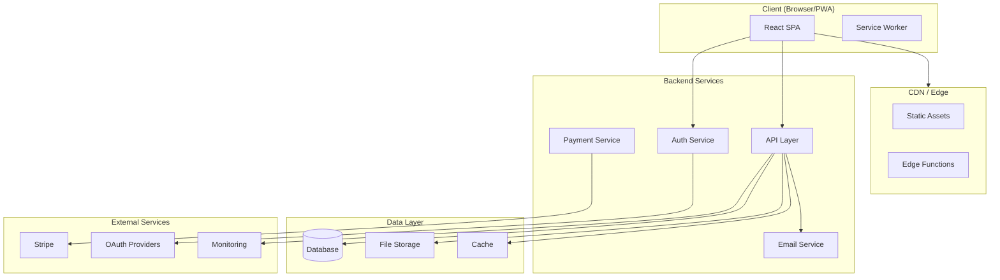
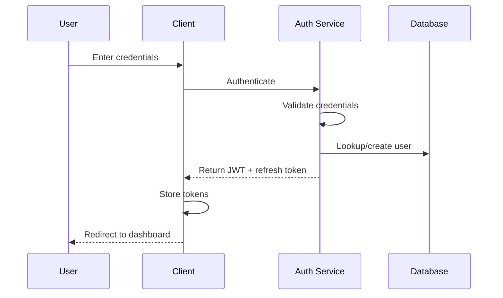
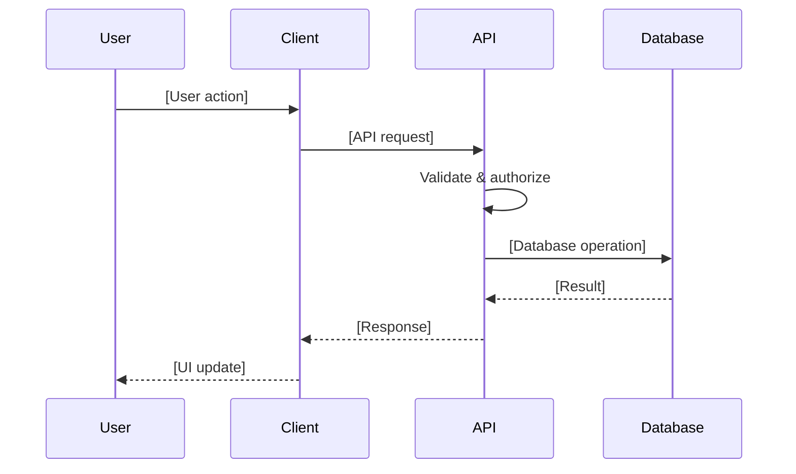
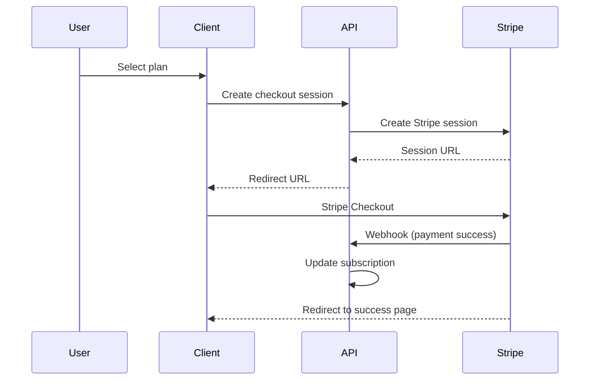
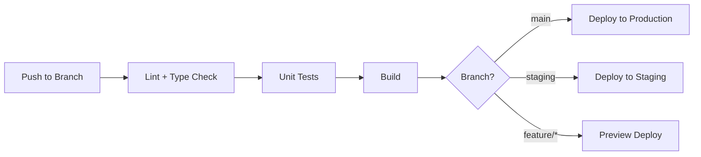

# Architecture

> Use `prompts/PromptGuide-Architecture.md` to generate this document based on your key decisions.

<!-- TEMPLATE: This document is the single source of truth for your system's architecture. -->
<!-- Fill in each section as you make decisions in Phase 3 of SETUP_GUIDE.md. -->
<!-- The mermaid diagrams render on GitHub and most modern markdown viewers. -->

---

## System Overview

<!-- TEMPLATE: 2-3 sentences describing your system at the highest level. -->
<!-- What is it? What are the major components? How do users interact with it? -->

[YOUR_APP_NAME] is a [type of application] that [what it does]. The system consists of [major components] and serves [target users].

---

## Tech Stack

<!-- TEMPLATE: Fill in your actual stack. This should match your README but with more detail. -->

| Layer | Technology | Version | Notes |
|-------|-----------|---------|-------|
| **Runtime** | Node.js | 20.x LTS | [Notes] |
| **Language** | TypeScript | 5.x | Strict mode enabled |
| **Framework** | React | 18.x | [Notes] |
| **Build Tool** | Vite | 5.x | [Notes] |
| **Styling** | Tailwind CSS | 3.x | With shadcn/ui components |
| **Backend** | [Your choice] | [Version] | See `decisions/BACKEND_CHOICES.md` |
| **Database** | [Your choice] | [Version] | [Notes] |
| **Auth** | [Your choice] | [Version] | See `decisions/AUTH_CHOICES.md` |
| **Payments** | [Your choice] | [Version] | See `decisions/PAYMENT_CHOICES.md` |
| **Hosting** | [Your choice] | N/A | See `decisions/PLATFORM_CHOICES.md` |

---

## Architecture Diagram

<!-- TEMPLATE: Replace this with your actual architecture. -->
<!-- The mermaid syntax below is a starting point -- modify it to match your system. -->



---

## Data Flow

<!-- TEMPLATE: Describe the main data flows in your application. -->

### Authentication Flow



### Core Data Flow

<!-- TEMPLATE: Replace with your application's primary data flow. -->



### Payment Flow

<!-- TEMPLATE: Replace with your actual payment flow. -->



---

## Key Design Decisions

<!-- TEMPLATE: List the architectural decisions that shape your system. -->
<!-- Link to the full ADR in the decisions/ folder for each one. -->

| # | Decision | Choice | Rationale | ADR |
|---|----------|--------|-----------|-----|
| 1 | Backend platform | [Choice] | [Brief rationale] | `decisions/BACKEND_CHOICES.md` |
| 2 | Auth provider | [Choice] | [Brief rationale] | `decisions/AUTH_CHOICES.md` |
| 3 | Payment processor | [Choice] | [Brief rationale] | `decisions/PAYMENT_CHOICES.md` |
| 4 | Hosting platform | [Choice] | [Brief rationale] | `decisions/PLATFORM_CHOICES.md` |
| 5 | [Decision] | [Choice] | [Brief rationale] | [Link] |

---

## Security Model

<!-- TEMPLATE: Describe your security architecture. -->

### Authentication

- **Method**: [JWT / Session / etc.]
- **Token storage**: [httpOnly cookies / localStorage / etc.]
- **Session duration**: [Duration]
- **Refresh strategy**: [How tokens are refreshed]

### Authorization

- **Model**: [RBAC / ABAC / etc.]
- **Enforcement**: [Where authorization checks happen]
- **Roles**: See role definitions in `docs/architecture/access-control.md`

### Data Protection

| Measure | Implementation |
|---------|---------------|
| Encryption at rest | [How] |
| Encryption in transit | TLS 1.3 |
| PII handling | [Approach] |
| API authentication | [Method] |
| Rate limiting | [Strategy] |
| Input validation | [Approach] |
| CORS policy | [Configuration] |

### Security Headers

```
Content-Security-Policy: [your policy]
X-Frame-Options: DENY
X-Content-Type-Options: nosniff
Referrer-Policy: strict-origin-when-cross-origin
Permissions-Policy: [your policy]
```

---

## Scalability

<!-- TEMPLATE: Describe how your system scales. -->

### Current Scale

| Metric | Current Target |
|--------|---------------|
| Concurrent users | [Number] |
| Requests/second | [Number] |
| Data volume | [Size] |
| Storage | [Size] |

### Scaling Strategy

<!-- TEMPLATE: Describe your scaling approach for each layer. -->

| Layer | Strategy |
|-------|----------|
| **Frontend** | CDN edge caching, code splitting, lazy loading |
| **API** | [Horizontal scaling / Serverless / etc.] |
| **Database** | [Connection pooling, read replicas, sharding plan] |
| **Storage** | [CDN for assets, object storage for uploads] |
| **Cache** | [Redis / in-memory / CDN cache] |

### Performance Budgets

| Metric | Budget |
|--------|--------|
| First Contentful Paint | < [X]ms |
| Largest Contentful Paint | < [X]ms |
| Time to Interactive | < [X]ms |
| Bundle size (gzipped) | < [X]KB |
| API response (p95) | < [X]ms |

---

## Infrastructure

<!-- TEMPLATE: Describe your infrastructure setup. -->

### Environments

| Environment | URL | Purpose |
|-------------|-----|---------|
| Development | `http://localhost:8080` | Local development |
| Staging | `https://staging.[YOUR_DOMAIN]` | Pre-production testing |
| Production | `https://[YOUR_DOMAIN]` | Live application |

### CI/CD Pipeline



### Monitoring

| What | Tool | Alert Threshold |
|------|------|----------------|
| Uptime | [Tool] | < 99.9% |
| Error rate | [Tool] | > [X]% |
| Response time | [Tool] | > [X]ms p95 |
| CPU/Memory | [Tool] | > [X]% |

---

## Directory Reference

For implementation details, see these related documents:

- **[docs/architecture/access-control.md]** -- Role-based access control specification
- **[docs/architecture/data-model.md]** -- Entity relationship diagrams and data model
- **[docs/architecture/api-design.md]** -- API endpoint documentation
- **[decisions/]** -- Architecture Decision Records

---

*Generated with the help of `prompts/PromptGuide-Architecture.md`. Last updated: [DATE].*
