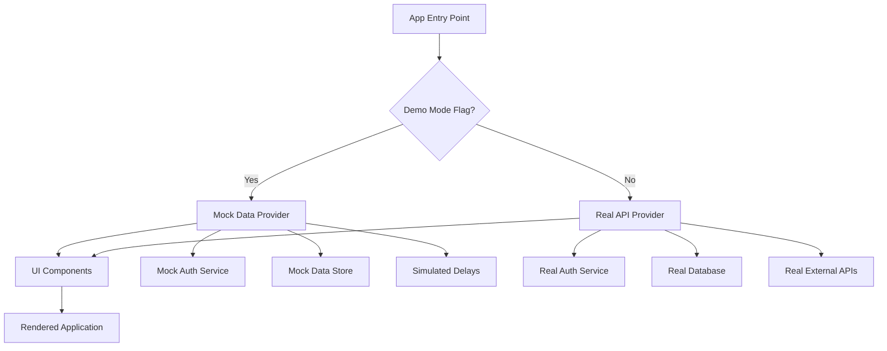
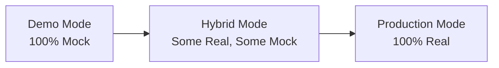

# Demo Mode Architecture — [YOUR_APP_NAME]

> **Purpose:** Define how to build a compelling demo experience that showcases your product
> before all features are fully implemented. Demo mode lets you sell the vision, gather
> feedback, and iterate on UX without backend dependencies.
>
> **Last Updated:** [DATE]
> **Demo Mode Status:** [Not Started / In Progress / Active]

---

## Why Demo Mode Matters

### The Problem
Building a SaaS product takes months. But you need to:
- **Show investors** what the product will look like
- **Get user feedback** before investing in backend complexity
- **Validate UX** with real navigation and interaction patterns
- **Onboard early adopters** who want to see the product before committing
- **Train sales and support** teams on the product experience

### The Solution: Demo Mode
A feature-flagged mode where the application runs with **mock data** and **simulated
interactions** instead of real backend calls. From the user's perspective, the app
looks and feels real. Under the hood, everything is local/static data.

### Key Principle
> **Show before you build.** Every screen should be demo-able before
> the backend endpoint exists.

---

## Architecture Overview



---

## Feature Flag Setup

### Environment Variable

```bash
# .env.local
NEXT_PUBLIC_DEMO_MODE=true    # Enable demo mode
# OR
NEXT_PUBLIC_DEMO_MODE=false   # Use real backend
```

### Feature Flag Provider

```typescript
// src/providers/DemoModeProvider.tsx

import { createContext, useContext, ReactNode } from 'react';

interface DemoModeContextType {
  isDemoMode: boolean;
  demoUser: DemoUser | null;
  demoScenario: string;
  setDemoScenario: (scenario: string) => void;
}

const DemoModeContext = createContext<DemoModeContextType>({
  isDemoMode: false,
  demoUser: null,
  demoScenario: 'default',
  setDemoScenario: () => {},
});

export function DemoModeProvider({ children }: { children: ReactNode }) {
  const isDemoMode = process.env.NEXT_PUBLIC_DEMO_MODE === 'true';
  // ... state management for demo scenarios

  return (
    <DemoModeContext.Provider value={{ isDemoMode, demoUser, demoScenario, setDemoScenario }}>
      {children}
    </DemoModeContext.Provider>
  );
}

export const useDemoMode = () => useContext(DemoModeContext);
```

### Conditional Service Layer

```typescript
// src/services/index.ts

import { useDemoMode } from '@/providers/DemoModeProvider';
import * as realServices from './real';
import * as mockServices from './mock';

export function useServices() {
  const { isDemoMode } = useDemoMode();

  return isDemoMode ? mockServices : realServices;
}
```

---

## Mock Data Strategy

### Mock Data Structure

```
src/
├── mocks/
│   ├── data/
│   │   ├── users.ts            # Mock user profiles
│   │   ├── [entities].ts       # Mock domain entities
│   │   ├── [transactions].ts   # Mock financial data
│   │   └── [analytics].ts      # Mock analytics/metrics
│   ├── services/
│   │   ├── mockAuth.ts         # Simulated auth (always succeeds)
│   │   ├── mock[Entity].ts     # CRUD operations on mock data
│   │   └── mockAnalytics.ts    # Static analytics data
│   ├── delays.ts               # Simulated network delays
│   └── index.ts                # Mock service exports
```

### Mock Data Guidelines

1. **Use realistic data.** Names, emails, dates should look real (use faker.js or similar).
2. **Include edge cases.** Empty states, long names, large numbers, special characters.
3. **Support multiple scenarios.** A "new user" scenario, a "power user" scenario, an "admin" scenario.
4. **Simulate latency.** Add 200-500ms delays to mock API calls so the UI loading states are visible.
5. **Support CRUD operations.** Mock data should be mutable within the session (stored in memory or localStorage).

### Example Mock Service

```typescript
// src/mocks/services/mock[Entity].ts

import { mockEntities } from '../data/[entities]';
import { simulateDelay } from '../delays';

let entities = [...mockEntities]; // Mutable copy

export async function getAll() {
  await simulateDelay(300);
  return { data: entities, error: null };
}

export async function getById(id: string) {
  await simulateDelay(200);
  const entity = entities.find(e => e.id === id);
  return entity
    ? { data: entity, error: null }
    : { data: null, error: 'Not found' };
}

export async function create(input: CreateInput) {
  await simulateDelay(400);
  const newEntity = {
    id: crypto.randomUUID(),
    ...input,
    created_at: new Date().toISOString(),
  };
  entities = [newEntity, ...entities];
  return { data: newEntity, error: null };
}

export async function update(id: string, input: UpdateInput) {
  await simulateDelay(300);
  entities = entities.map(e =>
    e.id === id ? { ...e, ...input, updated_at: new Date().toISOString() } : e
  );
  return { data: entities.find(e => e.id === id), error: null };
}

export async function remove(id: string) {
  await simulateDelay(200);
  entities = entities.filter(e => e.id !== id);
  return { data: null, error: null };
}
```

### Simulated Delay Utility

```typescript
// src/mocks/delays.ts

export function simulateDelay(ms: number = 300): Promise<void> {
  if (process.env.NODE_ENV === 'test') return Promise.resolve(); // No delay in tests
  const jitter = Math.random() * 100; // Add 0-100ms jitter for realism
  return new Promise(resolve => setTimeout(resolve, ms + jitter));
}
```

---

## Conditional Routing

### Demo-Aware Route Guards

```typescript
// src/middleware/demoGuard.ts

import { useDemoMode } from '@/providers/DemoModeProvider';

export function DemoGuard({ children }: { children: ReactNode }) {
  const { isDemoMode } = useDemoMode();

  // In demo mode, skip auth checks — use mock user
  if (isDemoMode) {
    return <>{children}</>;
  }

  // In real mode, enforce actual auth
  return <AuthGuard>{children}</AuthGuard>;
}
```

### Demo Banner

```typescript
// src/components/DemoBanner.tsx

import { useDemoMode } from '@/providers/DemoModeProvider';

export function DemoBanner() {
  const { isDemoMode } = useDemoMode();

  if (!isDemoMode) return null;

  return (
    <div className="bg-amber-100 border-b border-amber-300 px-4 py-2 text-center text-sm">
      You are viewing a demo with sample data.
      <a href="[YOUR_SIGNUP_URL]" className="ml-2 font-medium underline">
        Sign up for a real account
      </a>
    </div>
  );
}
```

---

## Demo Scenarios

> Define specific scenarios that demonstrate different aspects of the product.

| Scenario ID | Name | Description | Target Audience | Mock User Role |
|---|---|---|---|---|
| `default` | [Default Experience] | [Standard user flow with typical data] | General | [User] |
| `new-user` | [New User / Empty State] | [Fresh account with no data — shows onboarding] | Sales demos | [New User] |
| `power-user` | [Power User] | [Heavy usage — lots of data, all features active] | Enterprise prospects | [Admin] |
| `admin` | [Admin View] | [Platform administration perspective] | Internal team | [Platform Admin] |
| `[custom]` | [Custom Scenario] | [Description] | [Audience] | [Role] |

### Scenario Switcher (Internal Tool)

```typescript
// src/components/DemoScenarioSwitcher.tsx
// Only shown when DEMO_MODE=true AND user opens dev tools or uses a key combo

export function DemoScenarioSwitcher() {
  const { demoScenario, setDemoScenario } = useDemoMode();
  const scenarios = ['default', 'new-user', 'power-user', 'admin'];

  return (
    <div className="fixed bottom-4 right-4 bg-white shadow-lg rounded-lg p-4 z-50">
      <h4 className="font-bold mb-2">Demo Scenario</h4>
      {scenarios.map(s => (
        <button
          key={s}
          onClick={() => setDemoScenario(s)}
          className={s === demoScenario ? 'font-bold' : ''}
        >
          {s}
        </button>
      ))}
    </div>
  );
}
```

---

## Gradually Replacing Demo with Real Data

### Migration Path



### Step-by-Step Replacement

1. **Start with demo mode for all features.**
2. **Build real auth first.** Replace mock auth with real authentication.
3. **Replace one service at a time.** Pick the most critical feature, build the real API, and swap the mock service for the real one.
4. **Use the service layer pattern** so each feature can independently switch between mock and real.
5. **Keep demo mode available** even after launch — it is useful for:
   - Sales demonstrations
   - QA testing
   - Onboarding tutorials
   - Offline development

### Service-by-Service Migration Tracker

| Service | Demo | Real | Status | Notes |
|---|---|---|---|---|
| Authentication | `mockAuth.ts` | `[realAuth].ts` | [Mock / Real] | [Notes] |
| [Entity] CRUD | `mock[Entity].ts` | `[real service]` | [Mock / Real] | [Notes] |
| Payments | `mockPayments.ts` | `[Stripe service]` | [Mock / Real] | [Notes] |
| Notifications | `mockNotifications.ts` | `[real service]` | [Mock / Real] | [Notes] |
| Analytics | `mockAnalytics.ts` | `[real service]` | [Mock / Real] | [Notes] |
| File Uploads | `mockUploads.ts` | `[S3 service]` | [Mock / Real] | [Notes] |

---

## Demo Mode Checklist

### Setup
- [ ] Feature flag configured (`NEXT_PUBLIC_DEMO_MODE`)
- [ ] DemoModeProvider created and wrapped around app
- [ ] Service layer abstraction in place (mock vs real)
- [ ] Demo banner component showing when in demo mode

### Data
- [ ] Mock data created for all core entities
- [ ] Mock data covers edge cases (empty states, large datasets, long strings)
- [ ] Multiple demo scenarios defined
- [ ] Simulated delays added for realism

### UX
- [ ] All primary user flows work end-to-end in demo mode
- [ ] Loading states visible (thanks to simulated delays)
- [ ] Error states demonstrable (optional mock error injection)
- [ ] Empty states visible in "new user" scenario
- [ ] Demo scenario switcher available for internal use

### Deployment
- [ ] Demo mode deployable to a public URL (e.g., `demo.[YOUR_DOMAIN]`)
- [ ] Demo mode isolated from production data
- [ ] No real API keys or secrets used in demo mode
- [ ] Analytics tracking indicates demo vs real usage

---

## Anti-Patterns to Avoid

| Anti-Pattern | Problem | Do This Instead |
|---|---|---|
| Hardcoding `if (demo)` in components | Spaghetti code, hard to remove | Use service layer abstraction |
| Using production data for demos | Security risk, GDPR violation | Always use synthetic mock data |
| Demo mode that cannot create/edit | Feels static and unimpressive | Support full CRUD on mock data |
| No loading states in demo | Unrealistic; masks UX issues | Add simulated delays |
| Skipping demo mode | Slower feedback loops | Demo mode pays for itself |

---

## Prompt Guide Reference

```
I need to set up demo mode for [YOUR_APP_NAME] following the architecture in
docs/DEMO_MODE.md. My current features are:

[List your features from FEATURE_INDEX.md]

For each feature, generate:
1. Mock data (realistic, using the schema from DOMAIN_MODEL.md)
2. Mock service (matching the real service interface)
3. Demo scenario definitions

Use the DemoModeProvider pattern and service layer abstraction described
in the template. Ensure simulated delays are included for realism.
```

---

*Status: Template*
*Next review: [DATE]*
