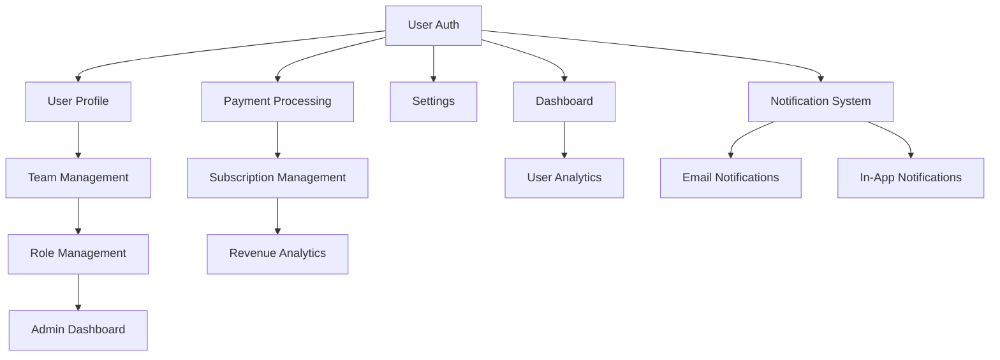

# Feature Registry — [YOUR_APP_NAME]

> **Purpose:** A single source of truth for every feature in the product. Each feature
> is tracked from idea through production with links to its PRD, database tables, and
> UI location.
>
> **Last Updated:** [DATE]

---

## Status Definitions

| Status | Meaning | Indicator |
|---|---|---|
| **Planned** | Feature is defined in a PRD but no implementation has started | Idea exists |
| **Schema Only** | Database tables/models created but no UI or API | Backend foundation |
| **UI Only** | Frontend components exist but not connected to real data | Mockup / demo |
| **Built** | Feature is implemented end-to-end but not yet in production | Ready for QA |
| **Production** | Feature is live and available to users | Shipped |
| **Deprecated** | Feature has been removed or superseded | Archived |

---

## Core Features

> The essential features that define the product's primary value proposition.

| Feature | Status | UI Location | Database Table(s) | PRD | Notes |
|---|---|---|---|---|---|
| [User Registration] | [Status] | `/signup` | `users` | [Link] | [Notes] |
| [User Login / Auth] | [Status] | `/login` | `users`, `sessions` | [Link] | [Auth provider: e.g., Supabase] |
| [User Profile] | [Status] | `/profile` | `users`, `profiles` | [Link] | — |
| [Primary Entity CRUD] | [Status] | `/[entities]` | `[entity_table]` | [Link] | [Core domain entity] |
| [Secondary Entity CRUD] | [Status] | `/[entities]` | `[entity_table]` | [Link] | [Supporting entity] |
| [Dashboard — Home] | [Status] | `/dashboard` | — (aggregated) | [Link] | [Key metrics displayed] |
| [Search] | [Status] | `/search` | — (query layer) | [Link] | [Full-text or filtered] |
| [Settings] | [Status] | `/settings` | `settings`, `preferences` | [Link] | [User-level and org-level] |

---

## Growth Features

> Features that drive user acquisition, retention, engagement, and revenue.

| Feature | Status | UI Location | Database Table(s) | PRD | Notes |
|---|---|---|---|---|---|
| [Team / Org Management] | [Status] | `/org/settings` | `organizations`, `memberships` | [Link] | [Invite flow] |
| [Role Management] | [Status] | `/org/roles` | `roles`, `permissions` | [Link] | [See RBAC doc] |
| [Email Notifications] | [Status] | `/settings/notifications` | `notification_preferences` | [Link] | [Transactional + marketing] |
| [In-App Notifications] | [Status] | Global header | `notifications` | [Link] | [Bell icon, real-time] |
| [Onboarding Flow] | [Status] | `/onboarding` | `onboarding_progress` | [Link] | [Step-by-step wizard] |
| [Referral Program] | [Status] | `/referrals` | `referrals`, `referral_codes` | [Link] | — |
| [Social Sharing] | [Status] | Various | — | [Link] | [Open Graph metadata] |

---

## Operations Features

> Features for managing the business and day-to-day operations.

| Feature | Status | UI Location | Database Table(s) | PRD | Notes |
|---|---|---|---|---|---|
| [Admin Dashboard] | [Status] | `/admin` | — (aggregated) | [Link] | [Platform-level admin] |
| [User Management (Admin)] | [Status] | `/admin/users` | `users` | [Link] | [CRUD, impersonation] |
| [Content Management] | [Status] | `/admin/content` | `[content_table]` | [Link] | — |
| [Support Ticket System] | [Status] | `/support` | `tickets`, `messages` | [Link] | [Or external: Zendesk, etc.] |
| [Audit Log Viewer] | [Status] | `/admin/audit` | `audit_logs` | [Link] | [See Audit doc] |
| [Feature Flags] | [Status] | `/admin/flags` | `feature_flags` | [Link] | [Or external: LaunchDarkly] |

---

## Analytics Features

> Features for understanding user behavior, business performance, and product health.

| Feature | Status | UI Location | Database Table(s) | PRD | Notes |
|---|---|---|---|---|---|
| [User Analytics] | [Status] | `/analytics/users` | — (analytics layer) | [Link] | [DAU, WAU, MAU] |
| [Revenue Analytics] | [Status] | `/analytics/revenue` | `subscriptions`, `payments` | [Link] | [MRR, churn, LTV] |
| [Usage Analytics] | [Status] | `/analytics/usage` | `events` | [Link] | [Feature adoption] |
| [Funnel Analytics] | [Status] | `/analytics/funnels` | `events` | [Link] | [Conversion tracking] |
| [Export / Reports] | [Status] | `/analytics/export` | — | [Link] | [CSV, PDF generation] |

---

## Integration Features

> Features that connect with external services and platforms.

| Feature | Status | UI Location | Database Table(s) | PRD | Notes |
|---|---|---|---|---|---|
| [Payment Processing] | [Status] | `/billing` | `subscriptions`, `payments`, `invoices` | [Link] | [Provider: Stripe, etc.] |
| [Email Service] | [Status] | — (background) | `email_logs` | [Link] | [Provider: SendGrid, etc.] |
| [File Storage] | [Status] | Various | `files`, `uploads` | [Link] | [Provider: S3, etc.] |
| [Calendar Integration] | [Status] | `/calendar` | `calendar_events` | [Link] | [Google Calendar, etc.] |
| [OAuth / SSO] | [Status] | `/login` | `oauth_connections` | [Link] | [Google, GitHub, etc.] |
| [Webhook System] | [Status] | `/settings/webhooks` | `webhooks`, `webhook_logs` | [Link] | [Outbound events] |
| [API (Public)] | [Status] | `/developers/api` | — | [Link] | [REST or GraphQL] |

---

## Feature Dependency Map

> Shows which features depend on other features.



> **Instructions:** Replace the generic features above with your actual features
> and their dependency relationships. Use `graph TD` for top-down or `graph LR`
> for left-to-right layout.

---

## Adding a New Feature

When adding a new feature to this registry:

1. **Determine the category** (Core, Growth, Operations, Analytics, Integrations)
2. **Set initial status** (usually "Planned")
3. **Assign a UI location** (the route where the feature will live)
4. **Identify database tables** (existing or new tables needed)
5. **Link the PRD** (create one if it doesn't exist)
6. **Update the dependency map** if this feature depends on or enables others

### Feature Row Template

```markdown
| [Feature Name] | Planned | `/[route]` | `[table_name]` | [PRD Link] | [Notes] |
```

---

## Feature Counts by Status

> Update these counts when features change status.

| Status | Count |
|---|---|
| Planned | [X] |
| Schema Only | [X] |
| UI Only | [X] |
| Built | [X] |
| Production | [X] |
| Deprecated | [X] |
| **Total** | **[X]** |

---

## Feature Counts by Category

| Category | Total | In Production | % Complete |
|---|---|---|---|
| Core | [X] | [X] | [X]% |
| Growth | [X] | [X] | [X]% |
| Operations | [X] | [X] | [X]% |
| Analytics | [X] | [X] | [X]% |
| Integrations | [X] | [X] | [X]% |

---

## Prompt Guide Reference

> Use the following prompt to generate a feature index from your codebase:

```
Analyze the codebase at [YOUR_REPO_PATH] and generate a Feature Index following
the template in docs/FEATURE_INDEX.md. For each feature:

1. Identify the feature name from routes, components, and database tables
2. Determine the current status:
   - Production: Has tests, deployed, used by real users
   - Built: Implemented end-to-end but not deployed
   - UI Only: Components exist but no backend integration
   - Schema Only: Database tables exist but no UI
   - Planned: Referenced in PRDs/docs but not implemented
3. Map the UI location (route path)
4. List the database tables involved
5. Categorize as Core, Growth, Operations, Analytics, or Integrations

Output as a markdown table matching the template format.
```

---

*Status: Template*
*Next review: [DATE]*
