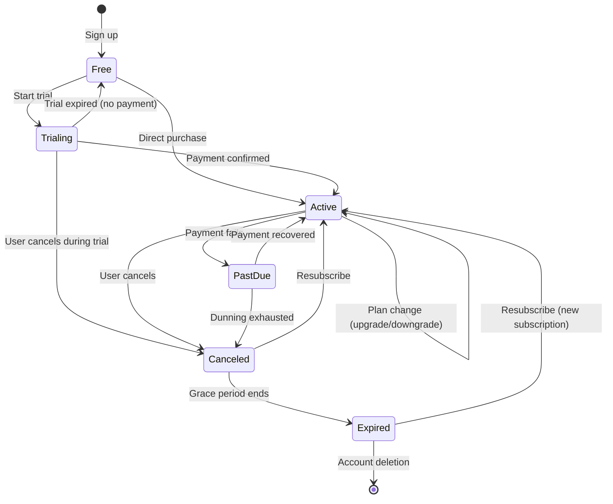
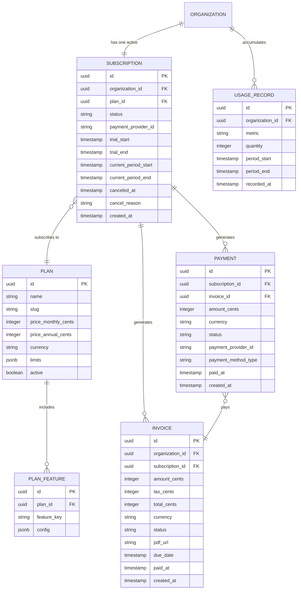
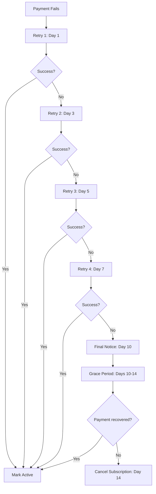
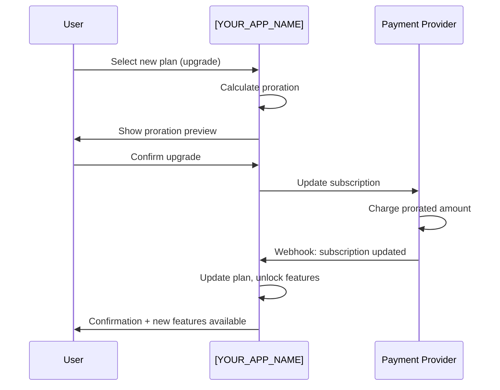
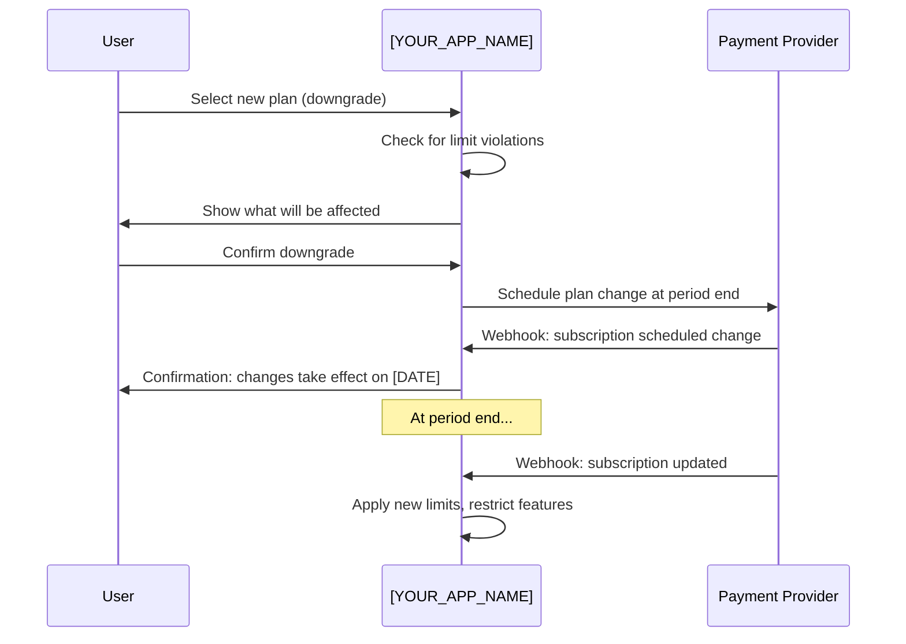

# Billing & Pricing Architecture — [YOUR_APP_NAME]

> **Purpose:** Define the pricing model, subscription lifecycle, billing schema,
> proration, dunning, free trials, and upgrade/downgrade flows for your SaaS.
>
> **Last Updated:** [DATE]
> **Status:** [Template / In Progress / Complete]
> **Payment Provider:** [Stripe / Paddle / Braintree / LemonSqueezy / Custom]

---

## Pricing Model Options

> Choose the model(s) that fit your product. Most SaaS products use a combination.

| Model | Description | Best For | Example |
|---|---|---|---|
| **Flat Rate** | One price, one set of features | Simple products, early MVPs | "$29/month for everything" |
| **Tiered** | Multiple plans with increasing features | Most B2B SaaS | "Starter $19, Pro $49, Enterprise $149" |
| **Per-Seat** | Price per user/member | Collaboration tools | "$10/user/month" |
| **Usage-Based** | Pay for what you use | API products, infrastructure | "$0.01 per API call" |
| **Freemium** | Free tier with paid upgrades | Consumer / PLG products | "Free for 3 projects, $9/mo unlimited" |
| **Hybrid** | Combination of the above | Mature products | "Base $29 + $5/user + usage overage" |

### Chosen Model for [YOUR_APP_NAME]

**Primary Model:** [YOUR_CHOICE]
**Rationale:** [Why this model fits your product and market]

---

## Plan Definitions

| Plan | Monthly Price | Annual Price | Audience | Key Limits |
|---|---|---|---|---|
| Free | $0 | $0 | Individual users, evaluation | [X] [entities], [X] members, [limited features] |
| [Starter] | $[X]/mo | $[X]/yr | Small teams | [X] [entities], [X] members, [features included] |
| [Professional] | $[X]/mo | $[X]/yr | Growing teams | [X] [entities], [X] members, [features included] |
| [Enterprise] | Custom | Custom | Large organizations | Unlimited, custom features, SLA, support |

### Plan Feature Matrix

| Feature | Free | [Starter] | [Professional] | [Enterprise] |
|---|---|---|---|---|
| [Core Feature 1] | Yes | Yes | Yes | Yes |
| [Core Feature 2] | Limited ([X]) | Yes | Yes | Yes |
| [Growth Feature 1] | — | Yes | Yes | Yes |
| [Growth Feature 2] | — | — | Yes | Yes |
| [Advanced Feature 1] | — | — | Yes | Yes |
| [Enterprise Feature 1] | — | — | — | Yes |
| [Entity] Limit | [X] | [X] | [X] | Unlimited |
| Member Limit | [X] | [X] | [X] | Unlimited |
| Storage Limit | [X] GB | [X] GB | [X] GB | Custom |
| API Rate Limit | [X]/min | [X]/min | [X]/min | Custom |
| Support | Community | Email | Priority Email | Dedicated |
| SLA | — | — | 99.9% | 99.99% |

---

## Subscription Lifecycle



### Status Definitions

| Status | Meaning | User Experience | Data Access |
|---|---|---|---|
| `free` | Using free tier | Limited features | Read + limited write |
| `trialing` | In free trial period | Full plan features | Full access |
| `active` | Paying subscriber | Full plan features | Full access |
| `past_due` | Payment failed, in dunning | Full access (grace period) | Full access |
| `canceled` | User canceled, in grace period | Read-only (until period end) | Read-only |
| `expired` | Subscription fully ended | Free tier only | Read-only for past data |
| `paused` | Subscription paused (if supported) | Read-only | Read-only |

---

## Billing Entity Schema



### Key Schema Notes

- **All monetary values stored in cents** (integer) to avoid floating-point issues
- **Currency stored per record** for multi-currency support
- **Provider IDs stored** (e.g., Stripe subscription ID) for reconciliation
- **Timestamps in UTC** always
- **Soft deletes** on subscriptions (use `canceled_at`, not `DELETE`)

---

## Proration Handling

### When Proration Occurs

| Scenario | Proration Behavior |
|---|---|
| Upgrade mid-cycle | Charge prorated amount for remaining days on new plan |
| Downgrade mid-cycle | Credit prorated amount, apply at next billing cycle |
| Add seats mid-cycle | Charge prorated amount per new seat |
| Remove seats mid-cycle | Credit prorated amount, apply at next cycle |

### Proration Calculation

```typescript
// Example proration for mid-cycle upgrade
function calculateProration(
  currentPlan: Plan,
  newPlan: Plan,
  daysRemaining: number,
  totalDaysInPeriod: number
): number {
  const dailyRateCurrent = currentPlan.priceMonthly / totalDaysInPeriod;
  const dailyRateNew = newPlan.priceMonthly / totalDaysInPeriod;

  const creditForUnused = dailyRateCurrent * daysRemaining;
  const chargeForNew = dailyRateNew * daysRemaining;

  return Math.round((chargeForNew - creditForUnused) * 100) / 100; // Cents
}
```

### Provider Handling

Most payment providers (Stripe, Paddle) handle proration automatically. Configure:
```typescript
// Stripe example
const subscription = await stripe.subscriptions.update(subscriptionId, {
  items: [{ id: itemId, plan: newPlanId }],
  proration_behavior: 'create_prorations', // or 'none' or 'always_invoice'
});
```

---

## Dunning (Failed Payment) Flows

### Dunning Schedule



### Dunning Communications

| Day | Action | Communication |
|---|---|---|
| 0 | Payment fails | Email: "Your payment failed. We'll retry automatically." |
| 1 | Retry #1 | — (silent retry) |
| 3 | Retry #2 | Email: "Payment still failing. Please update your card." |
| 5 | Retry #3 | Email: "Action required: update payment method" |
| 7 | Retry #4 | Email: "Final retry — update payment to avoid interruption" |
| 10 | Final notice | Email: "Your subscription will be canceled in 4 days" |
| 14 | Cancellation | Email: "Your subscription has been canceled" |

### In-App Dunning UI

```typescript
// Show a banner when subscription is past_due
function BillingBanner({ subscription }: { subscription: Subscription }) {
  if (subscription.status !== 'past_due') return null;

  return (
    <Banner variant="warning">
      Your payment method needs attention.
      <Link href="/billing/update">Update payment method</Link>
      to avoid service interruption.
    </Banner>
  );
}
```

---

## Free Trial Patterns

### Trial Configuration

| Setting | Value | Notes |
|---|---|---|
| Trial duration | [X] days | Industry standard: 7-30 days |
| Credit card required? | [Yes / No] | No card = higher signup, lower conversion |
| Trial plan level | [Which plan to trial] | Usually the most popular paid plan |
| What happens at trial end? | [Downgrade to free / Cancel / Require payment] | [YOUR_CHOICE] |
| Trial extension policy | [Allow / Deny / Case-by-case] | [YOUR_POLICY] |

### Trial Implementation

```typescript
// When user starts trial:
async function startTrial(organizationId: string, planId: string): Promise<Subscription> {
  const trialDays = [YOUR_TRIAL_DAYS];
  const now = new Date();
  const trialEnd = addDays(now, trialDays);

  return await createSubscription({
    organization_id: organizationId,
    plan_id: planId,
    status: 'trialing',
    trial_start: now,
    trial_end: trialEnd,
    current_period_start: now,
    current_period_end: trialEnd,
  });
}

// Trial expiry check (run daily via cron):
async function processExpiredTrials() {
  const expiredTrials = await db.query(`
    SELECT * FROM subscriptions
    WHERE status = 'trialing'
      AND trial_end < NOW()
  `);

  for (const trial of expiredTrials) {
    if (trial.payment_method_on_file) {
      await convertTrialToActive(trial);
    } else {
      await downgradeToFree(trial);
      await sendTrialExpiredEmail(trial);
    }
  }
}
```

---

## Upgrade / Downgrade Flows

### Upgrade Flow



### Downgrade Flow



### Downgrade Limit Handling

| Limit | Over Limit Behavior |
|---|---|
| [Entity] count exceeds new plan | Oldest entities archived (or block downgrade until resolved) |
| Member count exceeds new plan | Org admin must remove members before downgrade |
| Storage exceeds new plan | Block new uploads until under limit; do not delete existing files |
| Feature not in new plan | Feature becomes read-only or hidden |

---

## Webhook Handling

### Critical Billing Webhooks

| Event | Provider Event | Action |
|---|---|---|
| Payment succeeded | `invoice.payment_succeeded` | Update subscription status, send receipt |
| Payment failed | `invoice.payment_failed` | Start dunning, notify user |
| Subscription created | `customer.subscription.created` | Create subscription record |
| Subscription updated | `customer.subscription.updated` | Update plan, status |
| Subscription canceled | `customer.subscription.deleted` | Mark canceled, start grace period |
| Trial ending | `customer.subscription.trial_will_end` | Send reminder email (3 days before) |
| Dispute created | `charge.dispute.created` | Alert team, gather evidence |

### Webhook Security

```typescript
// Always verify webhook signatures
app.post('/api/webhooks/[provider]', async (req, res) => {
  const signature = req.headers['[provider]-signature'];

  try {
    const event = [provider].webhooks.constructEvent(
      req.body,
      signature,
      process.env.[PROVIDER]_WEBHOOK_SECRET
    );

    await processWebhookEvent(event);
    res.status(200).json({ received: true });
  } catch (err) {
    logger.error('Webhook signature verification failed', err);
    res.status(400).json({ error: 'Invalid signature' });
  }
});
```

---

## Implementation Checklist

- [ ] Pricing model chosen and documented
- [ ] Plan definitions with feature matrix
- [ ] Subscription lifecycle state machine implemented
- [ ] Billing database schema created
- [ ] Payment provider integration (Stripe, etc.)
- [ ] Proration handling configured
- [ ] Dunning flow implemented with email notifications
- [ ] Free trial flow working end-to-end
- [ ] Upgrade flow with proration preview
- [ ] Downgrade flow with limit checks
- [ ] Webhook handlers for all critical events
- [ ] Webhook signature verification
- [ ] Billing UI (plan selection, payment method, invoices)
- [ ] Tested with real transactions on staging

---

## Prompt Guide Reference

See [PromptGuide-Architecture.md](./PromptGuide-Architecture.md) for prompts related to billing architecture generation.

---

*Status: Template*
*Next review: [DATE]*
