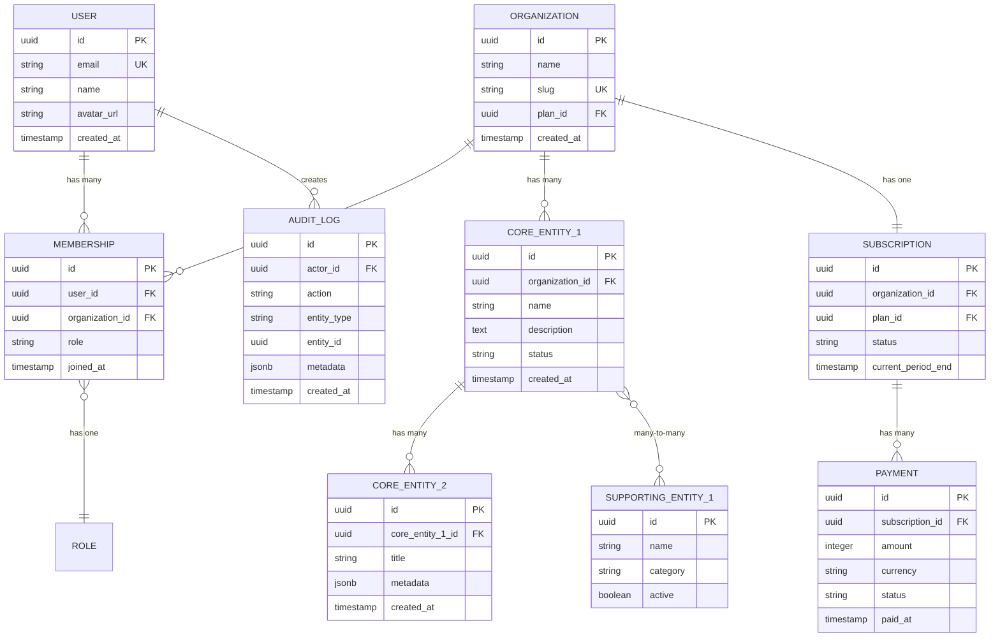

# Domain Model — [YOUR_APP_NAME]

> **Your domain model is the intellectual foundation of your SaaS.** Every feature,
> every database table, every API endpoint, and every UI screen derives from the
> entities and relationships defined here. Get this right, and everything else falls
> into place. Get this wrong, and you will be refactoring for months.
>
> **Last Updated:** [DATE]
> **Status:** [Template / In Progress / Complete]

---

## How to Use This Template

1. **Identify your core entities.** What are the "nouns" of your application?
2. **Define relationships.** How do entities relate to each other?
3. **Establish design principles.** What separations and boundaries matter?
4. **Build the glossary.** Ensure everyone uses the same language.
5. **Use the prompt guide** at `docs/architecture/PromptGuide-Architecture.md` to generate a first draft from your product description.

---

## Core Entities

> List every significant entity in your domain. An entity is something that:
> - Has its own identity (usually a UUID primary key)
> - Is stored in its own database table
> - Has a lifecycle (created, updated, possibly deleted)

| Entity | Database Table | Role in System | Key Fields |
|---|---|---|---|
| User | `users` | The person using the system. Authenticated identity. | `id`, `email`, `name`, `avatar_url`, `created_at` |
| Organization | `organizations` | Multi-tenant grouping. All data is scoped to an org. | `id`, `name`, `slug`, `plan_id`, `created_at` |
| Membership | `memberships` | Links a User to an Organization with a specific role. | `id`, `user_id`, `organization_id`, `role`, `joined_at` |
| [Core Entity 1] | `[table_name]` | [What this entity represents in your domain] | `id`, `organization_id`, [key fields] |
| [Core Entity 2] | `[table_name]` | [What this entity represents] | `id`, `organization_id`, [key fields] |
| [Core Entity 3] | `[table_name]` | [What this entity represents] | `id`, [parent_entity_id], [key fields] |
| [Supporting Entity 1] | `[table_name]` | [Supporting role, e.g., "lookup table", "config"] | `id`, [key fields] |
| [Supporting Entity 2] | `[table_name]` | [Supporting role] | `id`, [key fields] |
| Subscription | `subscriptions` | Billing state for an organization. | `id`, `organization_id`, `plan_id`, `status`, `current_period_end` |
| Payment | `payments` | Individual payment records. | `id`, `subscription_id`, `amount`, `currency`, `status`, `paid_at` |
| Audit Log | `audit_logs` | Immutable record of significant actions. | `id`, `actor_id`, `action`, `entity_type`, `entity_id`, `timestamp` |

### Entity Categories

```
┌─────────────────────────────────────────────────────────────┐
│                     IDENTITY LAYER                          │
│  User, Organization, Membership, Role, Permission           │
├─────────────────────────────────────────────────────────────┤
│                     DOMAIN LAYER                            │
│  [Core Entity 1], [Core Entity 2], [Core Entity 3]         │
│  [Supporting Entity 1], [Supporting Entity 2]               │
├─────────────────────────────────────────────────────────────┤
│                     OPERATIONS LAYER                        │
│  Subscription, Payment, Invoice, Notification               │
├─────────────────────────────────────────────────────────────┤
│                     OBSERVABILITY LAYER                     │
│  Audit Log, Event, Analytics, Error Log                     │
└─────────────────────────────────────────────────────────────┘
```

---

## Entity Relationships

### ER Diagram



> **Instructions:** Replace `CORE_ENTITY_1`, `CORE_ENTITY_2`, `SUPPORTING_ENTITY_1`
> with your actual entity names. Add or remove entities as needed. Adjust
> relationships (`||--o{` = one-to-many, `}o--o{` = many-to-many, `||--||` = one-to-one).

### Relationship Summary

| From | To | Type | Description |
|---|---|---|---|
| User | Membership | One-to-Many | A user can belong to multiple organizations |
| Organization | Membership | One-to-Many | An org has multiple members |
| Organization | [Core Entity 1] | One-to-Many | All domain data is org-scoped |
| [Core Entity 1] | [Core Entity 2] | One-to-Many | [Describe the relationship] |
| [Core Entity 1] | [Supporting Entity] | Many-to-Many | [Describe via junction table] |
| Organization | Subscription | One-to-One | Each org has one active subscription |
| Subscription | Payment | One-to-Many | A subscription generates payments |

---

## Key Separations and Design Principles

> These are the architectural boundaries that keep your domain model clean. Violating
> these separations leads to coupled code, confusing UX, and painful migrations.

### Principle 1: Operations Are Not Finance
- **Operations data** (what users do in the app) lives in domain tables
- **Financial data** (billing, payments, subscriptions) lives in billing tables
- **Never mix them.** A domain entity should not have a `price` column. A payment record should not store domain-specific metadata.
- **Why:** You may change pricing without changing operations. You may change billing providers. Keep them decoupled.

### Principle 2: Permission Is Not Payment
- **Access control** (what a user CAN do) is determined by their role and permissions
- **Entitlement** (what a user HAS PAID FOR) is determined by their subscription plan
- **These overlap but are not the same.** An admin might have permission to access a feature that the org's plan does not include. Handle both checks independently.
- **Why:** Roles change independently of billing. A free-trial user has full permissions temporarily.

### Principle 3: Template Is Not Instance
- **Templates** define reusable structures (e.g., a report template, a workflow template)
- **Instances** are created from templates and hold actual data
- **Keep them in separate tables.** Templates are organization-scoped or global. Instances reference a template but diverge after creation.
- **Why:** Updating a template should not retroactively change existing instances.

### Principle 4: Configuration Is Not Content
- **Configuration** is how the system behaves (settings, preferences, feature flags)
- **Content** is what users create and consume (domain data, uploads, messages)
- **Store them differently.** Configuration can be cached aggressively. Content needs careful access control.

### Principle 5: [YOUR_CUSTOM_PRINCIPLE]
- **[Description of separation]**
- **Why:** [Rationale]

---

## Multi-Tenancy Model

### Approach: [Row-Level Isolation / Schema-Level Isolation / Database-Level Isolation]

> Most SaaS applications use **row-level isolation** where all tenants share the same
> database and tables, with an `organization_id` column on every tenant-scoped table.

```sql
-- Every tenant-scoped query must include the organization filter
SELECT * FROM [core_entity_1]
WHERE organization_id = :current_org_id
  AND [other_conditions];

-- Row Level Security (RLS) policy example (PostgreSQL / Supabase)
CREATE POLICY "Tenant isolation" ON [core_entity_1]
  USING (organization_id = auth.org_id());
```

### Tenant-Scoped vs Global Tables

| Table | Scope | Filter Column |
|---|---|---|
| `users` | Global | — (users exist across orgs) |
| `organizations` | Global | — |
| `memberships` | Global | — (but queries filter by user or org) |
| `[core_entity_1]` | Tenant-scoped | `organization_id` |
| `[core_entity_2]` | Tenant-scoped | Via parent entity |
| `subscriptions` | Tenant-scoped | `organization_id` |
| `audit_logs` | Tenant-scoped | `organization_id` |
| `[supporting_entity]` | [Global / Tenant] | [Column if tenant-scoped] |

---

## Glossary

> Define every domain term so the team (and AI assistants) use consistent language.

| Term | Definition | Example |
|---|---|---|
| Organization | The top-level tenant. All data belongs to an organization. | "Acme Corp" |
| Member | A user who belongs to an organization with a specific role. | "Jane is an Admin member of Acme Corp" |
| [Domain Term 1] | [Clear, one-sentence definition] | [Concrete example] |
| [Domain Term 2] | [Definition] | [Example] |
| [Domain Term 3] | [Definition] | [Example] |
| [Domain Term 4] | [Definition] | [Example] |
| [Domain Term 5] | [Definition] | [Example] |
| Active | A status indicating the entity is currently in use | "The subscription is active" |
| Archived | A soft-delete status; entity exists but is hidden from default views | "The project was archived" |

---

## Schema Conventions

> Follow these conventions for all database tables.

| Convention | Rule | Example |
|---|---|---|
| Primary Key | UUID, column named `id` | `id UUID DEFAULT gen_random_uuid()` |
| Foreign Key | `[entity]_id` format | `organization_id`, `user_id` |
| Timestamps | Always include `created_at`, optionally `updated_at` | `created_at TIMESTAMPTZ DEFAULT NOW()` |
| Soft Delete | Use `deleted_at` (nullable timestamp), not a boolean | `deleted_at TIMESTAMPTZ DEFAULT NULL` |
| Status | Use an enum or string column named `status` | `status TEXT CHECK (status IN ('active', 'archived'))` |
| Naming | Snake_case for tables and columns | `core_entity`, `created_at` |
| Indexes | Index all foreign keys and frequently queried columns | `CREATE INDEX idx_entity_org ON entity(organization_id)` |

---

## Prompt Guide Reference

See [PromptGuide-Architecture.md](./PromptGuide-Architecture.md) for detailed prompts to generate:
- A complete domain model from your product description
- An ER diagram in mermaid syntax
- SQL schema from this domain model
- Design principles specific to your domain

---

*Status: Template*
*Next review: [DATE]*
