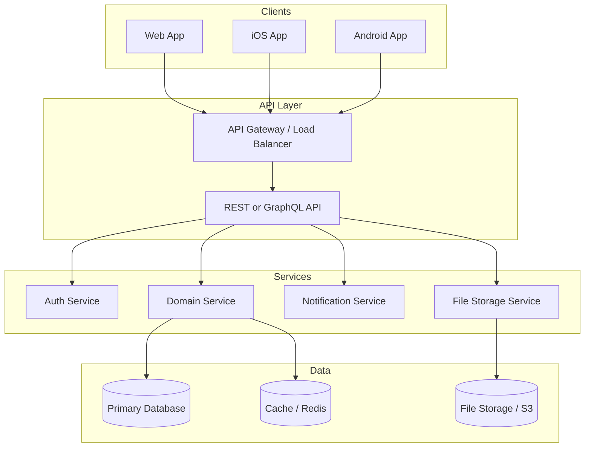
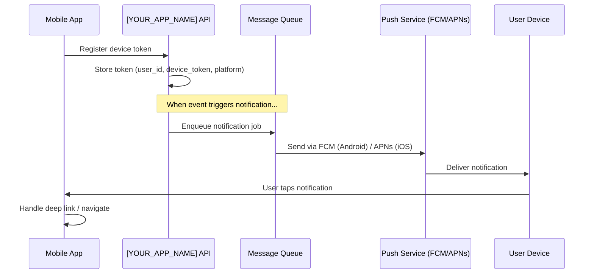
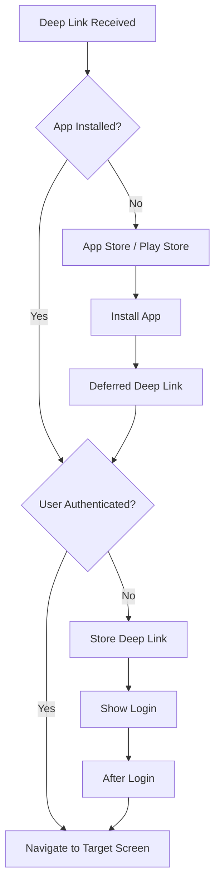

# Mobile Architecture — [YOUR_APP_NAME]

> **Purpose:** Define the mobile architecture for your SaaS application, including
> platform choice rationale, API-first patterns, offline support, push notifications,
> deep linking, and biometric authentication.
>
> **Last Updated:** [DATE]
> **Status:** [Template / In Progress / Complete]
> **Mobile Strategy:** [Native / Cross-Platform / PWA / Not Planned]

---

## Platform Choice

> Document your decision and rationale. For a full decision record, see
> `docs/decisions/PLATFORM_CHOICES.md`.

### Options Evaluated

| Option | Pros | Cons | When to Choose |
|---|---|---|---|
| **React Native** | Code sharing with React web, large ecosystem, Expo for fast dev | Bridge performance, native module complexity | Already have React web developers |
| **Flutter** | Excellent performance, consistent UI, single codebase | Dart (new language), fewer native packages | Building from scratch, UI-heavy app |
| **Native (Swift/Kotlin)** | Best performance, full platform API access | Two separate codebases, higher cost | Performance-critical or platform-specific features |
| **PWA** | No app store, single web codebase | Limited native APIs, no app store visibility | Simple app, quick to market, limited budget |
| **Capacitor / Ionic** | Web skills, native wrapper, plugin ecosystem | Performance overhead, non-native feel | Existing web app, rapid mobile version needed |

### Decision: [YOUR_CHOICE]

**Chosen Platform:** [React Native / Flutter / Native / PWA / Capacitor]
**Rationale:** [Why this choice makes sense for your team, timeline, and product]
**Trade-offs Accepted:** [What you are giving up with this choice]

---

## API-First Architecture

> The mobile app should be a thin client that consumes the same API as the web app.
> Never build mobile-specific backends unless absolutely necessary.

### Architecture Diagram



### API Design Principles for Mobile

| Principle | Description |
|---|---|
| **Single API for all clients** | Web, iOS, Android all use the same endpoints |
| **Pagination on all lists** | Mobile bandwidth is limited; always paginate |
| **Field selection** | Allow clients to request only needed fields (GraphQL, or sparse fieldsets) |
| **Optimistic responses** | Return expected result shape immediately; confirm async |
| **Versioned endpoints** | Use API versioning so mobile apps with old versions still work |
| **Consistent error format** | Standardized error response for client-side handling |
| **Compressed responses** | gzip/brotli compression for bandwidth savings |
| **ETags / conditional requests** | Support `If-None-Match` for cache validation |

### API Response Envelope

```typescript
// Consistent response format for mobile clients
interface ApiResponse<T> {
  data: T | null;
  error: ApiError | null;
  meta?: {
    page?: number;
    pageSize?: number;
    totalCount?: number;
    totalPages?: number;
  };
}

interface ApiError {
  code: string;        // Machine-readable error code
  message: string;     // Human-readable message
  details?: Record<string, string[]>; // Field-level errors
}
```

---

## Offline-First Patterns

> Mobile users frequently lose connectivity. Design for intermittent network.

### Offline Strategy Decision

| Strategy | Description | When to Use |
|---|---|---|
| **Cache-first** | Show cached data, fetch updates in background | Read-heavy features, dashboards |
| **Network-first** | Try network, fall back to cache | Features requiring fresh data |
| **Write-through** | Write to local store and queue for sync | Forms, creation flows |
| **Offline-unavailable** | Show "offline" state, block interaction | Features requiring real-time data (payments, chat) |

### Per-Feature Offline Support

| Feature | Offline Strategy | Local Storage | Sync Approach |
|---|---|---|---|
| Dashboard / Home | Cache-first | Last fetched data | Background refresh |
| [Core Entity] List | Cache-first | SQLite / Async Storage | Pull-to-refresh |
| [Core Entity] Detail | Cache-first | SQLite / Async Storage | Background refresh |
| Create [Core Entity] | Write-through | Local queue | Sync when online |
| Edit [Core Entity] | Write-through | Local queue | Sync when online |
| Search | Network-first | Recent searches cached | Online only |
| Authentication | Cache token | Secure storage | Token refresh on reconnect |
| Notifications | Cache-first | Local notification store | Background fetch |
| Payments / Billing | Offline-unavailable | — | Online only |

### Conflict Resolution

When the same entity is modified offline on multiple devices:

| Strategy | Description | Use When |
|---|---|---|
| Last-write-wins | Most recent timestamp wins | Simple, acceptable data loss |
| Server-wins | Server version always wins | Server is source of truth |
| Client-wins | Local version always wins | Client autonomy matters |
| Merge | Attempt field-level merge, flag conflicts | Collaborative editing |

**Chosen strategy for [YOUR_APP_NAME]:** [Strategy and rationale]

### Local Storage Options

| Storage Type | Use Case | Size Limit | Encrypted |
|---|---|---|---|
| Async Storage / SharedPreferences | Simple key-value (settings, tokens) | ~6MB | No (encrypt manually) |
| SQLite / Realm / WatermelonDB | Structured relational data | Device storage | Optional |
| Secure Storage (Keychain / Keystore) | Tokens, credentials, secrets | Small | Yes (hardware-backed) |
| File system | Downloaded files, images, documents | Device storage | Optional |

---

## Push Notification Architecture

### Architecture Overview



### Device Token Management

```typescript
// Token registration payload
interface DeviceTokenRegistration {
  user_id: string;
  device_token: string;
  platform: 'ios' | 'android' | 'web';
  app_version: string;
  os_version: string;
  device_model: string;
}

// Store in database
// CREATE TABLE device_tokens (
//   id UUID PRIMARY KEY,
//   user_id UUID REFERENCES users(id),
//   device_token TEXT NOT NULL,
//   platform TEXT NOT NULL,
//   app_version TEXT,
//   last_active TIMESTAMPTZ DEFAULT NOW(),
//   created_at TIMESTAMPTZ DEFAULT NOW()
// );
```

### Notification Categories

| Category | Trigger | Priority | Sound | Badge |
|---|---|---|---|---|
| [Transaction Complete] | [Entity] status changes | High | Default | Yes |
| [New Message] | Team member sends message | High | Custom | Yes |
| [Reminder] | Scheduled event approaching | Medium | Default | No |
| [Marketing] | New feature, promotion | Low | None | No |
| [System] | Account security, billing | High | Default | Yes |

### Notification Preferences

Allow users to control which notifications they receive:

```typescript
interface NotificationPreferences {
  user_id: string;
  channels: {
    push: boolean;
    email: boolean;
    in_app: boolean;
  };
  categories: {
    [category: string]: {
      enabled: boolean;
      channels: ('push' | 'email' | 'in_app')[];
    };
  };
  quiet_hours?: {
    enabled: boolean;
    start: string; // "22:00"
    end: string;   // "08:00"
    timezone: string;
  };
}
```

---

## Deep Linking

### URL Scheme

| Link Type | Pattern | Example | Opens |
|---|---|---|---|
| Universal/App Link | `https://[YOUR_DOMAIN]/[path]` | `https://app.example.com/entities/123` | Entity detail screen |
| Custom Scheme | `[yourapp]://[path]` | `yourapp://entities/123` | Entity detail screen |
| Invite Link | `https://[YOUR_DOMAIN]/invite/[code]` | `https://app.example.com/invite/abc123` | Invite acceptance flow |
| Password Reset | `https://[YOUR_DOMAIN]/reset/[token]` | `https://app.example.com/reset/xyz` | Password reset screen |
| Notification | `https://[YOUR_DOMAIN]/n/[id]` | `https://app.example.com/n/456` | Context from notification |

### Deep Link Routing

```typescript
// src/navigation/deepLinkConfig.ts

const linking = {
  prefixes: [
    'https://[YOUR_DOMAIN]',
    '[yourapp]://',
  ],
  config: {
    screens: {
      Dashboard: 'dashboard',
      EntityList: '[entities]',
      EntityDetail: '[entities]/:id',
      Settings: 'settings',
      Profile: 'profile',
      Invite: 'invite/:code',
      NotFound: '*',
    },
  },
};
```

### Deep Link Handling Flow



---

## Biometric Authentication

### Supported Methods

| Method | Platform | API |
|---|---|---|
| Face ID | iOS | LocalAuthentication framework |
| Touch ID | iOS (older devices) | LocalAuthentication framework |
| Fingerprint | Android | BiometricPrompt API |
| Face Recognition | Android | BiometricPrompt API |

### Implementation Pattern

```typescript
// src/auth/biometric.ts

interface BiometricConfig {
  enabled: boolean;
  type: 'face' | 'fingerprint' | 'iris' | 'none';
  fallbackToPasscode: boolean;
}

// Flow:
// 1. User logs in with credentials (first time)
// 2. Prompt: "Enable biometric login?"
// 3. If yes: store auth token in secure storage (Keychain/Keystore)
// 4. Next app open: prompt biometric → retrieve token → authenticate
// 5. If biometric fails: fall back to credential login

async function authenticateWithBiometrics(): Promise<AuthResult> {
  const isAvailable = await checkBiometricAvailability();
  if (!isAvailable) return { success: false, reason: 'not_available' };

  const authenticated = await promptBiometric({
    reason: 'Log in to [YOUR_APP_NAME]',
    fallbackLabel: 'Use password',
  });

  if (!authenticated) return { success: false, reason: 'user_canceled' };

  const token = await getSecureToken();
  if (!token) return { success: false, reason: 'no_stored_token' };

  return { success: true, token };
}
```

### Security Considerations

- [ ] Biometric data never leaves the device (OS handles verification)
- [ ] Auth tokens stored in hardware-backed secure storage
- [ ] Biometric login can be disabled by the user
- [ ] Re-authentication required for sensitive actions (even with biometrics)
- [ ] Fallback to password always available
- [ ] Token expiry still enforced (biometric only unlocks stored token)

---

## Mobile-Specific Considerations

### Performance Targets

| Metric | Target | How to Measure |
|---|---|---|
| Cold start time | < [X] seconds | Profiler / analytics |
| Screen transition | < [X]ms | Frame timing |
| API response (P95) | < [X]ms | APM tool |
| Image load time | < [X]s on 3G | Network throttling test |
| App size (download) | < [X] MB | Store listing |
| Memory usage | < [X] MB | Profiler |
| Battery impact | Minimal background drain | Battery profiler |

### Implementation Checklist

- [ ] Platform choice documented with rationale
- [ ] API-first architecture in place (shared with web)
- [ ] Offline strategy defined per feature
- [ ] Push notification system architecture designed
- [ ] Deep linking configuration for all key screens
- [ ] Biometric auth integrated (if applicable)
- [ ] Performance targets defined and measurable
- [ ] App store compliance reviewed (see [APP_STORE_COMPLIANCE.md](./APP_STORE_COMPLIANCE.md))

---

## Prompt Guide Reference

See [PromptGuide-Architecture.md](./PromptGuide-Architecture.md) for prompts related to mobile architecture generation.

---

*Status: Template*
*Next review: [DATE]*
