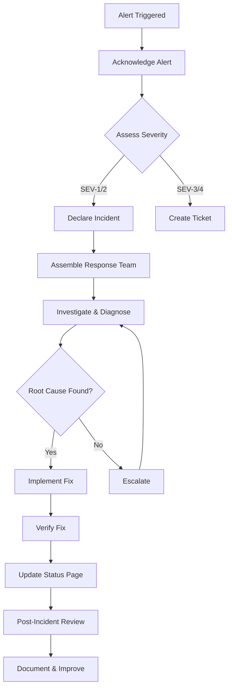

# Reliability — [YOUR_APP_NAME]

> **Purpose:** Define SLA targets, monitoring strategy, error handling patterns,
> backup procedures, incident response, and health check endpoints.
>
> **Last Updated:** [DATE]
> **Status:** [Template / In Progress / Complete]

---

## SLA Target Definitions

### Uptime Targets

| Tier | SLA | Allowed Downtime/Month | Allowed Downtime/Year | Target Audience |
|---|---|---|---|---|
| Standard | 99.9% | ~43 minutes | ~8.7 hours | Most SaaS applications |
| High | 99.95% | ~22 minutes | ~4.4 hours | Business-critical applications |
| Premium | 99.99% | ~4.3 minutes | ~52.6 minutes | Enterprise / financial |

**[YOUR_APP_NAME] Target:** [99.9% / 99.95% / 99.99%]
**Measurement Method:** [Uptime monitoring tool, e.g., Pingdom, UptimeRobot, Datadog]
**Exclusions:** Scheduled maintenance windows, force majeure, third-party outages

### Performance Targets

| Metric | Target | Measurement | Alert Threshold |
|---|---|---|---|
| API Response Time (P50) | < [X]ms | APM tool | > [X]ms |
| API Response Time (P95) | < [X]ms | APM tool | > [X]ms |
| API Response Time (P99) | < [X]ms | APM tool | > [X]ms |
| Page Load Time (LCP) | < [X]s | Real User Monitoring | > [X]s |
| Time to Interactive (TTI) | < [X]s | Lighthouse / RUM | > [X]s |
| Error Rate | < [X]% | Error tracking | > [X]% |
| Database Query Time (P95) | < [X]ms | Query logging | > [X]ms |

### Reliability Targets

| Metric | Target | Measurement |
|---|---|---|
| Mean Time to Detect (MTTD) | < [X] minutes | Time from failure to alert |
| Mean Time to Respond (MTTR) | < [X] minutes | Time from alert to first response |
| Mean Time to Recover (MTTR) | < [X] minutes | Time from alert to resolution |
| Change Failure Rate | < [X]% | Deployments causing incidents / total deployments |
| Deployment Frequency | [X] per [week/day] | CI/CD metrics |

---

## Monitoring Strategy

### Monitoring Layers

```
┌─────────────────────────────────────────────────────────────┐
│                    SYNTHETIC MONITORING                      │
│  External checks: uptime, API health, critical user flows   │
├─────────────────────────────────────────────────────────────┤
│                    REAL USER MONITORING (RUM)                │
│  Frontend: page load, errors, performance, user experience  │
├─────────────────────────────────────────────────────────────┤
│                    APPLICATION MONITORING (APM)              │
│  Backend: request traces, errors, latency, throughput       │
├─────────────────────────────────────────────────────────────┤
│                    INFRASTRUCTURE MONITORING                 │
│  Servers: CPU, memory, disk, network, containers            │
├─────────────────────────────────────────────────────────────┤
│                    DATABASE MONITORING                       │
│  Queries: slow queries, connections, replication lag, size   │
├─────────────────────────────────────────────────────────────┤
│                    LOG AGGREGATION                           │
│  All logs: application, access, error, audit                │
└─────────────────────────────────────────────────────────────┘
```

### Monitoring Tool Selection

| Layer | Tool Options | Chosen Tool | Notes |
|---|---|---|---|
| Synthetic Monitoring | Pingdom, UptimeRobot, Checkly | [YOUR_CHOICE] | [Notes] |
| Real User Monitoring | Datadog RUM, Sentry, LogRocket | [YOUR_CHOICE] | [Notes] |
| APM | Datadog, New Relic, Sentry | [YOUR_CHOICE] | [Notes] |
| Infrastructure | Datadog, CloudWatch, Grafana | [YOUR_CHOICE] | [Notes] |
| Database Monitoring | pganalyze, Datadog, built-in | [YOUR_CHOICE] | [Notes] |
| Log Aggregation | Datadog, Logtail, CloudWatch Logs | [YOUR_CHOICE] | [Notes] |
| Alerting | PagerDuty, Opsgenie, Slack | [YOUR_CHOICE] | [Notes] |
| Status Page | Statuspage.io, Instatus, Cachet | [YOUR_CHOICE] | [Notes] |

### Alert Rules

| Alert | Condition | Severity | Notification Channel | Auto-Resolve |
|---|---|---|---|---|
| API Down | Health check fails 3 consecutive times | Critical | [PagerDuty + Slack] | Yes, on recovery |
| High Error Rate | Error rate > [X]% for 5 minutes | Critical | [PagerDuty + Slack] | Yes |
| Slow API | P95 latency > [X]ms for 10 minutes | Warning | [Slack] | Yes |
| High CPU | CPU > 85% for 10 minutes | Warning | [Slack] | Yes |
| Disk Space | Disk usage > 80% | Warning | [Slack + Email] | No |
| Database Connections | Connection pool > 80% capacity | Warning | [Slack] | Yes |
| Certificate Expiry | SSL cert expires in < 14 days | Warning | [Email] | No |
| Failed Deployments | Deployment fails or rollback triggered | Critical | [Slack] | No |
| Payment Failures | Payment failure rate > [X]% in 1 hour | Critical | [PagerDuty + Slack] | No |

---

## Error Handling Patterns

### Frontend Error Handling

```typescript
// Error boundary for React
// Catches rendering errors and shows fallback UI

class ErrorBoundary extends React.Component<Props, State> {
  static getDerivedStateFromError(error: Error) {
    return { hasError: true, error };
  }

  componentDidCatch(error: Error, errorInfo: ErrorInfo) {
    // Report to error tracking service
    errorTracker.captureException(error, { extra: errorInfo });
  }

  render() {
    if (this.state.hasError) {
      return <ErrorFallback error={this.state.error} onRetry={this.handleRetry} />;
    }
    return this.props.children;
  }
}
```

### API Error Handling

```typescript
// Standardized error response format
interface ApiError {
  status: number;       // HTTP status code
  code: string;         // Machine-readable error code (e.g., 'RESOURCE_NOT_FOUND')
  message: string;      // Human-readable message
  details?: Record<string, string[]>; // Field-level validation errors
  requestId: string;    // For debugging / support tickets
}

// Error handler middleware
function errorHandler(err: Error, req: Request, res: Response, next: NextFunction) {
  const requestId = req.headers['x-request-id'] || generateRequestId();

  // Log the full error internally
  logger.error({
    requestId,
    error: err.message,
    stack: err.stack,
    path: req.path,
    method: req.method,
    userId: req.user?.id,
  });

  // Report to error tracking
  errorTracker.captureException(err, {
    extra: { requestId, path: req.path, userId: req.user?.id },
  });

  // Return sanitized error to client
  const statusCode = err instanceof AppError ? err.statusCode : 500;
  res.status(statusCode).json({
    status: statusCode,
    code: err instanceof AppError ? err.code : 'INTERNAL_ERROR',
    message: statusCode === 500 ? 'An unexpected error occurred' : err.message,
    requestId,
  });
}
```

### Retry Strategy

| Operation | Max Retries | Backoff | Timeout per Attempt |
|---|---|---|---|
| API calls (read) | 3 | Exponential (1s, 2s, 4s) | 10s |
| API calls (write) | 1 (idempotent) or 0 | — | 30s |
| External service calls | 3 | Exponential with jitter | 15s |
| Database queries | 2 | Linear (500ms) | 5s |
| File uploads | 2 | Exponential (2s, 4s) | 60s |

---

## Backup Strategy

### Backup Schedule

| Data | Method | Frequency | Retention | Storage | Tested |
|---|---|---|---|---|---|
| Database (full) | pg_dump / managed backup | Daily | 30 days | [S3 / Cloud storage] | [Date last tested] |
| Database (WAL/incremental) | Continuous archiving | Continuous | 7 days | [S3 / Cloud storage] | [Date last tested] |
| File uploads | Versioned storage | Continuous | Indefinite | [S3 versioning] | [Date last tested] |
| Configuration | Git repository | Every change | Indefinite | [Git host] | N/A |
| Secrets | Secrets manager | Every change | Versioned | [Vault / AWS SM] | [Date last tested] |

### Backup Verification

- [ ] Automated backup verification runs [daily/weekly]
- [ ] Restore procedure documented below
- [ ] Full restore tested within last [X] days
- [ ] Restore time measured: [X] minutes for full database
- [ ] Point-in-time recovery tested for database

### Restore Procedure

```bash
# 1. Identify the backup to restore
# List available backups:
# [YOUR_BACKUP_LIST_COMMAND]

# 2. Stop the application (or switch to maintenance mode)
# [YOUR_MAINTENANCE_MODE_COMMAND]

# 3. Restore the database
# [YOUR_RESTORE_COMMAND, e.g.:]
# pg_restore --dbname=[YOUR_DB] --clean --no-owner [BACKUP_FILE]

# 4. Verify data integrity
# [YOUR_VERIFICATION_COMMAND]

# 5. Restart the application
# [YOUR_RESTART_COMMAND]

# 6. Verify application is working
# curl https://[YOUR_DOMAIN]/api/health
```

---

## Incident Response

### Severity Levels

| Level | Description | Response Time | Communication | Example |
|---|---|---|---|---|
| SEV-1 | Complete outage or data loss | Immediate (< 15 min) | Status page + email + in-app | Application unreachable |
| SEV-2 | Major feature broken, no workaround | < 30 min | Status page + email | Payment processing down |
| SEV-3 | Feature degraded, workaround exists | < 2 hours | Status page | Slow page loads |
| SEV-4 | Minor issue, no user impact | Next business day | Internal tracking | Log noise |

### Incident Response Process



### Incident Communication Template

```markdown
## Incident: [TITLE]
**Severity:** [SEV-1/2/3/4]
**Status:** [Investigating / Identified / Monitoring / Resolved]
**Started:** [TIMESTAMP]
**Last Updated:** [TIMESTAMP]

### Impact
[What is affected and how many users are impacted]

### Current Status
[What we know and what we're doing about it]

### Timeline
- [TIMESTAMP] - Issue detected via [monitoring/user report]
- [TIMESTAMP] - Investigation started
- [TIMESTAMP] - Root cause identified: [brief description]
- [TIMESTAMP] - Fix deployed
- [TIMESTAMP] - Issue resolved

### Next Steps
[Preventive measures being taken]
```

### Post-Incident Review Template

| Field | Details |
|---|---|
| Incident Title | [Title] |
| Severity | [SEV level] |
| Duration | [Start to resolution] |
| Impact | [Users affected, revenue impact] |
| Root Cause | [Technical root cause] |
| Contributing Factors | [What made it worse] |
| What Went Well | [Effective responses] |
| What Went Poorly | [Gaps in response] |
| Action Items | [Numbered list with owners and deadlines] |

---

## Health Check Endpoints

### Endpoints

| Endpoint | Purpose | Checks | Response Time Target |
|---|---|---|---|
| `GET /api/health` | Basic liveness | App is running | < 100ms |
| `GET /api/health/ready` | Readiness | Database, cache, external services | < 500ms |
| `GET /api/health/detailed` | Detailed status (internal only) | All subsystems | < 2s |

### Health Check Implementation

```typescript
// GET /api/health — Simple liveness check
// Returns 200 if the process is running
app.get('/api/health', (req, res) => {
  res.status(200).json({ status: 'ok', timestamp: new Date().toISOString() });
});

// GET /api/health/ready — Readiness check
// Returns 200 if all dependencies are available
app.get('/api/health/ready', async (req, res) => {
  const checks = await Promise.allSettled([
    checkDatabase(),
    checkCache(),
    checkExternalServices(),
  ]);

  const results = {
    database: checks[0].status === 'fulfilled' ? 'ok' : 'error',
    cache: checks[1].status === 'fulfilled' ? 'ok' : 'error',
    external: checks[2].status === 'fulfilled' ? 'ok' : 'error',
  };

  const allHealthy = Object.values(results).every(s => s === 'ok');

  res.status(allHealthy ? 200 : 503).json({
    status: allHealthy ? 'ok' : 'degraded',
    checks: results,
    timestamp: new Date().toISOString(),
  });
});

// GET /api/health/detailed — Internal detailed check
// Protected by internal network or API key
app.get('/api/health/detailed', authorize('platform_admin'), async (req, res) => {
  res.json({
    status: 'ok',
    version: process.env.APP_VERSION,
    uptime: process.uptime(),
    memory: process.memoryUsage(),
    database: await getDatabaseStats(),
    cache: await getCacheStats(),
    queues: await getQueueStats(),
    timestamp: new Date().toISOString(),
  });
});
```

---

## Implementation Checklist

- [ ] SLA targets defined and communicated
- [ ] Monitoring tools selected and configured
- [ ] Alert rules configured with appropriate thresholds
- [ ] Error handling standardized across frontend and backend
- [ ] Retry logic implemented for transient failures
- [ ] Backup schedule running and verified
- [ ] Restore procedure documented and tested
- [ ] Incident severity levels defined
- [ ] Incident response process documented
- [ ] Communication templates prepared
- [ ] Health check endpoints implemented
- [ ] Status page configured and accessible
- [ ] On-call rotation established (if applicable)

---

## Prompt Guide Reference

See [PromptGuide-Architecture.md](./PromptGuide-Architecture.md) for prompts related to reliability architecture and monitoring setup.

---

*Status: Template*
*Next review: [DATE]*
