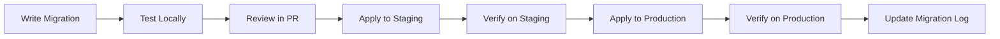
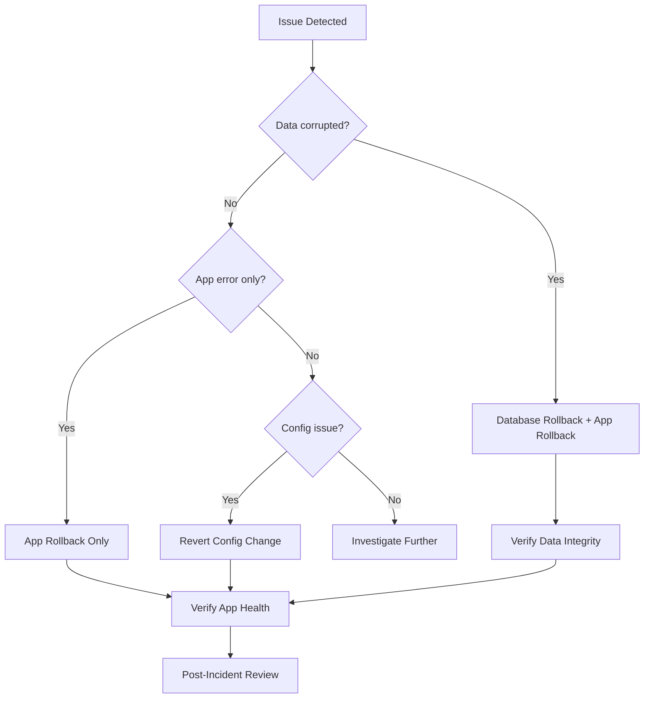
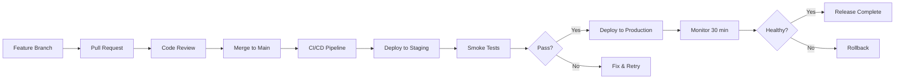

# Version Management — [YOUR_APP_NAME]

> **Purpose:** Define versioning policies, database migration strategies, API versioning,
> rollback procedures, feature flags for gradual rollout, and changelog standards.
>
> **Last Updated:** [DATE]
> **Status:** [Template / In Progress / Complete]

---

## Semantic Versioning Policy

### Version Format: `MAJOR.MINOR.PATCH`

| Component | When to Increment | Example |
|---|---|---|
| **MAJOR** | Breaking changes that require user action or client updates | `1.0.0` → `2.0.0` |
| **MINOR** | New features that are backward-compatible | `1.0.0` → `1.1.0` |
| **PATCH** | Bug fixes and minor improvements, no new features | `1.0.0` → `1.0.1` |

### Pre-Release Tags

| Tag | Meaning | Example |
|---|---|---|
| `-alpha.N` | Internal testing, unstable | `2.0.0-alpha.1` |
| `-beta.N` | External testing, feature-complete but may have bugs | `2.0.0-beta.1` |
| `-rc.N` | Release candidate, ready for production unless bugs found | `2.0.0-rc.1` |

### Version Sources

| Surface | Version Source | Update Method |
|---|---|---|
| `package.json` | Source of truth | `npm version [major|minor|patch]` |
| API responses | `X-API-Version` header | Read from `package.json` at build time |
| Mobile apps | `CFBundleShortVersionString` / `versionName` | Managed separately per platform |
| Status page | Displayed version | Read from deployed environment |
| Changelog | Human-readable history | Updated with each release |

### Release Naming Convention

```
v[MAJOR].[MINOR].[PATCH]    — e.g., v1.2.3
```

Releases are tagged in Git:
```bash
git tag -a v1.2.3 -m "Release v1.2.3: [brief description]"
git push origin v1.2.3
```

---

## Database Migration Strategy

### Migration Tool: [Prisma Migrate / Knex / golang-migrate / Flyway / custom]

### Migration Naming Convention

```
[TIMESTAMP]_[description].sql
# or for ORM-based migrations:
[TIMESTAMP]_[description].[ext]

# Examples:
20250115_create_users_table.sql
20250120_add_organization_id_to_entities.sql
20250125_create_subscriptions_table.sql
```

### Migration Rules

| Rule | Description |
|---|---|
| **Forward-only** | Never edit a migration that has been applied to staging or production |
| **Atomic** | Each migration should be a complete, self-contained change |
| **Reversible** | Include a `down` migration for every `up` (when possible) |
| **Non-destructive first** | Add new columns/tables before removing old ones |
| **Data migrations separate** | Schema changes and data migrations should be separate files |
| **Tested** | Run migration against a copy of production data before applying |

### Safe Migration Patterns

| Operation | Safe Pattern | Unsafe Pattern |
|---|---|---|
| Add column | `ALTER TABLE ADD COLUMN ... DEFAULT NULL` | Adding NOT NULL column without default |
| Rename column | Add new → migrate data → remove old (3 deploys) | `ALTER TABLE RENAME COLUMN` |
| Remove column | Stop reading → deploy → remove column | Remove column while code reads it |
| Add index | `CREATE INDEX CONCURRENTLY` (PostgreSQL) | `CREATE INDEX` (locks table) |
| Change column type | Add new column → migrate → remove old | `ALTER COLUMN TYPE` |
| Add table | `CREATE TABLE IF NOT EXISTS` | — |
| Remove table | Verify no references → `DROP TABLE` | Drop while code references it |

### Migration Workflow



### Migration Log

| Migration | Applied (Staging) | Applied (Production) | Verified | Notes |
|---|---|---|---|---|
| `[TIMESTAMP]_[description]` | [DATE] | [DATE] | [Yes/No] | [Notes] |

---

## API Versioning

### Strategy: [URL Path / Header / Query Parameter]

| Strategy | Example | When to Use |
|---|---|---|
| URL Path | `/api/v1/users`, `/api/v2/users` | Simple, visible, most common for REST |
| Header | `Accept: application/vnd.[app].v1+json` | Cleaner URLs, harder to test in browser |
| Query Parameter | `/api/users?version=1` | Easy migration, less standard |

### Chosen Strategy: [YOUR_CHOICE]

### API Version Lifecycle

```
  ┌──────────┐     ┌──────────┐     ┌──────────┐     ┌──────────┐
  │  Active   │────▶│Deprecated│────▶│  Sunset  │────▶│ Removed  │
  │           │     │(6 months)│     │(3 months)│     │          │
  └──────────┘     └──────────┘     └──────────┘     └──────────┘
```

| State | Meaning | Communication |
|---|---|---|
| **Active** | Current recommended version | Default in documentation |
| **Deprecated** | Still works but will be removed | `Sunset` and `Deprecation` response headers |
| **Sunset** | Final warning period | 410 Gone after sunset date |
| **Removed** | No longer available | 410 Gone with migration guide link |

### Deprecation Headers

```typescript
// When an API version is deprecated, include these headers:
res.setHeader('Deprecation', 'true');
res.setHeader('Sunset', 'Sat, 01 Jan 2026 00:00:00 GMT');
res.setHeader('Link', '</api/v2/docs>; rel="successor-version"');
```

### API Version Inventory

| Version | Status | Release Date | Deprecation Date | Sunset Date | Notes |
|---|---|---|---|---|---|
| v1 | [Active/Deprecated] | [DATE] | [DATE or N/A] | [DATE or N/A] | [Notes] |
| v2 | [Active] | [DATE] | N/A | N/A | [Notes] |

---

## Rollback Procedures

### Application Rollback

```bash
# Option 1: Revert to previous deployment (platform-specific)
# Vercel:
# vercel rollback [deployment-url]

# Option 2: Revert Git and redeploy
# git revert HEAD
# git push origin main

# Option 3: Deploy specific version
# [YOUR_DEPLOY_COMMAND] --version=[PREVIOUS_VERSION]
```

### Database Rollback

```bash
# Option 1: Run down migration
# [YOUR_MIGRATION_TOOL] migrate:down

# Option 2: Point-in-time recovery
# Restore database to timestamp before migration
# [YOUR_RESTORE_COMMAND] --target-time="[TIMESTAMP]"

# Option 3: Restore from backup
# [YOUR_RESTORE_FROM_BACKUP_COMMAND]
```

### Rollback Decision Tree



### Rollback Checklist

- [ ] Identify the exact version/commit to roll back to
- [ ] Notify the team that a rollback is in progress
- [ ] Determine if database rollback is needed (usually not for app-only issues)
- [ ] Execute the rollback
- [ ] Verify health check endpoints return healthy
- [ ] Verify critical user flows work
- [ ] Monitor error rates for 30 minutes
- [ ] Update status page
- [ ] Schedule post-incident review

---

## Feature Flags for Gradual Rollout

### Feature Flag Strategy

| Flag Type | Lifetime | Use Case | Example |
|---|---|---|---|
| Release flag | Days to weeks | Gradual rollout of new features | `new_dashboard_v2` |
| Experiment flag | Weeks | A/B testing | `checkout_flow_variant_b` |
| Ops flag | Permanent | Operational controls (kill switches) | `enable_email_notifications` |
| Permission flag | Permanent | Feature entitlements by plan | `advanced_analytics` |

### Feature Flag Implementation

```typescript
// src/lib/featureFlags.ts

interface FeatureFlag {
  key: string;
  enabled: boolean;
  rolloutPercentage?: number;  // 0-100
  enabledForOrgs?: string[];   // Specific org IDs
  enabledForUsers?: string[];  // Specific user IDs
}

export function isFeatureEnabled(
  flagKey: string,
  context: { userId?: string; orgId?: string }
): boolean {
  const flag = getFlag(flagKey);

  if (!flag || !flag.enabled) return false;

  // Check user-specific override
  if (context.userId && flag.enabledForUsers?.includes(context.userId)) return true;

  // Check org-specific override
  if (context.orgId && flag.enabledForOrgs?.includes(context.orgId)) return true;

  // Check percentage rollout
  if (flag.rolloutPercentage !== undefined) {
    const hash = hashString(`${flagKey}-${context.userId || context.orgId}`);
    return (hash % 100) < flag.rolloutPercentage;
  }

  return flag.enabled;
}
```

### Gradual Rollout Process

```
Day 0: Flag created, enabled for internal team (0% public)
Day 1: Enable for 5% of users, monitor errors/performance
Day 3: If healthy, increase to 25%
Day 5: If healthy, increase to 50%
Day 7: If healthy, increase to 100%
Day 14: Remove feature flag, clean up code
```

### Feature Flag Registry

| Flag Key | Type | Status | Rollout % | Created | Target Removal |
|---|---|---|---|---|---|
| `[flag_name]` | Release | [Active/Retired] | [X]% | [DATE] | [DATE] |
| `[flag_name]` | Experiment | [Active/Retired] | [X]% | [DATE] | [DATE] |
| `[flag_name]` | Ops | Active (permanent) | 100% | [DATE] | N/A |

---

## Changelog

### Format: [Keep a Changelog](https://keepachangelog.com/)

```markdown
# Changelog

All notable changes to [YOUR_APP_NAME] are documented in this file.

The format is based on [Keep a Changelog](https://keepachangelog.com/en/1.1.0/),
and this project adheres to [Semantic Versioning](https://semver.org/).

## [Unreleased]

### Added
- [New feature description]

### Changed
- [Modification to existing feature]

### Deprecated
- [Feature that will be removed in a future version]

### Removed
- [Feature that was removed]

### Fixed
- [Bug fix description]

### Security
- [Security fix or improvement]

---

## [X.Y.Z] — YYYY-MM-DD

### Added
- [Feature 1]
- [Feature 2]

### Fixed
- [Bug fix 1]

### Changed
- [Change 1]
```

### Changelog Rules

1. Every PR should include a changelog entry (or explicitly note "No changelog needed")
2. Entries are written from the user's perspective, not the developer's
3. Group entries by type: Added, Changed, Deprecated, Removed, Fixed, Security
4. Link to PRs or issues where applicable
5. Date format: `YYYY-MM-DD`

---

## Release Process

### Pre-Release Checklist

- [ ] All tests passing on `main`
- [ ] Changelog updated with all changes
- [ ] Version bumped (`npm version [type]`)
- [ ] Database migrations tested on staging
- [ ] Feature flags configured for gradual rollout
- [ ] Rollback procedure reviewed

### Release Workflow



---

## Implementation Checklist

- [ ] Semantic versioning policy communicated
- [ ] Migration tool configured and documented
- [ ] Safe migration patterns followed
- [ ] API versioning strategy implemented (if applicable)
- [ ] Rollback procedures documented and tested
- [ ] Feature flag system implemented
- [ ] Changelog format established
- [ ] Release process documented
- [ ] CI/CD pipeline enforces versioning rules

---

## Prompt Guide Reference

See [PromptGuide-Architecture.md](./PromptGuide-Architecture.md) for prompts related to migration generation and release planning.

---

*Status: Template*
*Next review: [DATE]*
