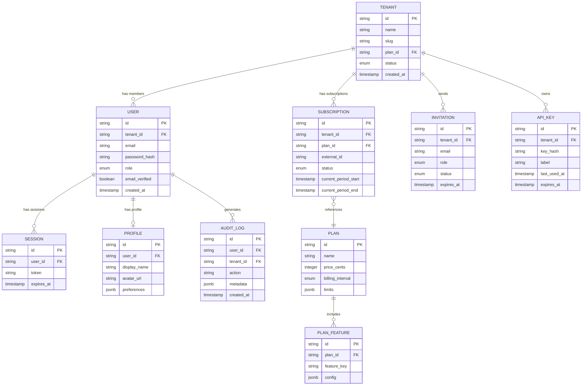

# Domain Model Developer Guide

> Understanding the core entities, their relationships, and how they map to code.

## Entity-Relationship Diagram



## Entity Descriptions

### Tenant
The top-level organizational unit. All resources are scoped to a tenant. In single-user mode, each user has exactly one tenant.

### User
An authenticated individual belonging to a tenant. Users have roles (`owner`, `admin`, `member`) that determine their permissions within the tenant.

### Profile
Extended user information separated from auth concerns. Contains display preferences and avatar.

### Subscription
Tracks the tenant's billing relationship. Links to an external payment provider (e.g., Stripe) via `external_id`.

### Plan
Defines what features and limits a subscription tier provides. Plans contain feature flags and usage limits as structured JSON.

### Invitation
Pending team member invitations. Tracks status through `pending` -> `accepted` | `expired` | `revoked`.

### Audit Log
Immutable record of significant actions for compliance and debugging.

---

## TypeScript Type Mappings

```typescript
// {PROJECT_NAME}/src/types/domain.ts

interface Tenant {
  id: string;
  name: string;
  slug: string;
  planId: string;
  status: "active" | "suspended" | "cancelled";
  createdAt: Date;
}

interface User {
  id: string;
  tenantId: string;
  email: string;
  role: "owner" | "admin" | "member";
  emailVerified: boolean;
  createdAt: Date;
}

interface Subscription {
  id: string;
  tenantId: string;
  planId: string;
  externalId: string; // e.g., Stripe subscription ID
  status: "active" | "past_due" | "cancelled" | "trialing";
  currentPeriodStart: Date;
  currentPeriodEnd: Date;
}

interface Plan {
  id: string;
  name: string;
  priceCents: number;
  billingInterval: "monthly" | "yearly";
  limits: Record<string, number>;
}

// TODO: Add remaining entity types for your project
```

---

## Common Query Patterns

### Get tenant with active subscription
```typescript
// TODO: Adapt to your ORM / query builder
async function getTenantWithSubscription(tenantId: string) {
  const tenant = await db.tenant.findUnique({
    where: { id: tenantId },
    include: {
      subscriptions: {
        where: { status: "active" },
        include: { plan: true },
      },
    },
  });
  return tenant;
}
```

### Check feature access
```typescript
async function hasFeatureAccess(tenantId: string, featureKey: string): Promise<boolean> {
  const subscription = await getActiveSubscription(tenantId);
  if (!subscription) return false;

  const feature = await db.planFeature.findFirst({
    where: {
      planId: subscription.planId,
      featureKey,
    },
  });
  return feature !== null;
}
```

### List tenant members with roles
```typescript
async function getTenantMembers(tenantId: string) {
  return db.user.findMany({
    where: { tenantId },
    include: { profile: true },
    orderBy: { createdAt: "asc" },
  });
}
```

---

## Extending the Domain Model

When adding a new entity:

1. Add it to the ER diagram above
2. Define the TypeScript interface in `src/types/domain.ts`
3. Create the database migration
4. Add query patterns to the relevant service layer
5. Update the audit log to track operations on the new entity

---

## Related Docs

- [Architecture](./02-architecture.md) -- How these entities fit into system layers
- [Key Flows](./03-key-flows.md) -- How entities interact during operations
