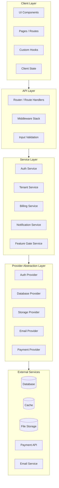
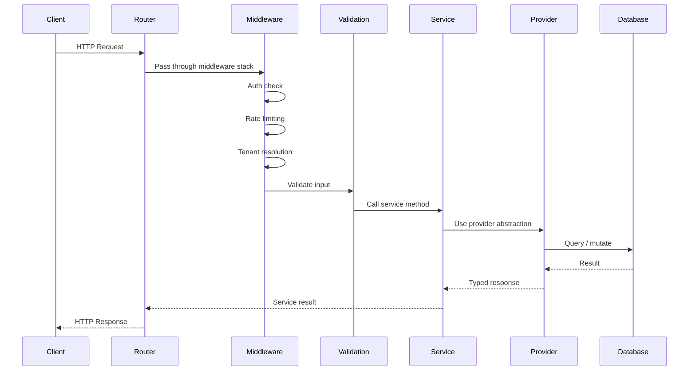
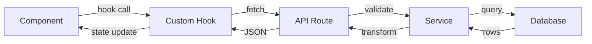
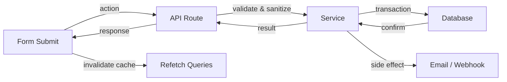
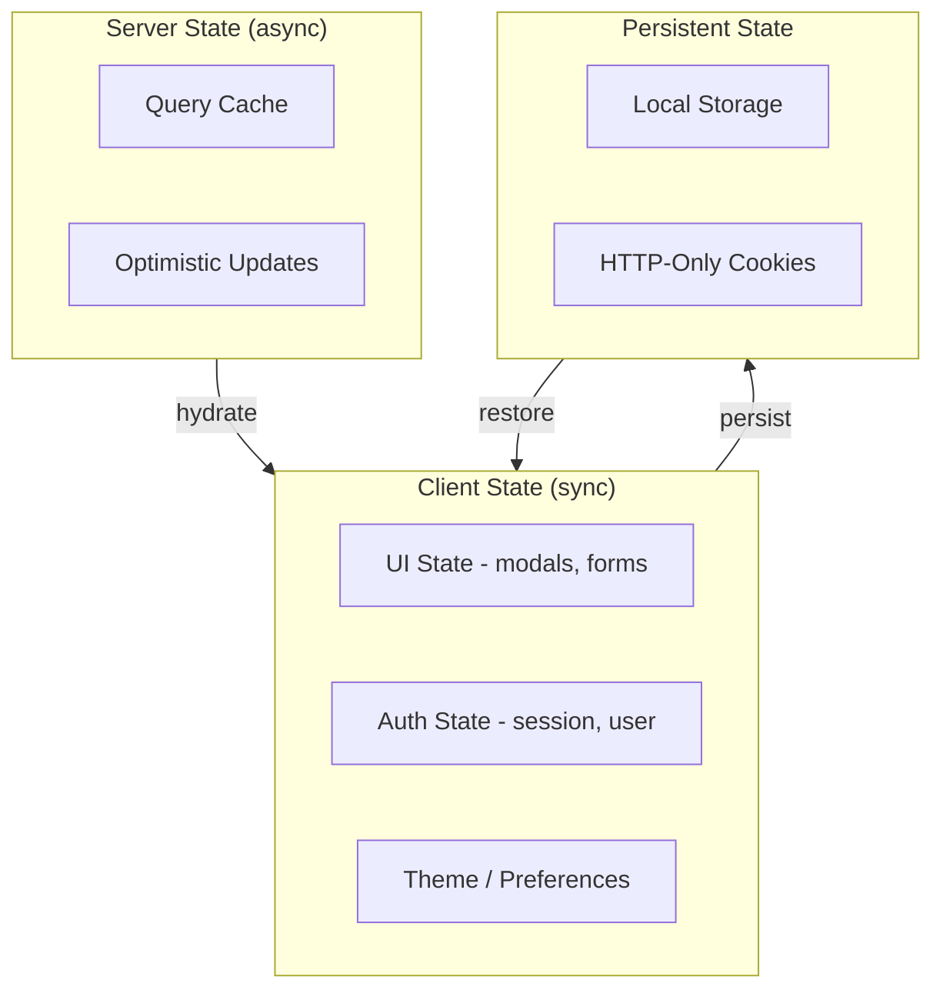

# System Architecture Developer Guide

> How the system is structured in layers, how data flows, and how components interact.

## System Layers



## Request Lifecycle



## Data Flow Patterns

### Read Path (Query)


### Write Path (Mutation)


---

## Component Interaction Patterns

### Service-to-Service Communication
Services communicate through direct method calls, never through HTTP internally.

```typescript
// {PROJECT_NAME}/src/services/billing.service.ts
class BillingService {
  constructor(
    private tenantService: TenantService,
    private notificationService: NotificationService,
    private paymentProvider: PaymentProvider,
  ) {}

  async upgradePlan(tenantId: string, newPlanId: string) {
    const tenant = await this.tenantService.getById(tenantId);
    const result = await this.paymentProvider.updateSubscription(/* ... */);
    await this.notificationService.sendPlanChanged(tenant, newPlanId);
    return result;
  }
}
```

### Middleware Stack

```typescript
// {PROJECT_NAME}/src/middleware/stack.ts
const protectedRoute = [
  rateLimiter({ windowMs: 60_000, max: 100 }),
  authenticate(),        // Verify token, attach user to context
  resolveTenant(),       // Resolve tenant from user or header
  checkSubscription(),   // Verify active subscription
  // Route handler runs here
];

const adminRoute = [
  ...protectedRoute,
  requireRole("admin"),  // Verify user role
];
```

---

## State Management Architecture



### State Categories

| Category | Examples | Storage | Tool |
|----------|----------|---------|------|
| Server state | Entities, lists, counts | Query cache | React Query / SWR / tRPC |
| Auth state | Session, user, permissions | Cookie + context | Auth provider SDK |
| UI state | Modals, sidebar, form drafts | Component / context | React state / Zustand |
| Preferences | Theme, locale, layout | Local storage | Custom hook |

---

## Error Handling Patterns

### Error Hierarchy
```typescript
// {PROJECT_NAME}/src/lib/errors.ts
class AppError extends Error {
  constructor(message: string, public code: string, public statusCode: number) {
    super(message);
  }
}

class NotFoundError extends AppError {
  constructor(resource: string, id: string) {
    super(`${resource} not found: ${id}`, "NOT_FOUND", 404);
  }
}

class ForbiddenError extends AppError {
  constructor(msg = "Insufficient permissions") { super(msg, "FORBIDDEN", 403); }
}

class ValidationError extends AppError {
  constructor(public details: Record<string, string[]>) {
    super("Validation failed", "VALIDATION_ERROR", 400);
  }
}
```

### Global Error Handler
```typescript
function errorHandler(err: Error, req: Request, res: Response) {
  if (err instanceof AppError) {
    return res.status(err.statusCode).json({ error: { code: err.code, message: err.message } });
  }
  logger.error("Unhandled error", { error: err, path: req.path });
  return res.status(500).json({ error: { code: "INTERNAL_ERROR", message: "An unexpected error occurred" } });
}
```

---

## Key Architectural Decisions

| Decision | Choice | Rationale |
|----------|--------|-----------|
| API style | REST / tRPC / GraphQL | {FILL_IN} |
| State management | {TOOL} | {FILL_IN} |
| Database | {DATABASE} | {FILL_IN} |
| Auth | {PROVIDER} | {FILL_IN} |
| Deployment | {PLATFORM} | {FILL_IN} |

---

## Related Docs

- [Domain Model](./01-domain-model.md) -- The entities these layers operate on
- [Key Flows](./03-key-flows.md) -- How these layers collaborate in real operations
- [Backend Flexibility](./backend-flexibility.md) -- Deep dive on the provider abstraction layer
