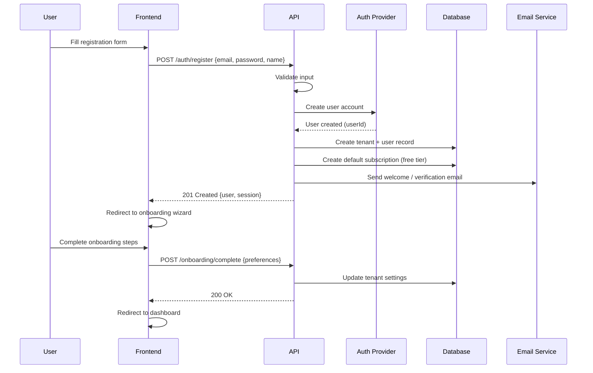
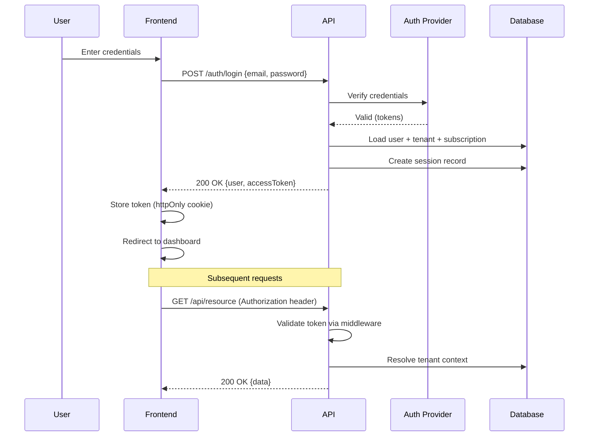
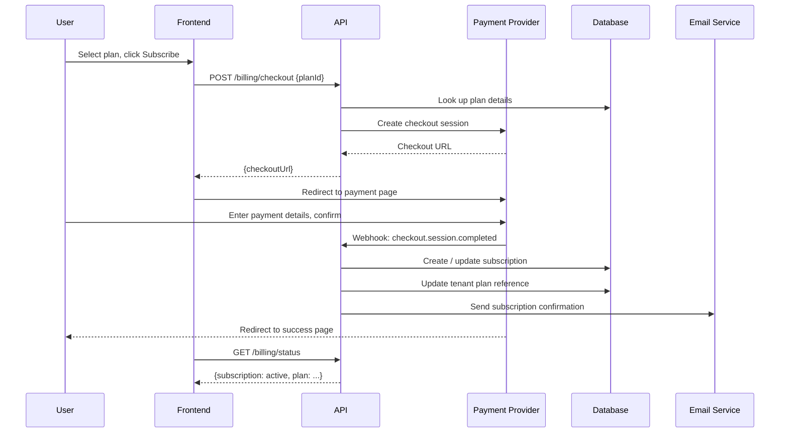
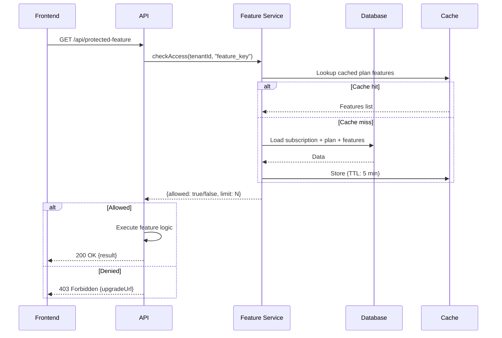
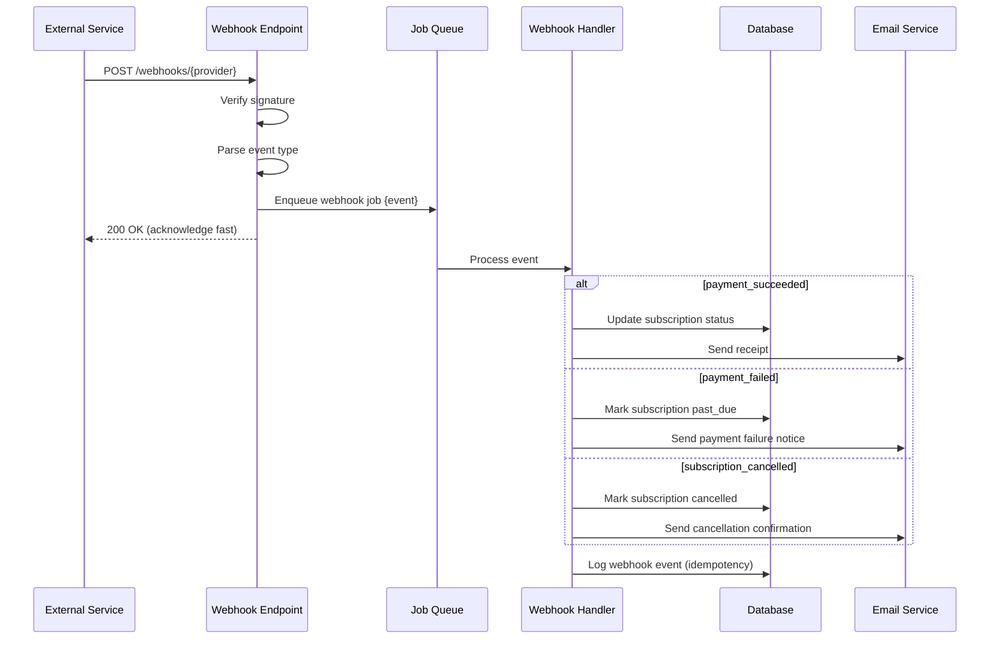
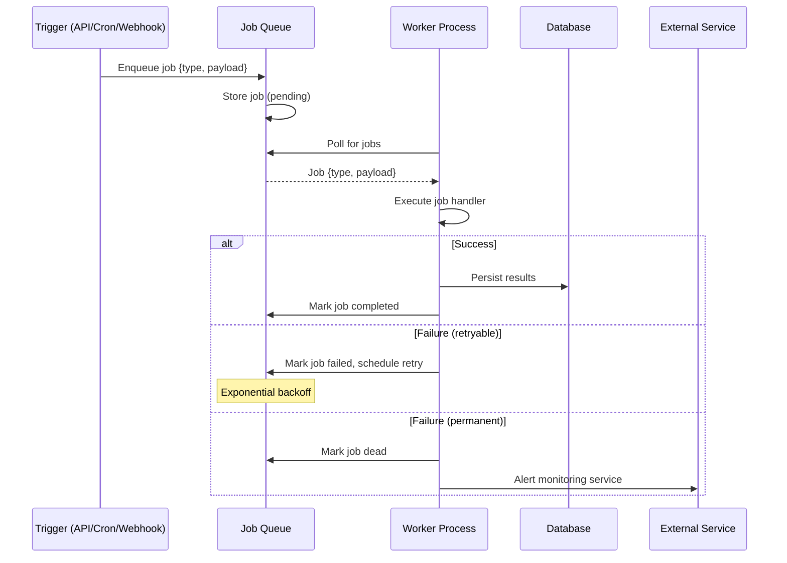

# Key Flows

> Sequence diagrams for the most important operations in the system. Use these as references when tracing bugs, onboarding, or adding new flows.

## User Registration and Onboarding



## Authentication Flow



## Subscription Purchase



## Feature Access Check



## Webhook Processing



## Background Job Execution



---

## Template: Adding a Custom Flow

Use this template when documenting a new flow:

```markdown
## {Flow Name}

**Trigger:** {What initiates this flow}
**Actors:** {Who/what is involved}
**Outcome:** {What state changes result}

\`\`\`mermaid
sequenceDiagram
    participant A as {Actor 1}
    participant B as {Actor 2}
    participant C as {Actor 3}

    A->>B: {Step 1 description}
    B->>C: {Step 2 description}
    C-->>B: {Response}
    B-->>A: {Final response}
\`\`\`

### Error Cases
- {Error scenario 1}: {How it is handled}
- {Error scenario 2}: {How it is handled}

### Side Effects
- {Side effect 1, e.g., email sent}
- {Side effect 2, e.g., audit log entry}
```

---

## Related Docs

- [Architecture](./02-architecture.md) -- The layers these flows traverse
- [Integrations](./04-integrations.md) -- External services referenced in these flows
- [Scenarios](./05-scenarios.md) -- Full end-to-end user journeys built from these flows
