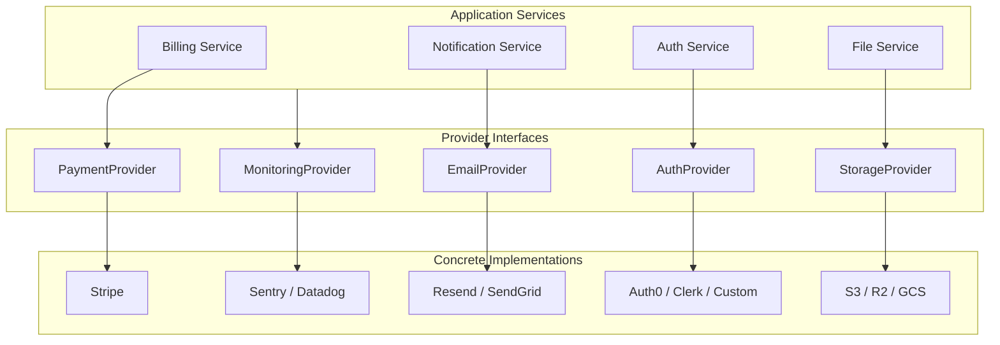

# External Integrations

> How external services are abstracted, configured, and integrated into the platform.

## Integration Architecture



## Provider Abstraction Pattern

Every external integration follows the same pattern: define an interface, then implement it per provider.

```typescript
// 1. Define the interface
interface EmailProvider {
  send(params: SendEmailParams): Promise<EmailResult>;
  sendBatch(params: SendEmailParams[]): Promise<EmailResult[]>;
}

// 2. Implement per provider
class ResendEmailProvider implements EmailProvider {
  constructor(private apiKey: string) {}
  async send(params: SendEmailParams): Promise<EmailResult> {
    const result = await new Resend(this.apiKey).emails.send({
      from: config.email.fromAddress,
      to: params.to,
      subject: params.subject,
      html: params.html,
    });
    return { id: result.id, status: "sent" };
  }
  // ... remaining methods
}
```

---

## Payment Integration

```typescript
interface PaymentProvider {
  createCustomer(params: CreateCustomerParams): Promise<Customer>;
  createCheckoutSession(params: CheckoutParams): Promise<{ url: string }>;
  createPortalSession(customerId: string): Promise<{ url: string }>;
  cancelSubscription(subscriptionId: string): Promise<void>;
  constructWebhookEvent(body: string, signature: string): WebhookEvent;
}
```

## Email Integration

| Provider | Best For | Configuration Key |
|----------|----------|-------------------|
| Resend | Developer-friendly API, React emails | `EMAIL_PROVIDER=resend` |
| SendGrid | High volume, marketing + transactional | `EMAIL_PROVIDER=sendgrid` |
| SMTP | Self-hosted, legacy systems | `EMAIL_PROVIDER=smtp` |
| Console | Local development (logs to stdout) | `EMAIL_PROVIDER=console` |

## Auth Integration

```typescript
interface AuthProvider {
  createUser(params: CreateUserParams): Promise<AuthUser>;
  verifyCredentials(email: string, password: string): Promise<AuthUser>;
  generateTokens(userId: string): Promise<TokenPair>;
  verifyToken(token: string): Promise<TokenPayload>;
  revokeToken(token: string): Promise<void>;
  sendPasswordReset(email: string): Promise<void>;
}
```

See [Authentication Guide](./06-authentication.md) for full details.

## Storage Integration

```typescript
interface StorageProvider {
  upload(key: string, data: Buffer, contentType: string): Promise<string>;
  download(key: string): Promise<Buffer>;
  getSignedUrl(key: string, expiresIn: number): Promise<string>;
  delete(key: string): Promise<void>;
  list(prefix: string): Promise<StorageObject[]>;
}
```

## Monitoring Integration

```typescript
interface MonitoringProvider {
  captureException(error: Error, context?: Record<string, unknown>): void;
  captureMessage(message: string, level: "info" | "warning" | "error"): void;
  startTransaction(name: string): Transaction;
  setUser(user: { id: string; email: string }): void;
}
```

---

## Webhook Handling Pattern

```typescript
// {PROJECT_NAME}/src/api/webhooks/handler.ts
async function handleWebhook(provider: string, req: Request, res: Response) {
  // 1. Verify signature (provider-specific)
  const event = verifyWebhookSignature(provider, req);

  // 2. Check idempotency
  const existing = await db.webhookEvent.findUnique({ where: { externalId: event.id } });
  if (existing) return res.status(200).json({ status: "already_processed" });

  // 3. Log the raw event
  await db.webhookEvent.create({
    data: { externalId: event.id, provider, type: event.type, payload: event },
  });

  // 4. Enqueue for processing (respond quickly)
  await jobQueue.enqueue("process_webhook", { eventId: event.id });

  return res.status(200).json({ status: "accepted" });
}
```

---

## API Key Management

```typescript
// Store only hashed keys in the database
function generateApiKey(): { raw: string; hash: string } {
  const raw = `sk_${crypto.randomBytes(32).toString("hex")}`;
  const hash = crypto.createHash("sha256").update(raw).digest("hex");
  return { raw, hash };
}

function verifyApiKey(raw: string, storedHash: string): boolean {
  const hash = crypto.createHash("sha256").update(raw).digest("hex");
  return crypto.timingSafeEqual(Buffer.from(hash), Buffer.from(storedHash));
}
```

### Key Rotation
1. Generate a new key pair
2. Store new hash, keep old hash active (grace period)
3. Client switches to new key
4. Revoke old key after grace period

---

## Adding a New Integration

1. Define the provider interface in `src/providers/types.ts`
2. Create implementation in `src/providers/{category}/{provider}.ts`
3. Register in the provider factory
4. Add environment variables to `.env.example`
5. Add webhook endpoint if applicable
6. Document in this file

---

## Related Docs

- [Backend Flexibility](./backend-flexibility.md) -- The full provider abstraction pattern
- [Payments Setup](./payments-setup.md) -- Detailed Stripe integration walkthrough
- [Email System](./email-system.md) -- Email provider deep dive
