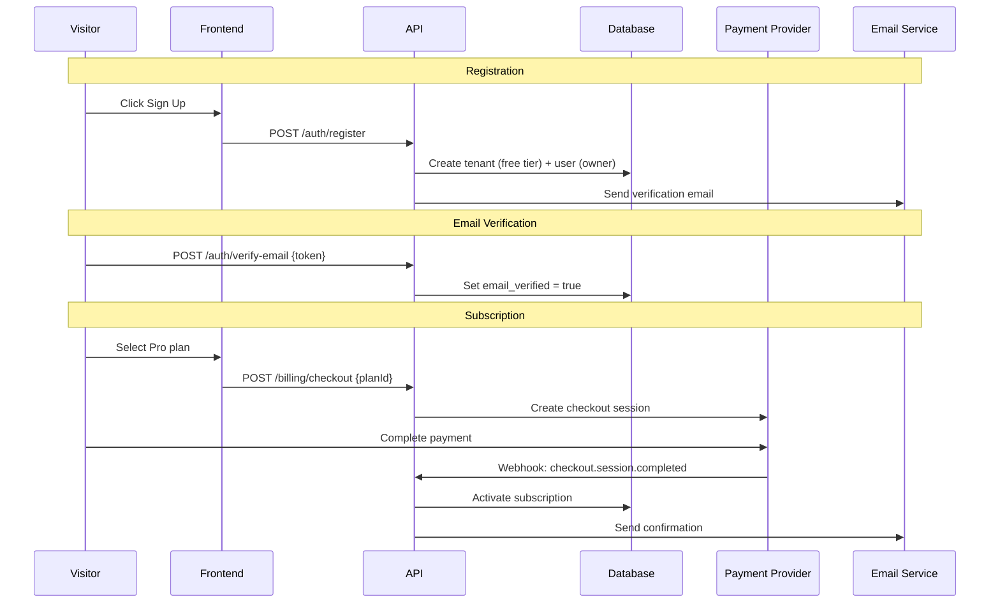
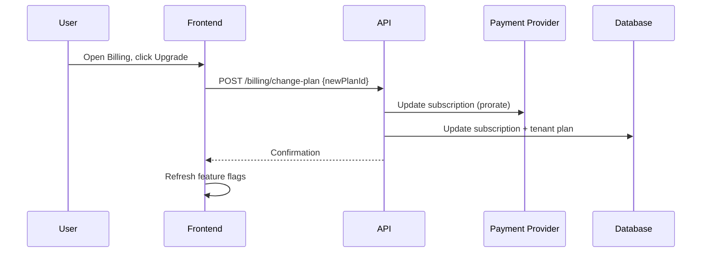
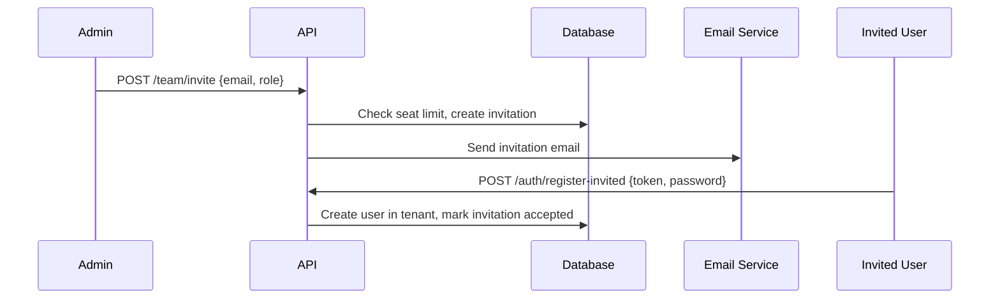
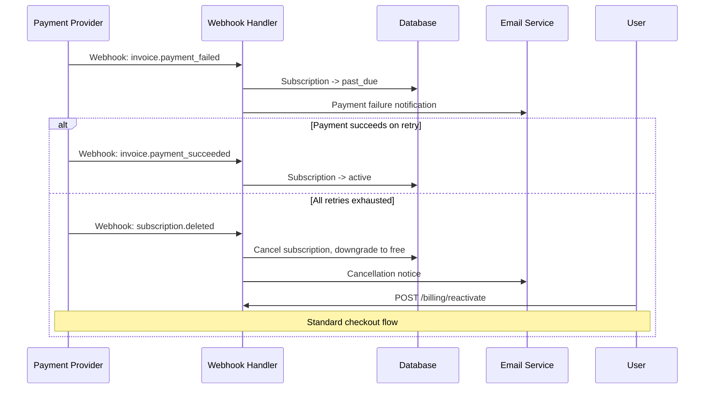
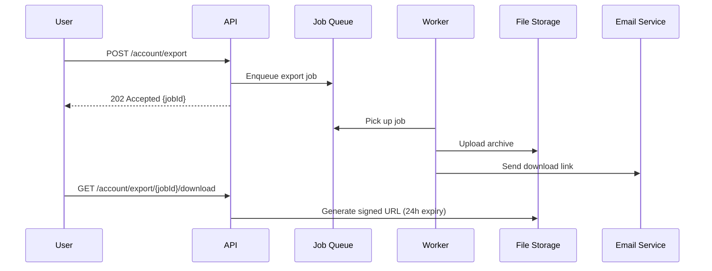

# End-to-End Scenarios

> Complete user journey walkthroughs showing how all system components collaborate.

## Scenario Format

Each scenario includes: **Actors**, **Preconditions**, **Steps** (with diagram), **Postconditions**, and **Verification checklist**.

---

## Scenario 1: New User Signs Up and Activates Subscription

**Actors:** Anonymous visitor | **Postconditions:** Active tenant with paid subscription



### Verify
- [ ] Tenant created with default plan, user has `owner` role
- [ ] Subscription linked to payment provider, features updated

---

## Scenario 2: User Upgrades Plan

**Actors:** Authenticated owner/admin | **Postconditions:** Higher tier active, prorated billing



### Verify
- [ ] Proration correct, new features accessible immediately
- [ ] Downgrade path available (reverse flow)

---

## Scenario 3: Admin Manages Team Members

**Actors:** Admin, invited user | **Postconditions:** New member in tenant



### Verify
- [ ] Seat limit enforced per plan, invitation expires after configured period
- [ ] Role correctly assigned, admin can revoke pending invitations

---

## Scenario 4: Payment Fails and Recovery

**Actors:** System (automated), affected user | **Postconditions:** Recovered or downgraded



### Verify
- [ ] Grace period before restriction, data preserved on downgrade
- [ ] Easy reactivation path, webhook idempotency enforced

---

## Scenario 5: User Exports Their Data

**Actors:** Authenticated user | **Postconditions:** Downloadable archive



### Verify
- [ ] Export includes all user data (GDPR), large exports async
- [ ] Download link expires, rate limiting on export requests

---

## Template: Adding a New Scenario

```markdown
## Scenario N: {Title}

**Actors:** {Who} | **Postconditions:** {Expected state}

\`\`\`mermaid
sequenceDiagram
    participant A as {Actor}
    participant B as {Component}
    A->>B: {Action}
    B-->>A: {Response}
\`\`\`

### Verify
- [ ] {Assertion 1}
- [ ] {Assertion 2}
```

---

## Related Docs

- [Key Flows](./03-key-flows.md) -- Individual flow diagrams composing these scenarios
- [Domain Model](./01-domain-model.md) -- Entities referenced in these scenarios
