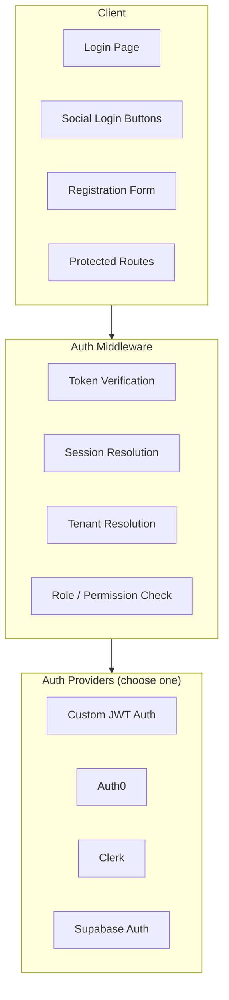
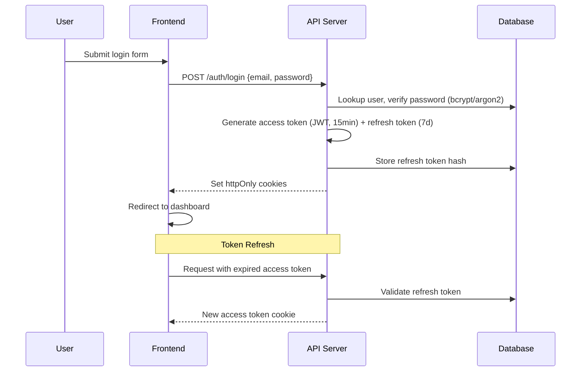
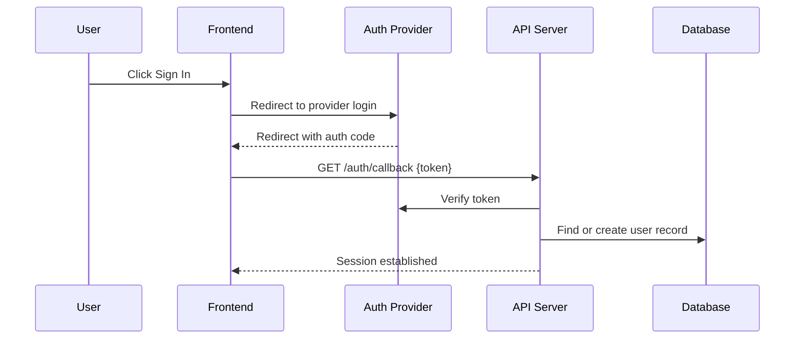
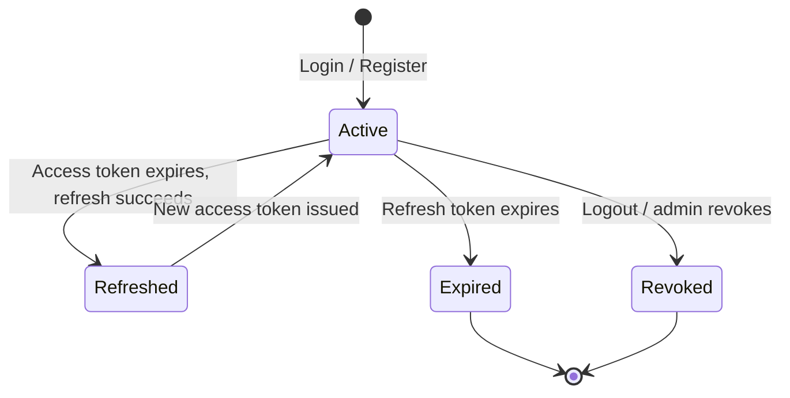
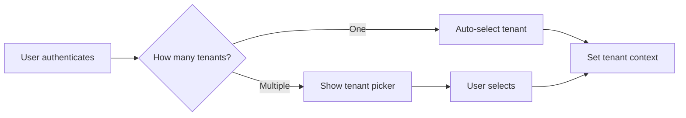
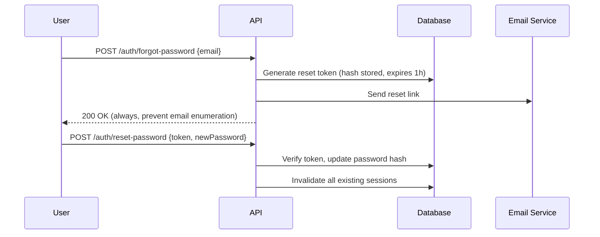
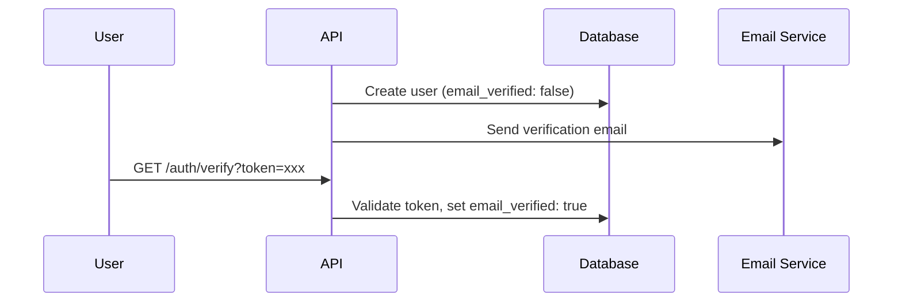

# Authentication Developer Guide

> Auth flows, session management, token handling, and security patterns.

## Auth Architecture Overview



> **Decision Reference**: See `decisions/AUTH_CHOICES.md` for the rationale behind provider selection.

---

## Auth Flow: Custom JWT



## Auth Flow: Third-Party Provider



---

## Session Management

```typescript
// {PROJECT_NAME}/src/types/auth.ts
interface Session {
  userId: string;
  tenantId: string;
  role: "owner" | "admin" | "member";
  permissions: string[];
  expiresAt: Date;
}
```



---

## Token Handling

| Token | Lifetime | Storage | Contains |
|-------|----------|---------|----------|
| Access (JWT) | 15 min | httpOnly Secure SameSite=Lax cookie | userId, tenantId, role |
| Refresh | 7 days | httpOnly Secure SameSite=Strict cookie | Opaque (no claims) |

---

## Protected Route Patterns

### Server-Side
```typescript
function authenticate() {
  return async (req: Request, res: Response, next: NextFunction) => {
    const token = extractToken(req);
    if (!token) return res.status(401).json({ error: "Authentication required" });
    try {
      const payload = jwt.verify(token, config.auth.jwtSecret) as TokenPayload;
      req.user = { id: payload.sub, tenantId: payload.tid, role: payload.role };
      next();
    } catch {
      return res.status(401).json({ error: "Invalid or expired token" });
    }
  };
}

function requireRole(...roles: string[]) {
  return (req: Request, res: Response, next: NextFunction) => {
    if (!roles.includes(req.user.role)) {
      return res.status(403).json({ error: "Insufficient permissions" });
    }
    next();
  };
}
```

### Client-Side
```typescript
function ProtectedRoute({ children, requiredRole }: Props) {
  const { user, isLoading } = useAuth();
  if (isLoading) return <LoadingSpinner />;
  if (!user) return <Navigate to="/login" />;
  if (requiredRole && user.role !== requiredRole) return <Navigate to="/unauthorized" />;
  return children;
}
```

---

## Multi-Tenant Auth



---

## Social Login

```typescript
const socialProviders = {
  google: {
    authUrl: "https://accounts.google.com/o/oauth2/v2/auth",
    tokenUrl: "https://oauth2.googleapis.com/token",
    scopes: ["email", "profile"],
  },
  github: {
    authUrl: "https://github.com/login/oauth/authorize",
    tokenUrl: "https://github.com/login/oauth/access_token",
    scopes: ["user:email"],
  },
  // TODO: Add additional social providers
};
```

---

## Password Reset Flow



## Email Verification Flow



---

## Security Checklist

- [ ] Passwords hashed with bcrypt (cost 12+) or argon2
- [ ] Tokens stored in HTTP-only, Secure, SameSite cookies
- [ ] CSRF protection enabled for cookie-based auth
- [ ] Rate limiting on login / registration / password reset
- [ ] Account lockout after N failed attempts
- [ ] Refresh token rotation on each use
- [ ] All sessions invalidated on password change
- [ ] Email enumeration prevented (consistent responses)

---

## Related Docs

- [Architecture](./02-architecture.md) -- How auth middleware fits in the system layers
- [Key Flows](./03-key-flows.md) -- Auth-related sequence diagrams
- [Backend Flexibility](./backend-flexibility.md) -- Swapping auth providers
