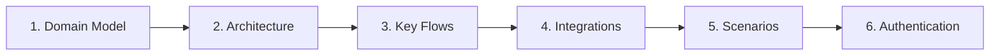

# Developer Documentation

> Comprehensive developer guides for understanding, extending, and maintaining the SaaS platform.

## How to Use These Docs

These documents are written for developers who need to understand the system internals. Each guide is self-contained but references related documents. We use **Mermaid diagrams** throughout to visualize architecture, data models, and flows.

### Rendering Mermaid Diagrams

Mermaid diagrams render natively in:
- GitHub / GitLab markdown preview
- VS Code with the Markdown Preview Mermaid extension
- Most modern documentation platforms (Docusaurus, Nextra, etc.)

If your viewer does not render Mermaid, paste diagram code into [mermaid.live](https://mermaid.live) to preview.

---

## Recommended Reading Order

Follow this sequence for the most coherent understanding of the system:

| Order | Document | What You Will Learn |
|-------|----------|---------------------|
| 1 | [Domain Model](./01-domain-model.md) | Core entities, relationships, data shape |
| 2 | [Architecture](./02-architecture.md) | System layers, data flow, state management |
| 3 | [Key Flows](./03-key-flows.md) | Step-by-step sequence diagrams for major operations |
| 4 | [Integrations](./04-integrations.md) | How external services are abstracted and connected |
| 5 | [Scenarios](./05-scenarios.md) | End-to-end walkthroughs of real user journeys |
| 6 | [Authentication](./06-authentication.md) | Auth flows, session management, protected routes |

---

## Supplementary Guides

These can be read in any order, as needed:

| Document | What You Will Learn |
|----------|---------------------|
| [Backend Flexibility](./backend-flexibility.md) | Provider abstraction pattern, swapping backends |
| [Email System](./email-system.md) | Transactional email architecture and templates |
| [SEO Guide](./seo-guide.md) | Meta tags, structured data, performance |
| [Dev Setup](./setup.md) | Local environment, running, testing |
| [Payments Setup](./payments-setup.md) | Stripe integration, webhooks, checkout |

---

## Quick Reference

### Common Developer Tasks

| Task | Where to Look |
|------|---------------|
| Add a new database entity | [Domain Model](./01-domain-model.md) |
| Understand request lifecycle | [Architecture](./02-architecture.md) |
| Trace a user action end-to-end | [Key Flows](./03-key-flows.md) |
| Add a new external integration | [Integrations](./04-integrations.md) |
| Add a new auth provider | [Authentication](./06-authentication.md) |
| Swap a backend service | [Backend Flexibility](./backend-flexibility.md) |
| Add a new email template | [Email System](./email-system.md) |
| Improve SEO for a page | [SEO Guide](./seo-guide.md) |
| Set up local dev environment | [Dev Setup](./setup.md) |
| Configure payment webhooks | [Payments Setup](./payments-setup.md) |

### Conventions Used in These Docs

- **`{PLACEHOLDER}`** -- Values you must fill in for your project
- **`// TODO:`** -- Sections requiring project-specific implementation
- **Mermaid diagrams** -- Copy and customize for your domain
- **TypeScript examples** -- Adapt types/interfaces to your schema

---

## Related Documentation

- `docs/architecture/` -- High-level architecture decision records
- `docs/prd/` -- Product requirements documents
- `decisions/` -- Technical decision records (if present)

---

## Contributing to These Docs

When adding new developer documentation:

1. Follow the numbered prefix convention for sequential docs (`07-feature-name.md`)
2. Use kebab-case for supplementary guides (`feature-name.md`)
3. Include at least one Mermaid diagram per document
4. Add the new doc to the tables above
5. Keep each document between 100-250 lines for readability
