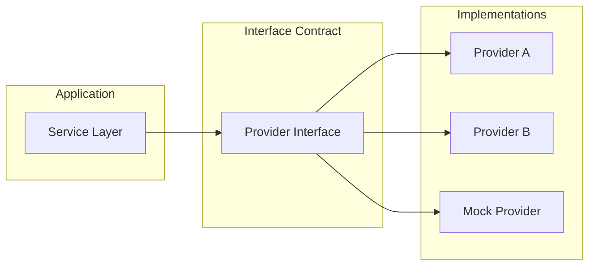
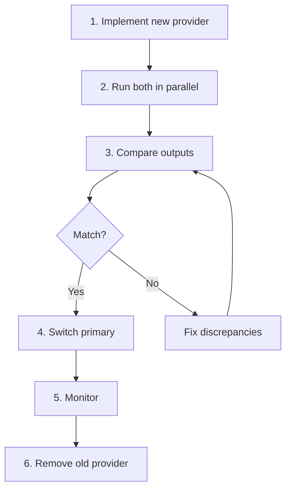

# Backend Abstraction Layer

> The pattern for defining interfaces and implementing per provider, enabling backend flexibility and testability.

## Core Concept

The application never calls external services directly. Instead, it depends on **interfaces** that are fulfilled by **provider implementations**.



---

## The BackendProvider Interface

```typescript
// {PROJECT_NAME}/src/providers/types.ts

interface BackendProvider {
  auth: AuthProvider;
  db: DatabaseProvider;
  storage: StorageProvider;
  realtime: RealtimeProvider;
}

interface AuthProvider {
  createUser(params: CreateUserParams): Promise<AuthUser>;
  verifyCredentials(email: string, password: string): Promise<AuthUser>;
  generateTokens(userId: string): Promise<TokenPair>;
  verifyToken(token: string): Promise<TokenPayload>;
  revokeToken(token: string): Promise<void>;
}

interface DatabaseProvider {
  query<T>(sql: string, params?: unknown[]): Promise<T[]>;
  transaction<T>(fn: (tx: TransactionClient) => Promise<T>): Promise<T>;
  migrate(): Promise<void>;
  healthCheck(): Promise<boolean>;
}

interface StorageProvider {
  upload(key: string, data: Buffer, contentType: string): Promise<string>;
  download(key: string): Promise<Buffer>;
  getSignedUrl(key: string, expiresInSeconds: number): Promise<string>;
  delete(key: string): Promise<void>;
  list(prefix: string): Promise<StorageObject[]>;
}

interface RealtimeProvider {
  subscribe(channel: string, callback: (event: RealtimeEvent) => void): Unsubscribe;
  publish(channel: string, event: RealtimeEvent): Promise<void>;
}
```

---

## Provider Factory

```typescript
// {PROJECT_NAME}/src/providers/factory.ts
type ProviderName = "supabase" | "firebase" | "custom" | "mock";

export function createBackendProvider(name: ProviderName): BackendProvider {
  switch (name) {
    case "supabase":  return createSupabaseProvider();
    case "firebase":  return createFirebaseProvider();
    case "custom":    return createCustomProvider();
    case "mock":      return createMockProvider();
    default: throw new Error(`Unknown backend provider: ${name}`);
  }
}

let _provider: BackendProvider | null = null;
export function getProvider(): BackendProvider {
  if (!_provider) {
    _provider = createBackendProvider(process.env.BACKEND_PROVIDER as ProviderName);
  }
  return _provider;
}
```

---

## How to Swap Backends

### Step 1: Create the new provider

```
src/providers/
  types.ts              # Shared interfaces (unchanged)
  factory.ts            # Add new provider case
  new-provider/
    index.ts
    auth.ts
    database.ts
    storage.ts
    realtime.ts
```

### Step 2: Implement each sub-provider interface
The compiler enforces that each file satisfies the corresponding interface.

### Step 3: Register in the factory
```typescript
case "new-provider":
  return createNewProvider();
```

### Step 4: Update environment
```bash
BACKEND_PROVIDER=new-provider
NEW_PROVIDER_API_KEY={YOUR_KEY}
```

### Step 5: Run integration tests
```bash
BACKEND_PROVIDER=new-provider npm run test:integration
```

---

## Testing with Mock Providers

```typescript
// {PROJECT_NAME}/src/providers/mock/index.ts
export function createMockProvider(): BackendProvider {
  return {
    auth: {
      createUser: async (params) => ({ id: "mock-id", email: params.email }),
      verifyCredentials: async () => ({ id: "mock-id", email: "test@example.com" }),
      generateTokens: async () => ({ accessToken: "mock-at", refreshToken: "mock-rt" }),
      verifyToken: async () => ({ sub: "mock-id", tid: "mock-tid", role: "owner" }),
      revokeToken: async () => {},
    },
    db: new InMemoryDatabaseProvider(),
    storage: new InMemoryStorageProvider(),
    realtime: new NoopRealtimeProvider(),
  };
}
```

```typescript
// Using in tests
describe("BillingService", () => {
  const provider = createMockProvider();
  const billingService = new BillingService(provider.db);

  it("should create a subscription", async () => {
    const result = await billingService.createSubscription({ tenantId: "t1", planId: "pro" });
    expect(result.status).toBe("active");
  });
});
```

---

## Migration Strategy



### Migration Checklist

- [ ] Schema compatibility verified
- [ ] All CRUD operations tested against new provider
- [ ] Performance benchmarks comparable
- [ ] Transactions behave identically
- [ ] Secrets and credentials provisioned
- [ ] Rollback plan documented

---

## Related Docs

- [Architecture](./02-architecture.md) -- Where the provider layer sits in the system
- [Integrations](./04-integrations.md) -- Specific provider implementations
- [Authentication](./06-authentication.md) -- Auth provider abstraction details
