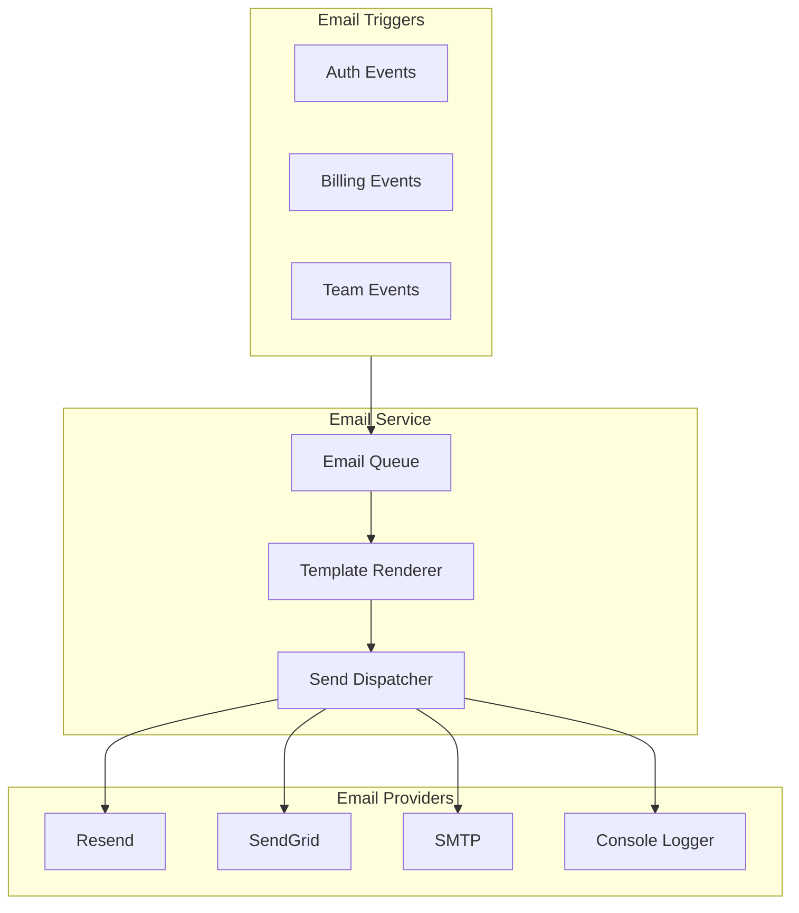

# Email System

> Provider abstraction, template architecture, and delivery patterns for transactional email.

## Architecture Overview



---

## Provider Abstraction

```typescript
// {PROJECT_NAME}/src/providers/email/types.ts
interface EmailProvider {
  send(params: SendEmailParams): Promise<EmailResult>;
  sendBatch(params: SendEmailParams[]): Promise<EmailResult[]>;
}

interface SendEmailParams {
  to: string | string[];
  subject: string;
  html: string;
  text?: string;
  replyTo?: string;
  tags?: string[];
}

interface EmailResult {
  id: string;
  status: "sent" | "queued" | "failed";
  error?: string;
}
```

### Provider Selection

```typescript
// {PROJECT_NAME}/src/providers/email/factory.ts
export function createEmailProvider(): EmailProvider {
  switch (process.env.EMAIL_PROVIDER) {
    case "resend":   return new ResendEmailProvider(process.env.RESEND_API_KEY!);
    case "sendgrid": return new SendGridEmailProvider(process.env.SENDGRID_API_KEY!);
    case "smtp":     return new SmtpEmailProvider(/* config from env */);
    case "console":
    default:         return new ConsoleEmailProvider();
  }
}
```

---

## Email Template Architecture

### Option A: React Email Templates

```typescript
// {PROJECT_NAME}/src/emails/welcome.tsx
import { Html, Head, Body, Container, Text, Button } from "@react-email/components";

export function WelcomeEmail({ userName, verifyUrl }: { userName: string; verifyUrl: string }) {
  return (
    <Html>
      <Head />
      <Body style={styles.body}>
        <Container>
          <Text>Welcome, {userName}!</Text>
          <Button href={verifyUrl}>Verify Email</Button>
        </Container>
      </Body>
    </Html>
  );
}
```

### Option B: HTML String Templates

```typescript
export function welcomeEmail(data: { userName: string; verifyUrl: string }): string {
  return `<div style="font-family: sans-serif; max-width: 600px; margin: 0 auto;">
    <h1>Welcome, ${data.userName}!</h1>
    <a href="${data.verifyUrl}">Verify Email</a>
  </div>`;
}
```

---

## Transactional Email Types

| Email | Trigger | Data | Priority |
|-------|---------|------|----------|
| Welcome / Verify | User registration | `userName, verifyUrl` | High |
| Password Reset | Reset requested | `userName, resetUrl, expiresIn` | High |
| Subscription Confirmation | Purchase | `userName, planName, amount` | Medium |
| Payment Receipt | Invoice paid | `userName, amount, invoiceUrl` | Medium |
| Usage Alert | Approaching limit | `resourceName, usage, limit, upgradeUrl` | Medium |
| Team Invitation | Admin invites | `inviterName, tenantName, inviteUrl, role` | High |

---

## Email Service Layer

```typescript
// {PROJECT_NAME}/src/services/email.service.ts
class EmailService {
  constructor(private provider: EmailProvider, private renderer: TemplateRenderer) {}

  async sendWelcome(user: { email: string; name: string }, verifyUrl: string) {
    const html = this.renderer.render("welcome", { userName: user.name, verifyUrl });
    await this.provider.send({ to: user.email, subject: "Welcome to {APP_NAME}!", html });
  }

  async sendPasswordReset(email: string, resetUrl: string) {
    const html = this.renderer.render("password-reset", { resetUrl });
    await this.provider.send({ to: email, subject: "Reset your password", html });
  }
  // TODO: Implement remaining email methods
}
```

---

## Email Testing Strategy

### Unit Tests
```typescript
describe("EmailService", () => {
  const provider = new ConsoleEmailProvider();
  const service = new EmailService(provider, templateRenderer);
  it("sends welcome email", async () => {
    await service.sendWelcome({ email: "test@example.com", name: "Test" }, "https://verify");
    // Assert console output or mock provider calls
  });
});
```

### Visual Preview
```bash
npx react-email dev --dir src/emails   # Opens at http://localhost:3000
```

---

## Deliverability Best Practices

| Practice | Implementation |
|----------|---------------|
| SPF record | `v=spf1 include:{provider}.com ~all` |
| DKIM signing | Configure via email provider dashboard |
| DMARC policy | `v=DMARC1; p=quarantine;` |
| Plain text fallback | Always provide `text` alongside `html` |
| Bounce handling | Configure bounce webhooks from provider |
| Rate limiting | Max 1 email per type per user per hour |

---

## Environment Configuration

```bash
EMAIL_PROVIDER=console          # console | resend | sendgrid | smtp
EMAIL_FROM="App Name <noreply@{YOUR_DOMAIN}>"
RESEND_API_KEY=re_xxx           # If using Resend
SENDGRID_API_KEY=SG.xxx         # If using SendGrid
SMTP_HOST=smtp.example.com      # If using SMTP
SMTP_PORT=587
```

---

## Related Docs

- [Integrations](./04-integrations.md) -- Email provider as part of the integration layer
- [Key Flows](./03-key-flows.md) -- Where emails are triggered in system flows
