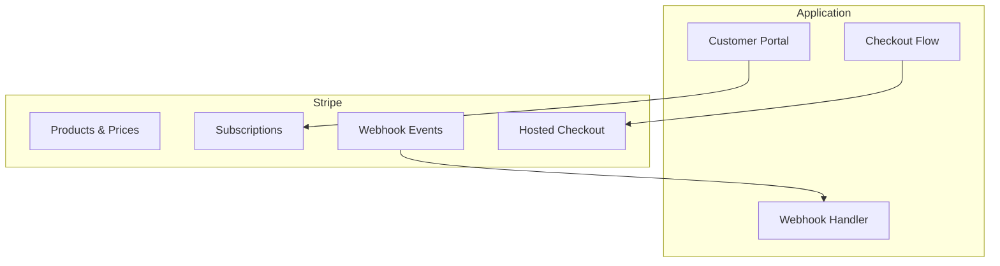

# Payment Integration Setup

> Step-by-step guide for configuring Stripe and alternative payment providers.

## Architecture Overview



---

## Stripe Setup

### Step 1: Account and SDK
1. Create account at [stripe.com](https://stripe.com)
2. Get API keys from Dashboard > Developers > API Keys
3. Install: `npm install stripe @stripe/stripe-js`

### Step 2: Environment Variables
```bash
STRIPE_SECRET_KEY=sk_test_{YOUR_KEY}
STRIPE_PUBLISHABLE_KEY=pk_test_{YOUR_KEY}
STRIPE_WEBHOOK_SECRET=whsec_{YOUR_SECRET}
```

### Step 3: Initialize Client
```typescript
// {PROJECT_NAME}/src/lib/stripe.ts
import Stripe from "stripe";
export const stripe = new Stripe(process.env.STRIPE_SECRET_KEY!, {
  apiVersion: "2024-06-20",
  typescript: true,
});
```

---

## Webhook Configuration

### Local Development
```bash
stripe login
stripe listen --forward-to localhost:3000/api/webhooks/stripe
```

### Production
1. Stripe Dashboard > Developers > Webhooks > Add endpoint
2. URL: `https://{YOUR_DOMAIN}/api/webhooks/stripe`
3. Select events below, copy signing secret

### Required Events

| Event | What to Do |
|-------|------------|
| `checkout.session.completed` | Create/activate subscription |
| `customer.subscription.updated` | Update subscription record |
| `customer.subscription.deleted` | Mark cancelled, downgrade |
| `invoice.payment_succeeded` | Update status, send receipt |
| `invoice.payment_failed` | Mark past_due, notify user |

### Webhook Handler
```typescript
export async function handleStripeWebhook(req: Request) {
  const body = await req.text();
  const sig = req.headers.get("stripe-signature")!;
  let event: Stripe.Event;
  try {
    event = stripe.webhooks.constructEvent(body, sig, process.env.STRIPE_WEBHOOK_SECRET!);
  } catch {
    return new Response("Invalid signature", { status: 400 });
  }
  switch (event.type) {
    case "checkout.session.completed":
      await handleCheckoutCompleted(event.data.object);
      break;
    case "invoice.payment_failed":
      await handlePaymentFailed(event.data.object);
      break;
    // TODO: Handle remaining events
  }
  return new Response("OK", { status: 200 });
}
```

---

## Test Mode vs Live Mode

| Aspect | Test Mode | Live Mode |
|--------|-----------|-----------|
| Key prefix | `sk_test_` / `pk_test_` | `sk_live_` / `pk_live_` |
| Real charges | No | Yes |

### Test Card Numbers
| Number | Behavior |
|--------|----------|
| `4242 4242 4242 4242` | Successful payment |
| `4000 0000 0000 3220` | Requires 3D Secure |
| `4000 0000 0000 9995` | Payment declined |

---

## Product and Price Setup

```typescript
// {PROJECT_NAME}/scripts/setup-stripe-products.ts
async function setupProducts() {
  const pro = await stripe.products.create({
    name: "Pro Plan",
    metadata: { planId: "pro" },
  });
  await stripe.prices.create({
    product: pro.id,
    unit_amount: 2900,  // $29.00
    currency: "usd",
    recurring: { interval: "month" },
  });
  await stripe.prices.create({
    product: pro.id,
    unit_amount: 29000, // $290.00/yr
    currency: "usd",
    recurring: { interval: "year" },
  });
  // TODO: Add additional plans
}
```

---

## Customer Portal Setup

1. Stripe Dashboard > Settings > Billing > Customer Portal
2. Enable: update payment method, cancel, switch plans, view invoices

```typescript
async function createPortalSession(tenantId: string): Promise<string> {
  const tenant = await db.tenant.findUnique({ where: { id: tenantId } });
  const session = await stripe.billingPortal.sessions.create({
    customer: tenant!.stripeCustomerId,
    return_url: `${process.env.APP_URL}/app/billing`,
  });
  return session.url;
}
```

---

## Checkout Flow

```typescript
async function createCheckoutSession(tenantId: string, priceId: string): Promise<string> {
  const tenant = await db.tenant.findUnique({ where: { id: tenantId } });
  let customerId = tenant?.stripeCustomerId;
  if (!customerId) {
    const customer = await stripe.customers.create({ metadata: { tenantId } });
    customerId = customer.id;
    await db.tenant.update({ where: { id: tenantId }, data: { stripeCustomerId: customerId } });
  }
  const session = await stripe.checkout.sessions.create({
    customer: customerId,
    mode: "subscription",
    line_items: [{ price: priceId, quantity: 1 }],
    success_url: `${process.env.APP_URL}/app/billing?success=true`,
    cancel_url: `${process.env.APP_URL}/app/billing?cancelled=true`,
  });
  return session.url!;
}
```

---

## Alternative Payment Providers

| Provider | Strengths | When to Consider |
|----------|-----------|------------------|
| Paddle | Tax handling, merchant of record | Global sales, tax compliance |
| LemonSqueezy | Simple API, merchant of record | Indie/small teams |
| PayPal | Wide consumer adoption | B2C, international |

To implement: create a class implementing `PaymentProvider` (see [Integrations](./04-integrations.md)).

---

## Troubleshooting

| Issue | Solution |
|-------|----------|
| Webhook signature fails | Pass raw body, not parsed JSON |
| Events not processed | Check event selection in dashboard |
| Duplicate subscriptions | Add idempotency check in handler |

---

## Related Docs

- [Integrations](./04-integrations.md) -- Payment provider abstraction pattern
- [Key Flows](./03-key-flows.md) -- Subscription purchase flow diagram
- [Scenarios](./05-scenarios.md) -- End-to-end payment scenarios
