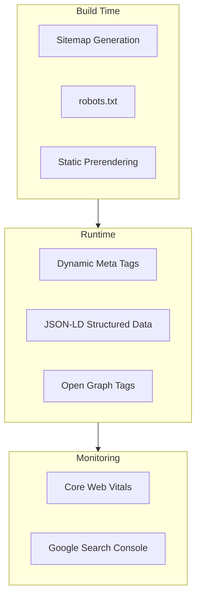

# SEO Implementation Guide

> Meta tags, structured data, performance optimization, and SPA-specific SEO considerations.

## SEO Architecture Overview



---

## Meta Tags Strategy

### Base Meta Tags (every page)

```html
<head>
  <meta charset="utf-8" />
  <meta name="viewport" content="width=device-width, initial-scale=1" />
  <title>{PAGE_TITLE} | {APP_NAME}</title>
  <meta name="description" content="{PAGE_DESCRIPTION}" />
  <link rel="canonical" href="{CANONICAL_URL}" />
  <meta name="robots" content="index, follow" />
  <link rel="icon" href="/favicon.ico" />
  <meta name="theme-color" content="{BRAND_COLOR}" />
</head>
```

### SEO Component (React)

```typescript
// {PROJECT_NAME}/src/components/SEO.tsx
function SEO({ title, description, path, image, type = "website", noIndex }: SEOProps) {
  const fullTitle = `${title} | {APP_NAME}`;
  const url = `{BASE_URL}${path}`;
  return (
    <Head>
      <title>{fullTitle}</title>
      <meta name="description" content={description} />
      <link rel="canonical" href={url} />
      {noIndex && <meta name="robots" content="noindex, nofollow" />}
      <meta property="og:title" content={fullTitle} />
      <meta property="og:description" content={description} />
      <meta property="og:url" content={url} />
      <meta property="og:image" content={image ?? `{BASE_URL}/og-default.png`} />
      <meta property="og:type" content={type} />
      <meta name="twitter:card" content="summary_large_image" />
      <meta name="twitter:title" content={fullTitle} />
      <meta name="twitter:description" content={description} />
    </Head>
  );
}
```

---

## Structured Data (JSON-LD)

### Organization Schema

```typescript
function OrganizationSchema() {
  const data = {
    "@context": "https://schema.org",
    "@type": "Organization",
    name: "{APP_NAME}",
    url: "{BASE_URL}",
    logo: "{BASE_URL}/logo.png",
    contactPoint: { "@type": "ContactPoint", email: "support@{DOMAIN}", contactType: "customer support" },
  };
  return <script type="application/ld+json">{JSON.stringify(data)}</script>;
}
```

### SaaS Product Schema

```typescript
function SaaSProductSchema() {
  const data = {
    "@context": "https://schema.org",
    "@type": "SoftwareApplication",
    name: "{APP_NAME}",
    applicationCategory: "BusinessApplication",
    operatingSystem: "Web",
    offers: { "@type": "AggregateOffer", priceCurrency: "USD", lowPrice: "{LOW_PRICE}", highPrice: "{HIGH_PRICE}" },
  };
  return <script type="application/ld+json">{JSON.stringify(data)}</script>;
}
```

### FAQ Schema

```typescript
function FAQSchema({ items }: { items: { question: string; answer: string }[] }) {
  const data = {
    "@context": "https://schema.org",
    "@type": "FAQPage",
    mainEntity: items.map((item) => ({
      "@type": "Question",
      name: item.question,
      acceptedAnswer: { "@type": "Answer", text: item.answer },
    })),
  };
  return <script type="application/ld+json">{JSON.stringify(data)}</script>;
}
```

---

## Sitemap Generation

```typescript
// {PROJECT_NAME}/src/lib/sitemap.ts
const staticPages: SitemapEntry[] = [
  { url: "{BASE_URL}/", changefreq: "weekly", priority: 1.0 },
  { url: "{BASE_URL}/pricing", changefreq: "weekly", priority: 0.9 },
  { url: "{BASE_URL}/features", changefreq: "monthly", priority: 0.8 },
  { url: "{BASE_URL}/blog", changefreq: "daily", priority: 0.7 },
  // TODO: Add dynamic pages (blog posts, public profiles, etc.)
];
```

## robots.txt Configuration

```text
User-agent: *
Allow: /
Disallow: /app/
Disallow: /api/
Disallow: /admin/
Disallow: /auth/
Sitemap: {BASE_URL}/sitemap.xml
```

---

## Core Web Vitals

| Metric | Target | Measures |
|--------|--------|----------|
| LCP (Largest Contentful Paint) | < 2.5s | Loading performance |
| INP (Interaction to Next Paint) | < 200ms | Interactivity |
| CLS (Cumulative Layout Shift) | < 0.1 | Visual stability |

### Performance Checklist
- [ ] Images use `loading="lazy"` and `srcset`
- [ ] Fonts preloaded with `<link rel="preload">`
- [ ] JavaScript bundle code-split by route
- [ ] Third-party scripts loaded with `async` or `defer`
- [ ] Static assets served from CDN with cache headers
- [ ] Compression enabled (gzip or brotli)

---

## SPA SEO Considerations

| Approach | Best For |
|----------|----------|
| SSR (Server-Side Rendering) | Content-heavy pages, best SEO |
| SSG (Static Site Generation) | Marketing pages, blog |
| ISR (Incremental Static Regen) | Frequently updated content |
| Prerendering service | Retrofit SPA without SSR |

### Recommended Strategy
```
Marketing pages (/, /pricing, /blog)  --> SSG or SSR
App pages (/app/*)                    --> Client-side (no SEO needed)
Public profiles (/u/{slug})           --> SSR or ISR
```

---

## Related Docs

- [Architecture](./02-architecture.md) -- How rendering strategy fits the system
- [Setup](./setup.md) -- Build configuration for SSG/SSR
