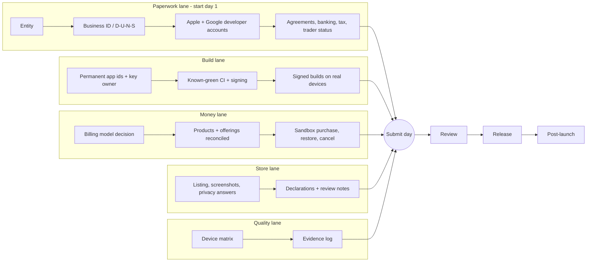

# Web to iOS and Android Launch Playbook

> The end-to-end path for a team that builds a web SaaS first, then ships it to
> the App Store and Google Play. Written from real launches: what blocked,
> what slipped, and what would have saved weeks if it had been done on day one.
>
> Use this file as the spine. The per-store checklists go deeper on each form
> and asset; this playbook tells you **what order to do things in, what runs in
> parallel, who has to click what, and what counts as proof.**

**Companion docs:**
[Launch Checklist](./LAUNCH_CHECKLIST.md) (web) |
[iOS Readiness Checklist](./IOS_READINESS_CHECKLIST.md) |
[Android Readiness Checklist](./ANDROID_READINESS_CHECKLIST.md) |
[App Store Compliance](../architecture/APP_STORE_COMPLIANCE.md) |
[Mobile Architecture](../architecture/MOBILE_ARCHITECTURE.md) |
[Device Test Runbook](./DEVICE_TEST_RUNBOOK.md) |
[Launch Tracker Template](../templates/LAUNCH_TRACKER_TEMPLATE.md) |
[Submit-Day Packet Template](../templates/SUBMIT_DAY_PACKET_TEMPLATE.md) |
[Launch Lessons](../ai-agents/LESSONS_LEARNED.md) (section "Launch and Store Submission")

---

## How to Read This Playbook

| If you are... | Start at |
|---|---|
| Starting a new product and know you want mobile later | Phase 0, then Phase 1 the same day |
| Web app is live, adding iOS and Android | Phase 1 (paperwork now, in parallel), then Phase 3 |
| App is built, submission is close | Phase 6, 7, 8, then the Red Flags table |
| Taking over a half-finished launch | The Evidence Rules section, then the Launch Tracker Template |

Every phase ends with **exit gates**. A gate is closed only by evidence (a
dashboard state, a database row, a CI run URL, a dated entry), never by a
document saying it is done. See [Evidence Rules](#evidence-rules).

---

## The Model: Five Lanes, One Critical Path

A launch is not a sequence. It is five lanes that mostly run in parallel and
meet at submission day. The most common failure is running the slow lane (paperwork) last.

**Critical path rule:** whichever lane has the longest wait you cannot control
(entity, business ID, account verification, review queue) starts first. Those
waits are calendar time, not effort. Starting them late costs weeks; starting
them early costs an hour.

---

## Phase 0: Decide (before writing mobile code)

These decisions are expensive to reverse. Write each one down in
`decisions/` as a short record.

### 0.1 Mobile delivery path

| Path | Best for | Costs | Watch out for |
|---|---|---|---|
| **PWA only** | Internal tools, content products, early validation | No store presence, limited push and background on iOS | No store discovery; no in-app purchase rails |
| **Web app in a native shell (Capacitor or similar)** | An existing React/Vite web app that needs store presence fast | One codebase, native plugins for push, biometrics, purchases | Thin wrappers risk review rejection under the "minimum functionality" guideline; invest in native-feeling UX and at least a few real native capabilities |
| **Cross-platform native (React Native / Expo, Flutter)** | Mobile is the primary product, heavy device features | Second UI layer to build and test | Share tokens and API contracts, not components; budget for native build tooling |
| **Fully native (Swift / Kotlin)** | Platform-specific experiences, performance-critical | Two codebases | Highest cost; justify with a product reason |

Default for this template (React + Vite + Tailwind + shadcn): **web first,
then a native shell**, upgrading to cross-platform native only if the product
proves it needs it. See [Mobile Architecture](../architecture/MOBILE_ARCHITECTURE.md).

### 0.2 Billing model (per platform)

Decide before writing entitlement logic. It shapes the whole billing layer.

| Model | Platforms | Notes |
|---|---|---|
| **Free** (no billing) | Both | Simplest. Do not leave dead billing code half wired. Remove it or gate it clearly. |
| **In-app purchase / subscription** | iOS (StoreKit), Android (Play Billing), often via a billing provider such as RevenueCat | Store fees apply. Each platform has its own product types and review rules. |
| **Web checkout only** | Both | Rules about steering users to external payment inside the app differ by region and change over time. Verify current policy before relying on this. |
| **Hybrid** | Both | Web subscribers and store subscribers both need entitlements. Plan one entitlement table that both rails write to. |

Rule: **per platform, either implement the full billing path or ship free.**
A server that accepts only one store's receipts, with the other store unhandled, is a bug waiting for a reviewer or a customer.

### 0.3 Privacy posture

Decide early because it changes architecture:

- Does the app need a server at all? If the promise is "no cloud" or "local-first,"
  then any challenge server, rate limiter or analytics endpoint contradicts it.
  Remove the component or drop the claim. Do not harden something you do not need.
- What personal data is collected, and can it be minimized? See the
  [privacy skill](../../skills/privacy-skill/SKILL.md).
- Account deletion must work in-app and in the backend from the first build.

### 0.4 Scope freeze rule

Pick the release candidate (RC) and freeze scope there. Everything else goes on
a written 1.0.1 list. A submit date that slips while scope stays open keeps slipping.

### 0.5 Publisher model

One legal publisher entity can own many apps. Set it up once, reuse it for
the whole portfolio, and keep a portfolio-level tracker (see
[Launch Tracker Template](../templates/LAUNCH_TRACKER_TEMPLATE.md)).

**Exit gates:** delivery path chosen, billing model per platform chosen,
privacy posture written, scope-freeze rule agreed, publisher entity decided.

---

## Phase 1: Day-One Paperwork (all of it, in parallel)

These items are independent of each other and independent of your code. They
are also the items with waits you cannot compress. **Start every one the same
day.** Most are human-only: an agent can prepare and report status, but a
person with legal authority submits, signs and pays.

| Item | Why it gates you | Typical wait (verify, it varies) | Human-only |
|---|---|---|---|
| Legal entity (if publishing as a company) | Org-level developer accounts need one | Days to weeks, jurisdiction dependent | Yes |
| Business identifier (for example D-U-N-S) | Required by Apple and Google for organization accounts | Days to weeks | Yes |
| Apple Developer Program enrollment (organization) | No App Store Connect without it | Days to weeks after identifiers exist | Yes |
| Google Play Console account (organization preferred) | No Play Console without it | Days for identity verification | Yes |
| Paid-apps agreements, banking, tax forms (both stores) | Required before any paid product can be sold | Days; banking verification can lag | Yes |
| EU trader status (Apple DSA declaration, Google equivalent) | Needed to distribute in the EU | Days after documents are submitted | Yes |
| Domain, support email, privacy policy URL, marketing URL | Every store listing needs them live | Hours | No |
| Code-signing ownership decision (who owns keys and certificates) | Wrong owner means re-signing later | Hours | Yes |

**Google Play personal accounts:** new personal developer accounts have had
a closed-testing requirement before production access (a minimum number of
testers opted in for a minimum number of days). Check the current rule on the
[Play Console help page](https://support.google.com/googleplay/android-developer/answer/14151465)
and start the clock early, or publish under an organization account if one is available.

**Record exact dates** (submitted, verified, active) for every item in the tracker.
Several waits start at a specific event, not at the day you began, and you will
want to know which clock is running.

**Exit gates:** every row above is either Done with a dated evidence entry or
In Progress with a date it was started. Anything only "believed done" is UNVERIFIED.

---

## Phase 2: Launch the Web App Properly First

Mobile builds inherit the quality of the web product and its backend.
Finish these before investing in store submission. Full lists live in
[Launch Checklist](./LAUNCH_CHECKLIST.md).

| Area | Minimum before mobile work |
|---|---|
| Marketing site vs app | Separate deploys. A copy change must not risk the app. |
| Auth | Sign-up, sign-in, password reset, session handling across tabs and devices |
| Account deletion | In-app control and a backend purge that is tested |
| Billing (web) | Webhooks idempotent, checkout and webhook race handled, status transitions covered |
| Observability | Error tracking and analytics in before the first user |
| Security | Row-level security default-deny, secrets never in the client, security headers |
| Legal | Terms, privacy policy, support contact, data deletion policy |
| Performance | Tested on a mid-tier phone with throttled network |
| SEO and presence | See [SEO Setup Guide](./SEO_SETUP_GUIDE.md) and [Digital Presence Checklist](./DIGITAL_PRESENCE_CHECKLIST.md) |

**Exit gates:** web app live, monitored, with deletion, legal pages and a tested billing flow.

---

## Phase 3: Make the Product Store-Ready

Most store rejections are product decisions, not paperwork. Design for them early.

### 3.1 Identifiers and ownership (do this before the first signed build)

- Pick **permanent** bundle id (iOS) and package name (Android). Never ship, or even
  prepare a signed build with, a placeholder such as `com.example.*`. Changing it
  later means a new app listing.
- Decide who owns the Apple team, the Android upload key and the Play App Signing key.
- Store keys and certificates in a password manager or secret store, never in the repo.

### 3.2 Product rules that cause rejections

| Rule | What to build |
|---|---|
| Account deletion | A visible in-app path that deletes the account and its data, not just a support email |
| Third-party login parity (Apple) | If you offer third-party social login on iOS, also offer an equivalent privacy-preserving option such as Sign in with Apple, per current guidelines |
| Minimum functionality | A shell around a website with no native value is a common rejection. Add genuine native capabilities and polish |
| No pre-release language | No "Beta", "Test", "Coming soon" badges, placeholder copy, test accounts in the UI |
| Payments | Do not steer users around the store's billing inside the app, except where current policy explicitly allows. Verify by region |
| Permissions | Request only what you use, with a purpose string that matches real behavior |
| Reviewer access | A working reviewer login or a documented no-login path. Notes written from an **empty** account |
| Privacy answers | Labels and Data Safety answers must match what the code actually collects |
| Kids and health topics | Extra rules apply. Check them before building, not on submit day |

### 3.3 Mobile UX realities

- Safe areas, notches and home indicators: use dynamic viewport units, test on real hardware.
- Minimum touch target 44 by 44 points.
- Deep links: configure universal links (iOS) and app links (Android) and test
  them from a cold start. Host the association files on your domain.
- Push notifications: decide opt-in timing, token storage, and unsubscribe path now.
- Offline and bad networks: define what works with no connection, and show
  helpful errors with recovery actions.
- Share design tokens across web and native instead of sharing components.

### 3.4 Remove anything you do not intend to ship

Add a pre-submit search for `beta`, `TODO`, `lorem`, `test@`, placeholder
ids and debug menus. Never delete a real feature just to get a build green:
tag it, track it, and restore it.

**Exit gates:** permanent ids chosen and owned, deletion works end to end,
no pre-release copy, privacy answers drafted from the actual data flow.

---

## Phase 4: Build, Signing and CI

CI failures consume more launch time than almost anything else. Do not
design your pipeline during launch week.

### 4.1 Start from a known-green pipeline

- Copy a CI configuration that has already produced a store-signed build, and adapt it.
  Do not author a new pipeline from scratch for a new app.
- Pre-provision working CI credentials and a **tag-based trigger** before launch
  week. Expired or missing tokens and agent-initiated triggers blocked by policy
  have each cost days.
- **Run every CI gate once and record the run URL.** A nightly end-to-end job
  whose required variable group never existed, so it failed at config parse
  for weeks, was theatre, not a gate.

### 4.2 iOS build and signing

- Build with the SDK and Xcode version the store currently requires for
  uploads. Apple publishes upcoming minimums on its
  [upcoming requirements page](https://developer.apple.com/news/upcoming-requirements/).
- Choose automatic (managed) signing or manual certificates and profiles. Document which.
- Increment the build number on every upload. Keep one version policy
  (see [Version Management](../architecture/VERSION_MANAGEMENT.md)).
- Include required privacy manifests and declare required-reason API usage if your dependencies need them.

### 4.3 Android build and signing

- Enroll in Play App Signing. Keep the upload key separate and backed up.
- Target the API level Play currently requires. Requirements step up on a yearly
  cadence; see the [target API help page](https://support.google.com/googleplay/android-developer/answer/11926878)
  and put the next deadline on your calendar.
- Ship an Android App Bundle (AAB), not an APK, to production.
- If you include native libraries, test 16 KB page-size compatibility
  (see the [Android guidance](https://developer.android.com/guide/practices/page-sizes)).
- **Inspect the produced artifact**: signed, correct target SDK, correct package name,
  expected version code. "CI is green" does not prove any of those.
- CI artifacts can expire in days. Record the expiry and rebuild before it lapses.
- An archive digest is not the inner bundle hash. Quote the inner AAB hash if you claim provenance.

### 4.4 Version and tag discipline

Tag every release candidate. Name the tag in the submit-day packet so everyone knows
which source produced which build number. Keep build numbers monotonic across both platforms.

**Exit gates:** a signed iOS build installed from the beta channel on a real device,
a signed Android bundle installed from internal testing on a real device,
each with a recorded build number and run URL.

---

## Phase 5: Billing and Entitlements

Skip this phase only if the app is free on both platforms.

### 5.1 Reconcile once, before the first sandbox test

Put every product through one table. Mismatches here have been found only
by a late red-team pass, which is the expensive way to find them.

| Check | Where to verify |
|---|---|
| Product id string identical everywhere | Store console, billing provider, paywall code, server |
| Product type matches the copy | Non-renewing vs auto-renewing vs non-consumable. If the paywall says "no auto-renewal", the store type must be non-renewing |
| Prices and regions | Store console tiers, paywall display, localized currency |
| Offering and entitlement mapping | Billing provider dashboard |
| Server accepts every store value you ship | Server code. A server that checks for one store only has no billing path for the other |
| Webhook live and pointed at the right endpoint | Provider dashboard plus a delivery log |
| Server secret set in the production environment | Hosting provider env list. If the agent cannot verify a secret, put it on the "human verifies" list |
| Web payment provider (if any) untouched | Do not change live subscriber config during a launch |

### 5.2 Entitlement design

- One entitlement table that every rail (web checkout, iOS, Android) writes to.
- Webhook handling is idempotent. Handle the checkout and webhook race.
- Handle status transitions: trial, active, grace, billing retry, cancelled, refunded, expired.
- Restore purchases is a visible, working control. Reviewers test it.
- Amounts are integers. Timestamps are UTC.

### 5.3 When you cannot run a real purchase

Simulators cannot do true sandbox purchases or real sign-in with the platform
identity provider. If a physical-device purchase test is blocked, do the static
verification set and write the residual risk down:

1. Product ids match across paywall, server and billing provider.
2. Billing unit tests pass on the exact release source (tag).
3. Webhook is live and pointed at the correct endpoint, with a recent delivery.

State plainly in the packet: "Sandbox purchase, restore, cancel NOT RUN. Risk:
a purchase-flow bug surfaces as a review rejection rather than a customer incident."
The owner can overrule that call; they should see it.

**Exit gates:** reconciliation table complete, sandbox purchase, restore and cancel run
on a real device per product (or the accepted-risk statement signed off).

---

## Phase 6: Device Testing

A build upload is not a test. **Count installs on real devices, not builds.**
One team uploaded dozens of beta builds over months with zero installs.

Run the full procedure in the [Device Test Runbook](./DEVICE_TEST_RUNBOOK.md).
The short version:

| Area | Minimum |
|---|---|
| Devices | One real iPhone and one real mid-tier Android phone, current OS plus one older |
| Install path | Install from TestFlight or internal testing, not from a dev cable, at least once |
| Flows | Sign-up, sign-in, core loop, background and resume, offline, purchase, restore, cancel, delete account |
| Reviewer path | Run exactly what a reviewer will run, from an empty account |
| Evidence | Build number, device model, OS version, date, pass or fail, per check |

**Schedule the device session early.** It needs a human holding the phone
for credentials and taps. Plan for it the week before you need it.

**Exit gates:** evidence log shows pass for every check on the RC build number,
or each gap has a written accepted-risk line.

---

## Phase 7: Store Listing, Compliance and Declarations

### 7.1 Assets

| Asset | Notes |
|---|---|
| App icon | Required sizes per store. No transparency on iOS |
| Screenshots | Capture from the **release candidate**, native, real data. Use the exact dimensions the console asks for |
| In-app purchase review screenshots (Apple) | Must be an **exact** accepted screenshot size (for example 1290 by 2796). A larger-than-minimum image was rejected for wrong dimensions. One paywall image showing all tiers can serve every product |
| Feature graphic (Google) | 1024 by 500 |
| Description, subtitle, keywords, short description | See [iOS](./IOS_READINESS_CHECKLIST.md) and [Android](./ANDROID_READINESS_CHECKLIST.md) checklists and the ASO notes there |
| URLs | Privacy policy, support, marketing, all live and loading |
| Reviewer credentials | Stored in a password manager. Entered by a human |

Capture IAP review screenshots in the **same device session** as the purchase tests.

### 7.2 Compliance answers

- Apple privacy nutrition labels and Google Data Safety form: derive from the real data flow.
- Age and content rating questionnaires (both stores).
- Encryption and export compliance declaration.
- Advertising identifier declaration.
- EU trader status.
- Any "regulated" category declaration. Stores add new ones; one launch
  discovered a new regulated-device question only at Add for Review.
- App price and availability (countries). One launch had neither set until submission.

### 7.3 Pre-flight: find submit-day blockers a week early

Open the submission flow in each console one week before the target date and
click through to the last step without submitting. Anything that appears only
at "Add for Review" will appear now:

- [ ] App price set
- [ ] Availability set (countries)
- [ ] Every App Information declaration answered
- [ ] Every product has a review screenshot at an accepted size
- [ ] Subscription group has localization and is attachable
- [ ] Reviewer login works from an empty account
- [ ] Privacy, support and marketing URLs load
- [ ] Release type chosen (manual, automatic, scheduled)

### 7.4 Review notes

Write notes from an **empty reviewer account.** If the notes point at a saved
item the account does not have, the reviewer is stuck. Start with the create flow.
List where purchase, restore and delete live. Explain anything unusual.
Never paste the reviewer password into a doc; reference the password manager.

**Exit gates:** pre-flight checklist clean in both consoles.

---

## Phase 8: Submission Day

Use the [Submit-Day Packet Template](../templates/SUBMIT_DAY_PACKET_TEMPLATE.md).
Fill it in the day before.

### 8.1 Apple (App Store Connect)

1. Confirm agreements show Active (paid apps, if applicable).
2. Attach the correct build (not the older one that stayed selected).
3. Upload IAP review screenshots at the exact accepted size.
4. Confirm review notes and reviewer credentials.
5. For a first release with purchases: add **every** in-app purchase and the
   **subscription group** to the same draft submission. The group must be added
   separately or Submit stays disabled.
6. Confirm the "items ready to submit" count matches your packet.
7. Leave any legacy or draft product explicitly unattached, and say so in the packet.
8. Choose release type. Manual release means approval does not auto-publish.
9. Submit.

### 8.2 Google (Play Console)

1. Release to the right track with the signed AAB.
2. Complete Data Safety, content rating, target audience, ads declaration.
3. Complete store listing and graphics.
4. Check pre-launch report results and fix blocking issues.
5. Confirm account-level requirements (for example personal account testing rules).
6. Start with a staged rollout percentage you are comfortable with.
7. Send for review.

### 8.3 What agents can and cannot do

| Step | Agent | Human |
|---|---|---|
| Prepare packet, notes, checks, status | Yes | Review |
| Drive the console through a browser extension | Often, except uploads from local disk | Drag files in |
| Enter passwords, sandbox credentials, 2FA | Never | Always |
| Click final Submit for Review | Blocked as a production action, by design | Always |
| Accept agreements, banking, tax, trader status | Never | Always |

Plan two human touches on submit day: drag the screenshots, click Submit.

**Exit gate:** console shows "Waiting for Review" (Apple) or "In review" (Google).
Record the timestamp in the tracker.

---

## Phase 9: Review, Rejection and Release

### 9.1 While waiting

Set a **scheduled check** (a mailbox watcher or reminder, roughly every few hours)
so nobody polls by hand:

- Quiet while the status is pending.
- On rejection: surface the exact guideline cited, the likely fix, and the fastest resubmit path.
- On approval: remind the owner to click release (if manual), then start the launch comms checklist.

### 9.2 Common rejection reasons and the fix

| Reason | Fix |
|---|---|
| Crash or broken flow found by the reviewer | Reproduce from an empty account on the exact build |
| Missing or non-working reviewer login | Fix credentials, add notes |
| In-app purchase not found or not working | Re-verify product attachment, status "Ready to Submit", paywall load |
| Pre-release text in the UI | Remove, rebuild, resubmit |
| Account deletion not in the app | Add the in-app path |
| Privacy label or Data Safety mismatch | Correct the answers or the code |
| Minimum functionality | Add native value; explain it in notes |
| Metadata mismatch (screenshots show features that do not exist) | Recapture from the RC |

### 9.3 Release

- **iOS:** manual or phased release. Phased release limits blast radius.
- **Android:** staged rollout (for example 5, 20, 50, 100 percent). Halt on crash-rate regressions.
- Keep a rollback plan: previous known-good build ready to promote.

**Exit gate:** the app is installable from the public store listing on a clean device.

---

## Phase 10: Post-Launch

| Window | Do |
|---|---|
| First hour | Install from the store on a clean device. Run sign-up, purchase (real or sandbox per store rules), restore, delete |
| First 72 hours | Watch crash-free rate, sign-up funnel, first real purchases and webhooks landing in the entitlement table |
| First week | Triage reviews, publish the 1.0.1 list, ask for ratings at a happy moment |
| Ongoing | Yearly target-API and SDK bumps on a calendar, dependency updates, store policy changes |

Keep promotion work (website link, waitlist email, social posts, community
outreach) as a checklist created before approval so it fires the same day.

---

## Evidence Rules

Most launch time was lost to docs that disagreed with reality.

**Evidence order (highest wins):**

1. Live dashboard or database (store console, billing provider, production DB)
2. CI run URL or build log
3. Dated entry in the launch tracker
4. Nightly or bot-generated summaries

**Gate states:** `Done` (evidence cited), `In progress`, `Not done`,
`UNVERIFIED` (believed, not proven). Never write `Done` from a document alone.
Newer dated entries supersede older ones. Anything with no evidence in 7 days is `Stale`.

**One canonical tracker.** Status that lives in three places is wrong in two.
Every session that moves a gate edits the tracker.

---

## Working With Agents on a Launch

- **One agent holds the device.** Two agents driving the same phone or console duplicate work and collide.
- **Read the other agent's merged docs and session log first.** A readiness doc already contained the login proof, the product decision and the backend test an agent spent an hour reproducing.
- **Give agents a spin budget.** Mirroring a phone screen that drops every nine seconds consumed hours. Cap any flaky path at 15 minutes, then switch route.
- **Never open a recording tool to look for the phone.** Choose the phone as the source first, or ask. A default can pick the computer webcam.
- **Credentials are typed by the human.** Give a numbered script instead.
- **Write handoffs into the repo**, not a temporary workspace: tracker, packet, lessons, and exact continuation steps.
- **Do not touch live billing configuration during a launch.**

---

## Red Flags

If any of these is true, stop and fix it before continuing.

| Red flag | Why it matters |
|---|---|
| Placeholder package or bundle id in a prepared build | Changing it means a new listing |
| Zero installs of the RC on real devices | You have not tested the product |
| Entity, business id, account verification not started | Longest lead time on the critical path |
| Server accepts one store's receipts only | Half-wired billing |
| Docs say Done but no dashboard evidence | Drift |
| CI gate that has never run | Not a gate |
| "Beta" visible in a production build | Rejection risk |
| Review notes written from an account with saved data | Reviewer gets stuck |
| Scope still changing after the RC | Date will slip |
| A secret the agent could not verify is not on the human list | Silent production failure |
| Promise says "no cloud" but a server exists | Trust and review problem |
| Artifact expiry date earlier than submission date | Rebuild needed |

---

## Time Budgets That Worked

| Activity | Budget | If exceeded |
|---|---|---|
| Flaky device mirroring | 15 min | Switch to manual script or command-line checks |
| A single failing CI config | 30 min | Copy the known-green config and diff |
| Waiting on a console state change | Poll with a scheduled check, not by hand | |
| Debating scope after RC | None | Add to the 1.0.1 list |

---

## Official References

Verify these before relying on any date or size in this playbook. Policies change.

- [App Store Review Guidelines](https://developer.apple.com/app-store/review/guidelines/)
- [App Store Connect Help](https://developer.apple.com/help/app-store-connect/)
- [Apple upcoming requirements](https://developer.apple.com/news/upcoming-requirements/)
- [Play Console Help](https://support.google.com/googleplay/android-developer/)
- [Play target API level requirements](https://support.google.com/googleplay/android-developer/answer/11926878)
- [Play app testing requirements for new personal accounts](https://support.google.com/googleplay/android-developer/answer/14151465)
- [Android 16 KB page size guidance](https://developer.android.com/guide/practices/page-sizes)
