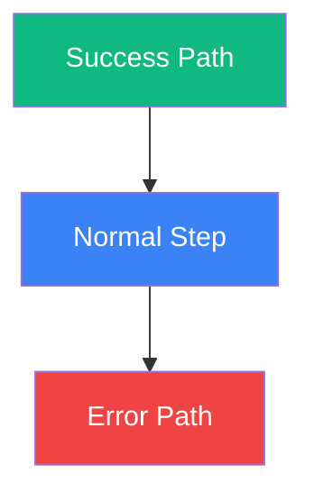

# Workflow Documentation Hub

> Operational workflows describe how your SaaS processes work end-to-end.
> Use these templates to document each workflow in your application.

---

## What Are Operational Workflows?

Operational workflows are the step-by-step processes that power your SaaS.
They describe how data flows through your system when a user takes an action,
a payment is processed, or an automated task runs.

Documenting workflows helps with:
- **Onboarding** -- new team members understand how things work
- **Debugging** -- trace where a process failed
- **AI assistance** -- give AI agents context to help with implementation
- **Compliance** -- demonstrate process controls for audits
- **Testing** -- ensure all paths and edge cases are covered

---

## Workflows Covered

| Workflow | File | Status |
|----------|------|--------|
| Customer Onboarding | `onboarding-new-customer.md` | Template |
| User Registration | `user-registration.md` | Template |
| Subscription Management | `subscription-management.md` | Template |
| Payment Flows | `payment-flows.md` | Template |
| [Your Workflow] | `[filename].md` | [Status] |

---

## How to Use Workflow Guides

### For Development

1. Read the workflow before implementing a related feature
2. Identify all decision points and edge cases
3. Ensure your implementation handles every path in the diagram
4. Update the workflow doc if implementation differs

### For Debugging

1. Identify which workflow the issue falls under
2. Trace the user's path through the flow diagram
3. Check logs at each step to find where the process diverged
4. Fix the issue and update the doc if a new edge case was discovered

### For AI Assistance

Share the relevant workflow document when asking an AI to:
- Implement a feature in the workflow
- Debug an issue in the process
- Write tests covering the workflow paths
- Generate API endpoints for workflow steps

---

## Template for Adding Custom Workflows

Copy this template when documenting a new workflow:

```markdown
# [Workflow Name]

## Overview
[1-2 sentences describing what this workflow accomplishes]

## Trigger
[What initiates this workflow -- user action, scheduled job, webhook, etc.]

## Actors
- **User:** [role/type]
- **System:** [which services are involved]
- **External:** [third-party services]

## Prerequisites
- [What must be true before this workflow starts]

## Flow Diagram

\`\`\`mermaid
flowchart TD
    A[Start] --> B{Decision?}
    B -->|Yes| C[Action 1]
    B -->|No| D[Action 2]
    C --> E[End]
    D --> E
\`\`\`

## Steps

### Step 1: [Name]
- **Actor:** [who performs this step]
- **Action:** [what happens]
- **Input:** [what data is needed]
- **Output:** [what data is produced]
- **Error handling:** [what happens if this step fails]

### Step 2: [Name]
[repeat for each step]

## Decision Points

| Decision | Condition | Path A | Path B |
|----------|-----------|--------|--------|
| [Name] | [Condition] | [If true] | [If false] |

## Error Scenarios

| Error | Cause | User Impact | Recovery |
|-------|-------|-------------|----------|
| [Error] | [Why] | [What user sees] | [How to fix] |

## Notifications

| Event | Channel | Recipient | Template |
|-------|---------|-----------|----------|
| [Event] | [Email/SMS/Push] | [Who] | [Template name] |

## Success Metrics
- [Metric 1: description and target]
- [Metric 2: description and target]

## Related Workflows
- [Link to related workflow 1]
- [Link to related workflow 2]
```

---

## Diagram Conventions

### Mermaid Shapes

| Shape | Usage |
|-------|-------|
| `[Rectangle]` | Process step |
| `{Diamond}` | Decision point |
| `([Stadium])` | Start/End |
| `[[Subroutine]]` | Sub-process (documented elsewhere) |
| `[(Database)]` | Data store operation |

### Color Coding (Optional)



- Green: Success/completion
- Blue: Normal processing
- Red: Error/failure
- Yellow: Decision/waiting

---

## Maintenance

- Review workflows quarterly or after major feature changes
- Update diagrams when process steps change
- Add new error scenarios as they are discovered
- Keep notification templates in sync with actual email/SMS content
