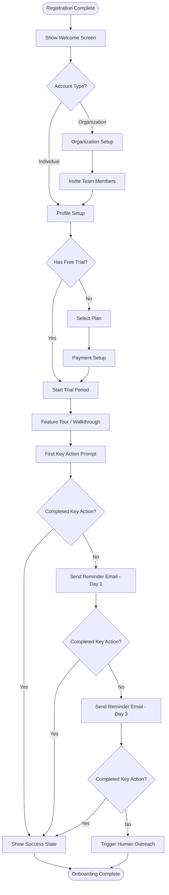

# Customer Onboarding Workflow

## Overview

The onboarding workflow converts a new signup into an active, engaged customer.
A well-designed onboarding flow reduces time-to-value and improves retention.

---

## Trigger

- User completes registration and email verification
- OR user is invited by an existing organization admin

## Actors

- **New User:** The person completing onboarding
- **System:** Application backend, email service, analytics
- **External:** Payment provider (if trial requires card), CRM

## Prerequisites

- Email is verified
- Account record exists in the database
- Authentication session is active

---

## Flow Diagram

---

## Steps

### Step 1: Welcome Screen

- **Actor:** System
- **Action:** Display personalized welcome screen with user's name
- **Content:** Brief value proposition reminder, what to expect in onboarding
- **CTA:** "Let's get started" button

### Step 2: Account Type Selection

- **Actor:** User
- **Action:** Choose between individual account or organization
- **Decision:** Organization accounts get extra setup steps (team, billing admin)

### Step 3: Profile Setup

- **Actor:** User
- **Action:** Complete profile information
- **Fields:** Display name, role/title, avatar (optional), timezone, preferences
- **Validation:** Name is required, other fields optional but encouraged
- **Skip option:** Allow skipping with "Complete later" option

### Step 4: Organization Setup (if applicable)

- **Actor:** User (admin)
- **Action:** Create or configure organization
- **Fields:** Organization name, logo, industry, size
- **System action:** Create organization record, assign user as admin

### Step 5: Team Invitations (if applicable)

- **Actor:** User (admin)
- **Action:** Invite team members by email
- **System action:** Send invitation emails, create pending member records
- **Skip option:** "I'll invite people later"

### Step 6: Plan Selection / Trial Start

- **Actor:** User / System
- **Action:** Start free trial or select a paid plan
- **System action:** Create subscription record, set trial end date
- **Integration:** Stripe customer creation (if not already created)

### Step 7: Feature Walkthrough

- **Actor:** System (with user interaction)
- **Action:** Interactive tour of 3-5 key features
- **Implementation:** Tooltip-based guided tour (e.g., driver.js, react-joyride)
- **Skip option:** "Skip tour" with ability to replay later from settings

### Step 8: First Key Action

- **Actor:** User
- **Action:** Complete the single most important action in your product
- **Examples:** Create first project, import data, send first message, set up first automation
- **System action:** Track completion, trigger success celebration

---

## Decision Points

| Decision | Condition | Path A | Path B |
|----------|-----------|--------|--------|
| Account type | User selection | Individual (simpler flow) | Organization (team setup) |
| Trial available | Product configuration | Start trial automatically | Show plan selection |
| Key action done | User behavior tracking | Mark onboarding complete | Send nurture emails |
| Invitation sent | User chose to invite | Send invite emails | Skip team setup |

---

## Email Triggers

| Email | Trigger | Delay | Purpose |
|-------|---------|-------|---------|
| Welcome email | Registration complete | Immediate | Confirm signup, set expectations |
| Getting started | Onboarding step 1 viewed | 1 hour | Tips for first session |
| Key action reminder | Key action not completed | 24 hours | Encourage first value moment |
| Follow-up nudge | Key action still not completed | 72 hours | Offer help, link to resources |
| Team invite reminder | Invites sent but not accepted | 48 hours | Remind invitees to join |
| Trial midpoint | Trial 50% elapsed | At midpoint | Highlight unused features |
| Trial ending | Trial 3 days from end | 3 days before | Conversion prompt |

---

## Error Scenarios

| Error | Cause | User Impact | Recovery |
|-------|-------|-------------|----------|
| Email verification expired | Link clicked after 24h | Cannot proceed | Resend verification email |
| Organization name taken | Name already in use | Cannot create org | Suggest alternatives |
| Invite email bounced | Invalid email address | Invite not received | Notify admin, allow re-send |
| Payment setup failed | Card declined / provider error | Cannot start paid plan | Show error, allow retry |
| Tour broken by UI change | Product update broke tour steps | Confusing tour | Auto-skip broken steps |

---

## Success Metrics

- **Onboarding completion rate:** % of signups who complete all steps (target: >70%)
- **Time to first value:** Average time from signup to first key action (target: <10 min)
- **Day-1 retention:** % of users who return the day after signup (target: >50%)
- **Day-7 retention:** % of users active 7 days after signup (target: >30%)
- **Trial-to-paid conversion:** % of trial users who convert (target: >5%)

---

## Integrations

| Service | Purpose | Events Sent |
|---------|---------|-------------|
| Analytics | Track funnel completion | `onboarding_started`, `step_completed`, `onboarding_finished` |
| CRM | Sales follow-up | `trial_started`, `key_action_completed` |
| Email service | Automated sequences | All email triggers above |
| Payment provider | Subscription creation | `plan_selected`, `payment_method_added` |
