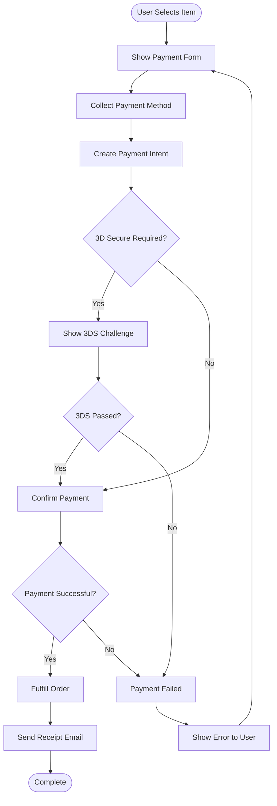
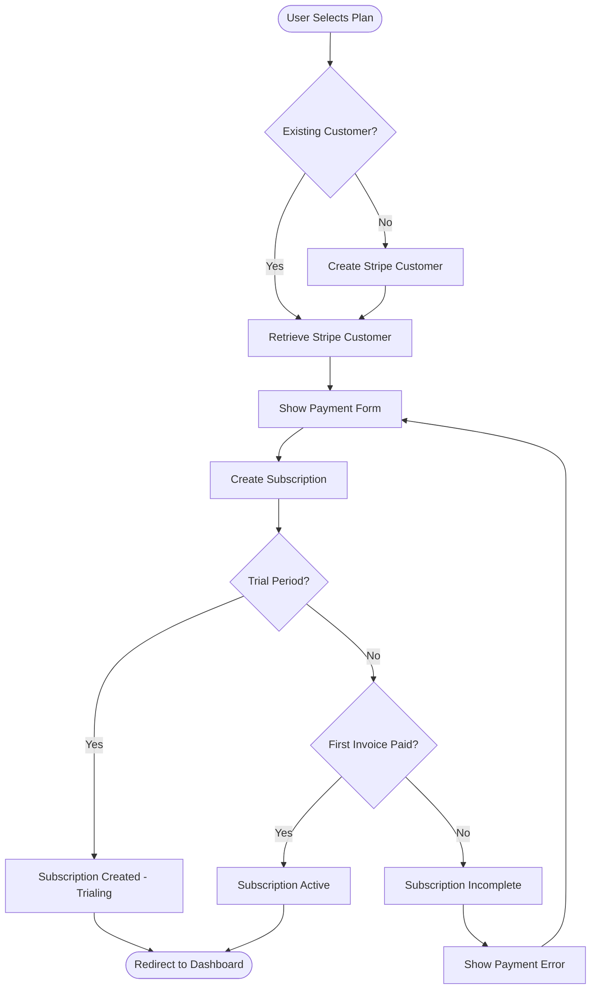
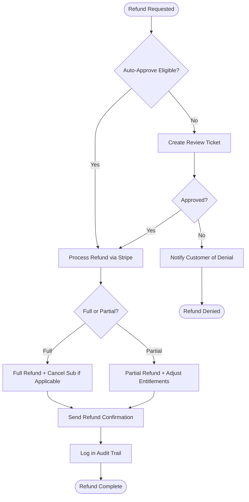

# Payment Workflow Templates

## Overview

All payment flows in the application, including one-time purchases, subscription
billing, failed payment recovery, refunds, and invoice generation.

---

## One-Time Purchases

### Use Cases

- Lifetime deal purchases
- One-off feature add-ons
- Credits or token packs
- Professional services

### Flow



### Implementation Notes

- Use Stripe Payment Intents for SCA compliance
- Always handle the `requires_action` status for 3D Secure
- Create the order record in `pending` state before payment
- Fulfill only after payment confirmation (webhook or return)
- Idempotency key on payment creation to prevent double charges

---

## Subscription Billing

### Initial Subscription Setup



### Recurring Billing Cycle

| Step | Timing | Actor |
|------|--------|-------|
| Invoice created | ~1 hour before period end | Stripe |
| Payment attempted | At period renewal | Stripe |
| `invoice.paid` webhook | After successful payment | Your webhook handler |
| Receipt email | After webhook processed | Your email service |
| Access confirmed | After webhook processed | Your entitlement service |

### Billing Events

| Event | System Action | User Notification |
|-------|---------------|-------------------|
| Subscription created | Store subscription record | Welcome + receipt email |
| Payment succeeded | Update `current_period_end` | Receipt email |
| Payment failed | Update status to `past_due` | Failed payment email |
| Subscription upgraded | Update plan, prorate | Upgrade confirmation email |
| Subscription downgraded | Schedule change at period end | Downgrade confirmation email |
| Subscription cancelled | Set `cancel_at_period_end` | Cancellation confirmation email |
| Subscription expired | Remove paid entitlements | Account downgraded email |

---

## Failed Payment Recovery

### Smart Retry Schedule

Stripe retries automatically, but supplement with your own communication:

| Retry | Timing | Email | In-App |
|-------|--------|-------|--------|
| Stripe retry 1 | +3 days | "Update your payment method" | Yellow banner |
| Stripe retry 2 | +5 days | "Action required" | Red banner |
| Stripe retry 3 | +7 days | "Last chance" | Modal on login |
| Final | +14 days | "Subscription cancelled" | Downgrade immediately |

### Self-Service Payment Update

```mermaid
flowchart TD
    A([User Sees Failed Payment Banner]) --> B[Click "Update Payment"]
    B --> C[Show Stripe Billing Portal]
    C --> D[User Updates Card]
    D --> E[Stripe Retries Immediately]
    E --> F{Successful?}
    F -->|Yes| G[Subscription Reactivated]
    F -->|No| H[Show Error, Try Another Card]
    G --> I[Remove Warning Banner]
    I --> J([Normal Access Restored])
```

### Implementation

```typescript
// Create a billing portal session for payment update
const session = await stripe.billingPortal.sessions.create({
  customer: customerId,
  return_url: `${baseUrl}/settings/billing`,
});
// Redirect user to session.url
```

---

## Refund Processing

### Refund Decision Matrix

| Timeframe | Amount | Auto-Approve | Requires Review |
|-----------|--------|--------------|-----------------|
| < 24 hours | Any | Yes | No |
| 1-7 days | < $50 | Yes | No |
| 1-7 days | > $50 | No | Yes |
| 7-30 days | Any | No | Yes |
| > 30 days | Any | No | Manager approval |

### Refund Flow



### Refund Implementation

```typescript
// Full refund
const refund = await stripe.refunds.create({
  payment_intent: paymentIntentId,
});

// Partial refund
const refund = await stripe.refunds.create({
  payment_intent: paymentIntentId,
  amount: 500, // $5.00 in cents
});
```

---

## Invoice Generation

### Automatic Invoices (Stripe-Managed)

Stripe automatically creates invoices for subscription payments. Configure:

- Invoice numbering prefix (e.g., `INV-`)
- Company details (name, address, tax ID)
- Default payment terms
- Custom fields (PO number, project code)
- Footer text (payment terms, support contact)

### Custom Invoice Requirements

| Field | Source | Required |
|-------|--------|----------|
| Invoice number | Auto-generated sequential | Yes |
| Issue date | Payment date | Yes |
| Customer name | User profile / org name | Yes |
| Customer email | User profile | Yes |
| Billing address | Billing settings | For tax compliance |
| Line items | Subscription plan + add-ons | Yes |
| Subtotal | Calculated | Yes |
| Tax | Tax calculation service | If applicable |
| Total | Calculated | Yes |
| Payment status | Stripe payment status | Yes |
| Payment method | Last 4 digits of card | Yes |

### Invoice Access

- Users can download PDF invoices from the billing settings page
- Invoices are also emailed automatically after each payment
- Provide API endpoint for programmatic invoice access
- Store invoice PDFs or generate on demand from Stripe

```typescript
// Generate invoice PDF URL
const invoice = await stripe.invoices.retrieve(invoiceId);
const pdfUrl = invoice.invoice_pdf; // Stripe-hosted PDF URL
```

---

## Currency Handling

### Rules

1. **Store amounts in smallest currency unit** (cents for USD, pence for GBP)
2. **Never use floating point** for currency calculations
3. **Display currency with proper locale formatting**
4. **Store the currency code** alongside every amount

```typescript
// Bad
const price = 9.99;
const total = price * quantity; // Floating point errors

// Good
const priceInCents = 999;
const totalInCents = priceInCents * quantity;
const display = new Intl.NumberFormat('en-US', {
  style: 'currency',
  currency: 'USD',
}).format(totalInCents / 100);
```

---

## Security Checklist

- [ ] Never log full card numbers or CVVs
- [ ] Use Stripe Elements or Checkout (card data never touches your server)
- [ ] Verify webhook signatures on every webhook endpoint
- [ ] Use idempotency keys for all payment creation requests
- [ ] Implement rate limiting on payment endpoints
- [ ] Log all payment events in an audit trail
- [ ] Use HTTPS for all payment-related pages
- [ ] PCI compliance: use SAQ A (Stripe handles card data)
