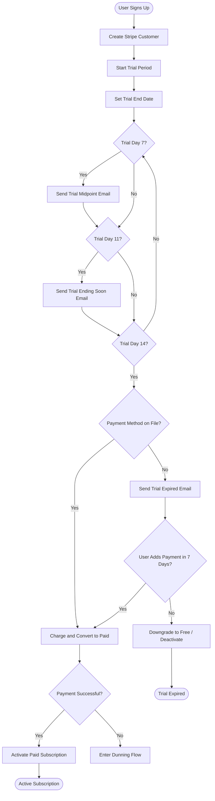
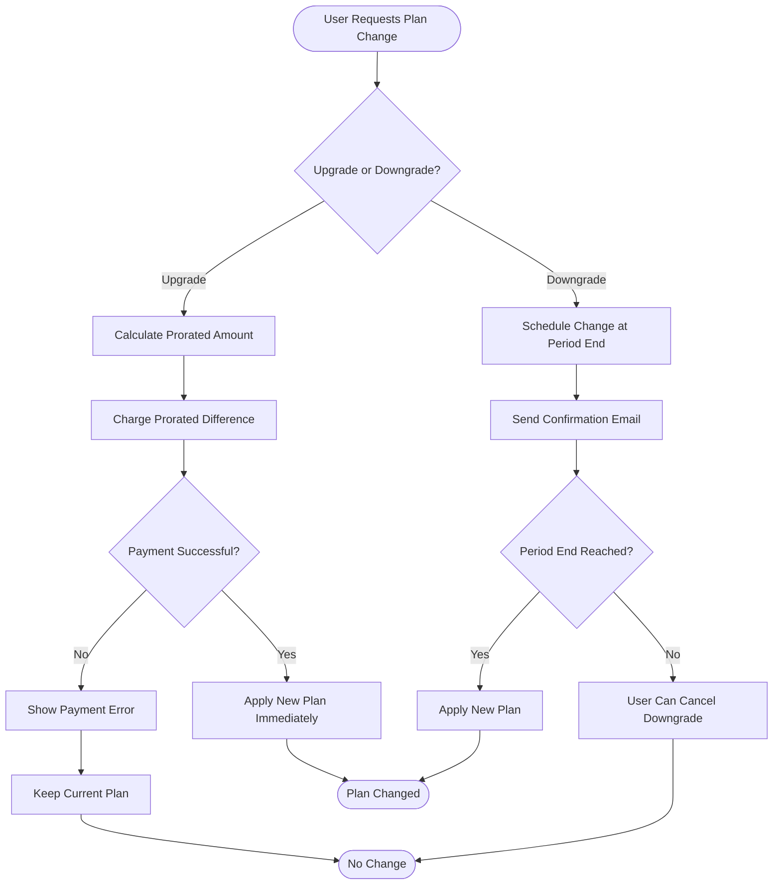
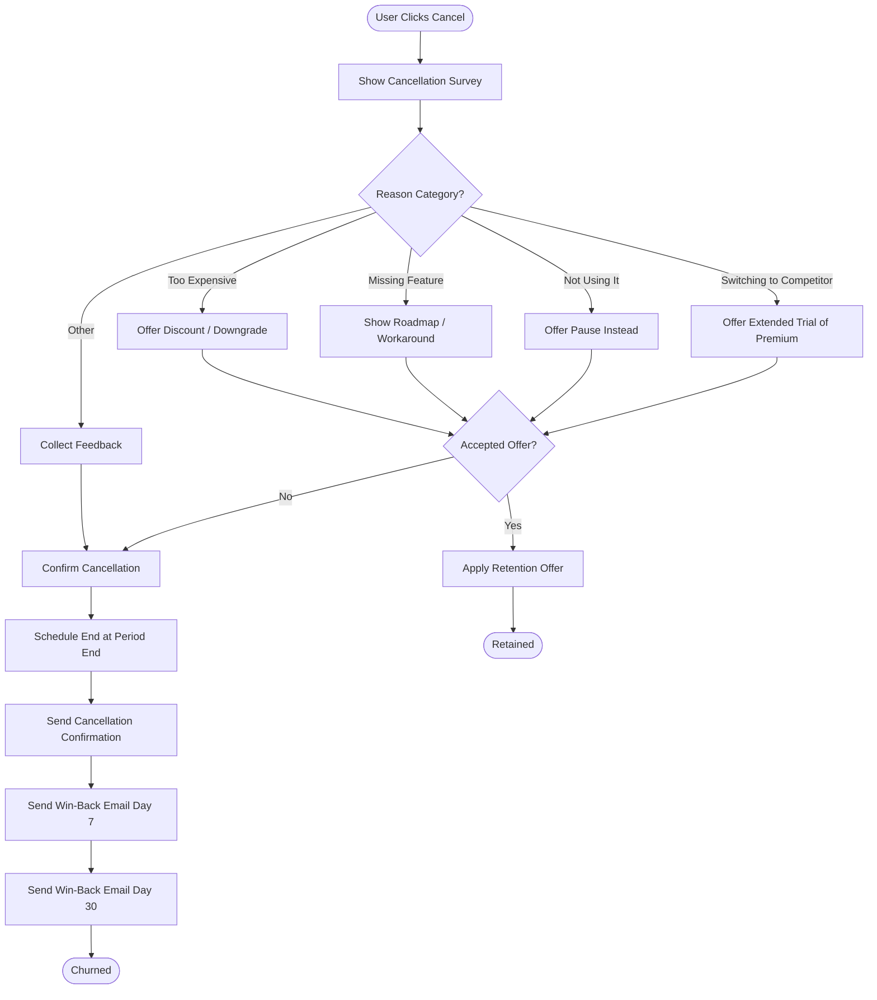
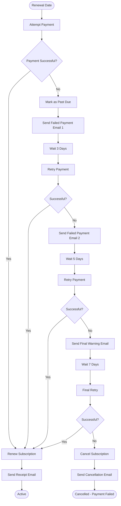

# Subscription Management Workflow

## Overview

Manages the full lifecycle of a customer subscription: trial start, conversion
to paid, plan changes, cancellation, retention attempts, renewals, and dunning.

---

## Trigger

- User signs up for a free trial
- User selects a paid plan
- User changes their subscription (upgrade, downgrade, cancel)
- Payment processor sends a webhook event

## Actors

- **Customer:** Account owner or billing admin
- **System:** Application backend, subscription service
- **External:** Stripe (or your payment provider), email service

---

## Trial Start to Conversion



### Trial Configuration

| Setting | Value | Notes |
|---------|-------|-------|
| Trial duration | [14 days] | Adjust based on time-to-value |
| Payment required to start | [No] | Reduces friction but lowers conversion |
| Grace period after trial | [7 days] | Time before account restriction |
| Features during trial | [Full access] | Or limited to specific plan tier |

---

## Plan Upgrade / Downgrade



### Plan Change Rules

| Scenario | Timing | Billing |
|----------|--------|---------|
| Upgrade | Immediate | Prorated charge for remainder of period |
| Downgrade | End of current period | No refund, features available until period ends |
| Same-tier feature add-on | Immediate | Additional charge prorated |
| Quantity change (seats) | Immediate for adds, end of period for removes | Prorated for additions |

---

## Cancellation and Retention



### Retention Offers

| Cancel Reason | Offer | Implementation |
|---------------|-------|----------------|
| Too expensive | 20% discount for 3 months | Apply coupon to subscription |
| Not using it | Pause subscription for up to 3 months | Set subscription to `paused` |
| Missing feature | Extend current plan free for 1 month | Apply 100% off coupon for 1 period |
| Switching | Offer premium trial period | Upgrade plan with trial |

### Cancellation Rules

- Cancellation takes effect at end of current billing period
- User retains access until period ends
- No prorated refunds for partial periods (configurable)
- User can reactivate before period end without losing data
- After period end, account moves to free tier or is deactivated

---

## Renewal and Dunning



### Dunning Schedule

| Attempt | Timing | Email | Access |
|---------|--------|-------|--------|
| 1st failure | Day 0 | "Payment failed, update card" | Full access |
| 2nd attempt | Day 3 | "Still unable to charge" | Full access |
| 3rd attempt | Day 8 | "Final warning" | Reduced access (read-only) |
| Final attempt | Day 15 | "Subscription cancelled" | Downgrade to free |

---

## Refund Processing

| Scenario | Policy | Implementation |
|----------|--------|----------------|
| Within 24 hours of charge | Full refund, no questions | Automatic via API |
| Within 14 days | Full refund on request | Manual review, then API |
| After 14 days | Pro-rated or case-by-case | Manual review required |
| Duplicate charge | Always full refund | Automatic detection + refund |
| Fraud | Full refund + account review | Flag account, refund, investigate |

### Refund Steps

1. Customer requests refund (support ticket or self-service)
2. System checks refund eligibility based on policy
3. If eligible: process refund via Stripe, adjust subscription
4. Send refund confirmation email
5. Log refund in audit trail
6. If subscription was cancelled due to refund, handle access accordingly

---

## Webhook Events to Handle

| Stripe Event | Action |
|--------------|--------|
| `customer.subscription.created` | Record new subscription |
| `customer.subscription.updated` | Update plan, status, period dates |
| `customer.subscription.deleted` | Mark subscription as cancelled |
| `invoice.paid` | Record successful payment, send receipt |
| `invoice.payment_failed` | Start dunning flow, notify customer |
| `customer.subscription.trial_will_end` | Send trial ending email (3 days before) |
| `charge.refunded` | Record refund, adjust entitlements |

---

## Database State Machine

```
trialing --> active          (payment successful)
trialing --> cancelled       (trial expired, no payment)
active --> past_due          (payment failed)
active --> cancelled         (user cancelled)
active --> paused            (user paused)
past_due --> active          (payment retry successful)
past_due --> cancelled       (all retries exhausted)
paused --> active            (user resumed)
cancelled --> active         (user resubscribed)
```
